# Native Federation Guide

This guide explains Native Federation from first principles and documents the actual Native Federation setup in this repository.

Scope:

- Native Federation with same-framework applications.
- Native Federation with cross-framework applications.
- Angular, React, Vue, and Web Component integration patterns.
- Runtime loading, manifests, shared dependencies, routing, deployment, debugging, and architecture decisions.

This is not a generic Micro Frontend guide and not a Webpack Module Federation tutorial. Traditional Module Federation is mentioned only where it helps explain how Native Federation differs.

## Table of Contents

- [1. Introduction](#1-introduction)
- [2. What Is Native Federation?](#2-what-is-native-federation)
- [3. How Native Federation Works](#3-how-native-federation-works)
- [4. Core Concepts](#4-core-concepts)
- [5. Native Federation Architecture](#5-native-federation-architecture)
- [6. Same-Framework Federation](#6-same-framework-federation)
  - [6.1 Angular to Angular](#61-angular-to-angular)
  - [6.2 React to React](#62-react-to-react)
  - [6.3 Vue to Vue](#63-vue-to-vue)
- [7. Cross-Framework Federation](#7-cross-framework-federation)
  - [7.1 Angular Host to React Remote](#71-angular-host-to-react-remote)
    - [7.1.1 React Widget Inside an Angular Page](#711-react-widget-inside-an-angular-page)
    - [7.1.2 React Remote as a Full Angular Route](#712-react-remote-as-a-full-angular-route)
    - [7.1.3 Price Lens React Remote Setup](#713-price-lens-react-remote-setup)
    - [7.1.4 Can Angular Load React Routes Directly?](#714-can-angular-load-react-routes-directly)
  - [7.2 Angular Host to Vue Remote](#72-angular-host-to-vue-remote)
  - [7.3 React Host to Angular Remote](#73-react-host-to-angular-remote)
  - [7.4 React Host to Vue Remote](#74-react-host-to-vue-remote)
  - [7.5 Vue Host to Angular Remote](#75-vue-host-to-angular-remote)
  - [7.6 Vue Host to React Remote](#76-vue-host-to-react-remote)
  - [7.7 Next.js and Django With an Angular Host](#77-nextjs-and-django-with-an-angular-host)
- [8. Web Components With Native Federation](#8-web-components-with-native-federation)
- [9. Federated JavaScript Modules](#9-federated-javascript-modules)
- [10. Communication](#10-communication)
  - [10.3 Sharing Colors and Theme Between Apps](#103-sharing-colors-and-theme-between-apps)
  - [10.4 Different Colors for Different Remotes](#104-different-colors-for-different-remotes)
  - [10.5 Sharing Data Between Native Federation Apps](#105-sharing-data-between-native-federation-apps)
  - [10.6 Why localStorage and sessionStorage Behave This Way](#106-why-localstorage-and-sessionstorage-behave-this-way)
- [11. Routing](#11-routing)
- [12. Shared Dependencies](#12-shared-dependencies)
- [13. Runtime Loading](#13-runtime-loading)
- [14. Step-by-Step Implementation Guide](#14-step-by-step-implementation-guide)
  - [14.1 Choose The Application Role](#141-choose-the-application-role)
  - [14.2 Make A Pure Angular Application A Host](#142-make-a-pure-angular-application-a-host)
  - [14.3 Make A Pure Angular Application A Remote](#143-make-a-pure-angular-application-a-remote)
  - [14.4 Make A Pure Angular Application Host Plus Remote](#144-make-a-pure-angular-application-host-plus-remote)
  - [14.5 Make A Pure React Application A Remote](#145-make-a-pure-react-application-a-remote)
  - [14.6 Make A Pure React Application A Host](#146-make-a-pure-react-application-a-host)
  - [14.7 Make A Next.js Application A Remote](#147-make-a-nextjs-application-a-remote)
  - [14.8 Make A Next.js Application A Host](#148-make-a-nextjs-application-a-host)
  - [What Changes From a Basic Angular App](#what-changes-from-a-basic-angular-app)
  - [Native Federation Files Added or Changed](#native-federation-files-added-or-changed)
- [15. Development Setup](#15-development-setup)
- [16. Production Deployment](#16-production-deployment)
- [17. Error Handling](#17-error-handling)
- [18. Debugging](#18-debugging)
- [19. Security](#19-security)
- [20. Performance](#20-performance)
- [21. Best Practices](#21-best-practices)
- [22. Anti-Patterns](#22-anti-patterns)
- [23. Same vs Cross Framework Comparison](#23-same-vs-cross-framework-comparison)
- [24. Architecture Decision Guide](#24-architecture-decision-guide)
- [25. FAQ](#25-faq)
- [26. Native Federation Details Often Missed](#26-native-federation-details-often-missed)
- [27. Quick Reference](#27-quick-reference)

## How To Read This Guide

Use this order if you are new to Native Federation:

```text
1. Read sections 1-5 for the mental model.
2. Read section 6 for same-framework Angular-to-Angular federation.
3. Read sections 7-10 before attempting cross-framework UI.
4. Use section 14 when implementing or reviewing files.
5. Use sections 15-18 while running, deploying, or debugging.
6. Use sections 23-27 as reference material.
```

If you only want to know what changed compared to a basic Angular app, start at [What Changes From a Basic Angular App](#what-changes-from-a-basic-angular-app).

## 1. Introduction

Native Federation lets one frontend application load JavaScript modules from another independently built frontend application at runtime.

In this repository, the Native Federation implementation is in:

```text
frontend/native-federation/
  shell-app/   # Angular host storefront, port 4200
  auth-app/    # Angular remote, port 4201
  admin-app/   # Angular remote and secondary host, port 4202
  product-spotlight-app/ # React remote Web Component, port 4203
  price-lens-product-app/ # React remote mount API, port 4204
  product-manager/ # Next.js app plus React Web Component remote, port 4205
```

The current project has Angular-to-Angular route federation and three Angular-to-React cross-framework examples:

- `product-spotlight-app` uses a Web Component boundary.
- `price-lens-product-app` exposes a framework-neutral `mount(element, options)` API and runs its own React Router internally.
- `product-manager` remains a standalone Next.js app, and also builds a browser-only React Native Federation remote that registers `<product-manager-mfe>` for the Angular admin route.

Angular never imports a React component directly. The Angular host loads a JavaScript module from the React remote and mounts React into a normal DOM element.

### Current Repository Facts

These values were inspected from the local project and installed packages.

| Item | Value |
| --- | --- |
| Angular package version | `@angular/core@22.1.3` |
| Angular CLI version | `@angular/cli@22.1.5` |
| Angular builder package | `@angular/build@22.1.5` |
| Native Federation Angular adapter | `@angular-architects/native-federation@22.1.1` |
| Native Federation orchestrator | `@softarc/native-federation-orchestrator@4.6.0` in `auth-app`; `^4.5.2` transitive from the adapter |
| React remote Native Federation core | `@softarc/native-federation@4.5.0` |
| React remote Native Federation esbuild adapter | `@softarc/native-federation-esbuild@4.0.0` |
| React remote version | `react@19.2.8`, `react-dom@19.2.8` |
| Import map shim | `es-module-shims@2.8.0` |
| TypeScript | `~6.0.2` |
| Package manager | `npm@11.13.0` |
| Existing React apps | `product-spotlight-app`, `price-lens-product-app`, `product-manager` |
| Existing Next.js apps | `product-manager@next 16.3.4` |
| Existing Vue apps | None found |

### Existing Native Federation Applications

| App | Role | Federation name | Port | Remote entry |
| --- | --- | --- | --- | --- |
| `shell-app` | Host | `shell_app` | `4200` | Not consumed by another app |
| `auth-app` | Remote | `auth_app` | `4201` | `http://localhost:4201/remoteEntry.json` |
| `admin-app` | Remote plus host | `admin_app` | `4202` | `http://localhost:4202/remoteEntry.json` |
| `product-spotlight-app` | React remote Web Component | `product_spotlight_app` | `4203` | `http://localhost:4203/remoteEntry.json` |
| `price-lens-product-app` | React remote mount API | `price_lens_product_app` | `4204` | `http://localhost:4204/remoteEntry.json` |
| `product-manager` | Next.js app plus React Web Component remote | `productManager` | `4205` | `http://localhost:4205/remoteEntry.json` |

`shell-app` loads:

```json
{
  "auth_app": "http://localhost:4201/remoteEntry.json",
  "admin_app": "http://localhost:4202/remoteEntry.json",
  "price_lens_product_app": "http://localhost:4204/remoteEntry.json",
  "productManager": "http://localhost:4205/remoteEntry.json"
}
```

`admin-app` also loads:

```json
{
  "auth_app": "http://localhost:4201/remoteEntry.json",
  "productManager": "http://localhost:4205/remoteEntry.json"
}
```

`shell-app` dynamically loads `product_spotlight_app` from `ProductSpotlightRemoteComponent` by remote entry URL. It is not placed in the startup manifest because the home-page spotlight is optional and should not block shell bootstrap if the React remote is unavailable.

`shell-app` loads `price_lens_product_app` from the startup manifest because Price Lens has its own top-level route at `/price-lens` and `/price-lens/search/:query`.

`admin-app` loads `productManager` from its own startup manifest because the admin product routes render the Next.js Product Manager's browser-only React remote through a Web Component. `shell-app` also lists `productManager` because `admin-app` can be loaded under `/admin` inside the shell, and nested host/remote loading must still resolve the product remote entry.

## 2. What Is Native Federation?

Native Federation is a runtime module loading approach based on web platform concepts:

- JavaScript ES modules.
- Import maps.
- Dynamic imports.
- Remote metadata files.
- Shared dependency resolution.

The simple idea:

```text
Host application
  |
  | loads metadata for a remote
  v
remoteEntry.json
  |
  | describes exposed modules and shared packages
  v
Remote JavaScript modules
```

In this repository, `shell-app` does not bundle `auth-app` and `admin-app` into its own JavaScript output. Instead, the shell initializes Native Federation, reads a federation manifest, discovers remote entry files, and loads remote route modules only when routes such as `/auth` or `/admin` are visited.

Native Federation exists because modern Angular applications commonly use the Angular application builder and esbuild instead of webpack. Native Federation provides federation without requiring a webpack-specific build pipeline.

### What Native Federation Does

Native Federation helps with:

- Discovering remote applications.
- Loading remote JavaScript modules at runtime.
- Mapping exposed module names such as `./routes` to real generated files.
- Sharing dependencies such as Angular packages between compatible applications.
- Supporting independent builds and deployments.

Native Federation does not automatically solve:

- Authentication.
- Authorization.
- Cross-application communication.
- Shared state.
- UI consistency.
- Backend data ownership.
- Cross-framework rendering.
- Version governance.

Those are application architecture concerns layered on top of federation.

## 3. How Native Federation Works

Native Federation has two sides:

- A remote exposes JavaScript modules.
- A host loads those modules at runtime.

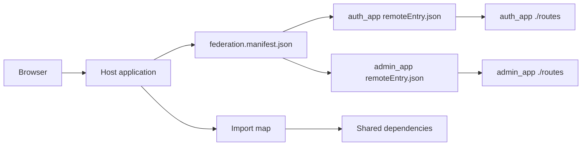

Runtime flow in this repository:

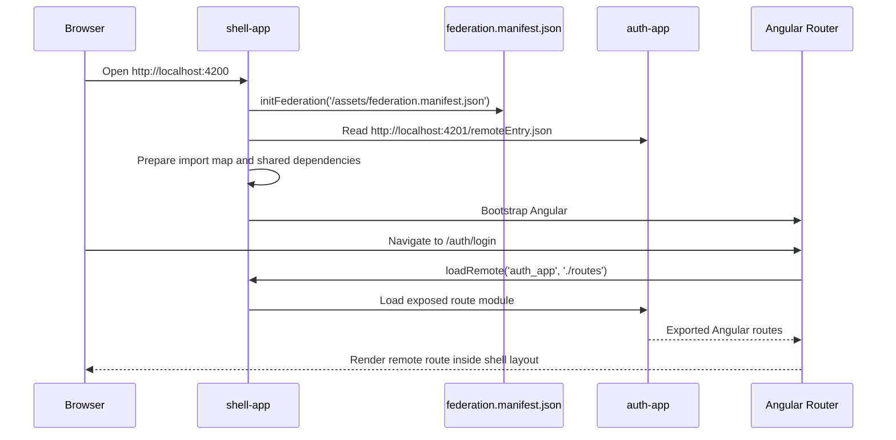

### ES Modules

ES modules are JavaScript modules loaded with `import` and `export`.

Example:

```ts
export const routes = [];
```

Native Federation exposes and loads JavaScript modules. It does not expose framework objects magically. If the exposed module contains Angular routes, an Angular host can use those routes naturally. If the exposed module contains React code, an Angular host still needs an integration boundary.

### Import Maps

An import map tells the browser or `es-module-shims` where module specifiers should resolve.

Conceptual example:

```json
{
  "imports": {
    "@angular/core": "http://localhost:4200/shared/@angular/core.js"
  }
}
```

In this repository, `es-module-shims` is included as an Angular polyfill in each Native Federation app:

```json
"polyfills": ["es-module-shims"]
```

This matters because Angular source files import packages such as `@angular/core`. The browser cannot resolve those package names by itself. Native Federation prepares the mapping before Angular is bootstrapped.

### Federation Manifest

A federation manifest is a host-side file that maps remote names to remote entry URLs.

`shell-app/public/assets/federation.manifest.json`:

```json
{
  "auth_app": "http://localhost:4201/remoteEntry.json",
  "admin_app": "http://localhost:4202/remoteEntry.json",
  "price_lens_product_app": "http://localhost:4204/remoteEntry.json",
  "productManager": "http://localhost:4205/remoteEntry.json"
}
```

The manifest is loaded by `shell-app/src/main.ts`:

```ts
import { initFederation } from '@angular-architects/native-federation';

initFederation('/assets/federation.manifest.json')
  .then(() => import('./bootstrap'))
  .catch((err: unknown) => console.error(err));
```

### Remote Entry

A remote entry is generated by Native Federation. In this project the URL ends in:

```text
remoteEntry.json
```

Do not use `remoteEntry.js` examples from webpack-oriented guides for this repository. Native Federation uses `remoteEntry.json` here.

### Bootstrap Order

Native Federation must initialize before Angular bootstraps.

Correct pattern:

```text
main.ts
  initFederation(...)
  then import('./bootstrap')

bootstrap.ts
  imports Angular packages
  bootstrapApplication(...)
```

This prevents package specifiers such as `@angular/core` from being imported before the import map is ready.

## 4. Core Concepts

| Concept | Meaning |
| --- | --- |
| Host | Application that loads remote modules. In this repo: `shell-app`. |
| Remote | Application that exposes modules. In this repo: `auth-app`, `admin-app`. |
| Host plus remote | App that is consumed by another host and also consumes remotes. In this repo: `admin-app`. |
| Exposed module | A JavaScript module made available by a remote, such as `./routes`. |
| Shared dependency | A package resolved once where possible, such as `@angular/core`. |
| Federation manifest | Host file mapping remote names to `remoteEntry.json` URLs. |
| Remote entry | Remote metadata generated by Native Federation. |
| Dynamic loading | Loading a remote module only when needed, usually during route navigation. |
| Independent deployment | Deploying host and remotes separately while preserving contracts. |

## 5. Native Federation Architecture

Current repository architecture:

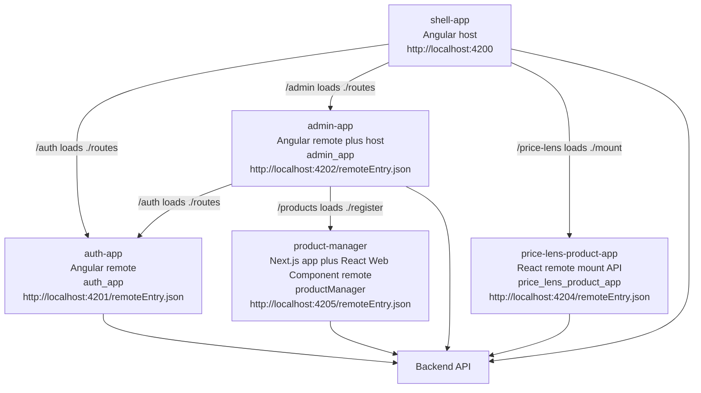

Current exposed modules:

| Remote | Exposed name | Source file | What is exported |
| --- | --- | --- | --- |
| `auth_app` | `./routes` | `./src/app/app.routes.ts` | `routes: Routes` |
| `admin_app` | `./routes` | `./src/app/app.routes.ts` | `routes: Routes` |
| `price_lens_product_app` | `./mount` | `./src/mount.tsx` | `mount(element, options)` |
| `productManager` | `./register` | `./src/remote/register.ts` | `PRODUCT_MANAGER_ELEMENT` and `ProductManagerElement`; also registers `<product-manager-mfe>` |

Current host routes:

```ts
{
  path: 'auth',
  loadChildren: () =>
    loadRemote<{ routes: Routes }>('auth_app', './routes').then((m) => m.routes),
},
{
  path: 'admin',
  loadChildren: () =>
    loadRemote<{ routes: Routes }>('admin_app', './routes').then((m) => m.routes),
},
{
  path: 'price-lens',
  loadComponent: () =>
    import('./features/price-lens/price-lens-remote.component').then(
      (m) => m.PriceLensRemoteComponent,
    ),
},
{
  path: 'price-lens/search/:query',
  loadComponent: () =>
    import('./features/price-lens/price-lens-remote.component').then(
      (m) => m.PriceLensRemoteComponent,
    ),
},
```

## 6. Same-Framework Federation

Same-framework federation means the host and remote use the same frontend framework.

Examples:

- Angular host to Angular remote.
- React host to React remote.
- Vue host to Vue remote.

Same-framework federation is usually the simplest and most natural form of Native Federation because the host and remote share the same component model, runtime expectations, routing concepts, and dependency ecosystem.

### 6.1 Angular to Angular

This repository is an Angular-to-Angular example.

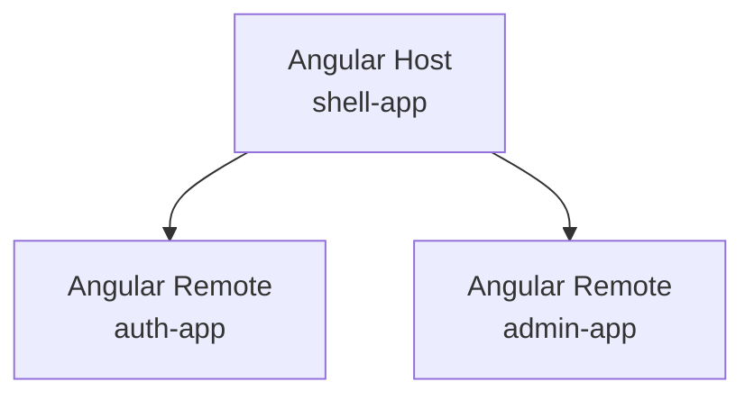

#### Host Configuration

`shell-app/federation.config.mjs`:

```js
import { withNativeFederation, shareAll } from '@angular-architects/native-federation/config';

export default withNativeFederation({
  name: 'shell_app',

  remotes: {
    auth_app: 'http://localhost:4201/remoteEntry.json',
    admin_app: 'http://localhost:4202/remoteEntry.json',
  },

  shared: {
    ...shareAll(
      { singleton: true, strictVersion: true, requiredVersion: 'auto', build: 'package' },
      {
        overrides: {
          '@angular/core': {
            singleton: true,
            strictVersion: true,
            requiredVersion: 'auto',
            build: 'package',
            includeSecondaries: false,
          },
        },
      },
    ),
  },
});
```

The host also has `public/assets/federation.manifest.json` with the remote entry URLs.

#### Remote Configuration

`auth-app/federation.config.mjs`:

```js
import { withNativeFederation, shareAll } from '@angular-architects/native-federation/config';

export default withNativeFederation({
  name: 'auth_app',
  exposes: {
    './routes': './src/app/app.routes.ts',
  },
  shared: {
    ...shareAll({ singleton: true, strictVersion: true, requiredVersion: 'auto', build: 'package' }),
  },
});
```

`admin-app` uses the same exposed route pattern, but it also has a `remotes` entry for `auth_app`.

#### Exposes

The remote exposes a JavaScript module. In this project that module exports Angular route definitions:

```ts
import { Routes } from '@angular/router';

export const routes: Routes = [
  {
    path: '',
    loadComponent: () => import('./features/auth/login/login').then((m) => m.Login),
  },
];
```

The host consumes that module and passes the routes to Angular Router.

#### Routing

`shell-app` owns the top-level route prefix:

```text
/auth  -> auth_app ./routes
/admin -> admin_app ./routes
```

The remote owns everything below its prefix:

```text
/auth/login
/auth/register
/auth/forgot-password

/admin/dashboard
/admin/products
/admin/orders
```

The host decides where a remote is mounted. The remote decides its own internal route structure.

#### Shared Angular Dependencies

For Angular-to-Angular, share compatible Angular runtime packages:

- `@angular/core`
- `@angular/common`
- `@angular/router`
- `@angular/forms`
- `@angular/platform-browser`
- `rxjs`
- `tslib`

This project uses:

```js
shareAll({ singleton: true, strictVersion: true, requiredVersion: 'auto', build: 'package' })
```

That is appropriate because all Native Federation apps use Angular 22.1.x.

#### Version Compatibility

Angular-to-Angular federation should keep host and remotes on compatible Angular versions. In this project, all three Native Federation apps resolve `@angular/core@22.1.3`.

With `strictVersion: true`, version mismatches are surfaced instead of silently loading incompatible combinations.

#### Sharing Libraries

Share libraries only when there is a reason:

- Share Angular runtime packages in Angular-to-Angular federation.
- Share stable internal contracts if they are published as a real package.
- Share UI libraries only if all apps intentionally use the same version and styling model.

Do not share every feature dependency just to reduce bytes. Excessive sharing creates deployment coupling.

#### Communication Between Angular MFEs

Angular-to-Angular can use:

- Route parameters.
- Query parameters.
- Angular inputs and outputs when a remote exposes a component meant for Angular use.
- Angular signals or RxJS in a deliberately shared library.
- Browser `CustomEvent` for framework-neutral events.
- Backend APIs for authoritative business state.

Prefer URL and API boundaries for business workflows. Use shared Angular services only for small platform-level contracts that are stable across deployments.

#### Development

Start remotes first, then the host:

```bash
cd frontend/native-federation/auth-app
npm start

cd ../admin-app
npm start

cd ../shell-app
npm start
```

Expected local URLs:

```text
shell-app: http://localhost:4200
auth-app:  http://localhost:4201
admin-app: http://localhost:4202
```

Verify remote entries:

```bash
curl http://localhost:4201/remoteEntry.json
curl http://localhost:4202/remoteEntry.json
```

#### Production Deployment

In production, replace localhost manifest URLs with deployed remote entry URLs:

```json
{
  "auth_app": "https://auth.example.com/remoteEntry.json",
  "admin_app": "https://admin.example.com/remoteEntry.json"
}
```

Each remote must deploy its generated `remoteEntry.json` and referenced assets together.

#### Common Problems

| Problem | Usual cause |
| --- | --- |
| `remoteEntry.json` 404 | Remote not running or manifest URL is wrong. |
| `Unable to resolve specifier '@angular/core'` | Angular imported before Native Federation initialized, missing shim, or bad shared config. |
| Version error | Host and remote Angular versions do not satisfy strict sharing. |
| Route loads but page is blank | Remote route module loaded, but a component import or provider failed. |
| Auth state differs | Apps have separate services or token storage expectations. |

### 6.2 React to React

Native Federation can be used with React applications when the build and runtime setup produce ESM-compatible remote modules and a Native Federation-compatible remote entry.

React-to-React is technically possible because both sides understand React components.

Recommended integration:

```text
React Host
  |
  | loads remote JS module
  v
React Remote exports a React component or route object
```

What is federated:

- A JavaScript module that exports React components, route objects, hooks, or mount functions.

Dependencies to consider sharing:

- `react`
- `react-dom`
- Routing library, only if the host and remote intentionally share router assumptions.

Important constraints:

- Keep `react` and `react-dom` compatible and singleton when rendering shared React component trees.
- Do not expose remote internals that assume a private host state shape.
- Use props and callbacks for component-level communication.
- Use URLs, events, and APIs for app-level communication.

This repository does not contain a React Native Federation app, so React examples here are architectural examples, not local runnable code.

### 6.3 Vue to Vue

Native Federation can be used with Vue applications when the build and runtime setup produce ESM-compatible exposed modules.

Vue-to-Vue is technically possible because both sides understand Vue components and the Vue runtime.

Recommended integration:

```text
Vue Host
  |
  | loads remote JS module
  v
Vue Remote exports a Vue component, route record, or mount function
```

Dependencies to consider sharing:

- `vue`
- Router/store libraries only when the host and remote deliberately share them.

Important constraints:

- Keep Vue runtime versions compatible.
- Prefer route-level boundaries over many tiny federated widgets.
- Keep remote route internals inside the remote.
- Avoid sharing remote-private stores unless they are a stable platform contract.

This repository does not contain a Vue Native Federation app.

## 7. Cross-Framework Federation

Cross-framework federation means the host and remote use different frontend frameworks.

Native Federation can load JavaScript modules across frameworks because JavaScript modules are framework-neutral. Rendering framework components across framework boundaries is not automatic.

The key distinction:

```text
Native Federation can load a JavaScript module.
Native Federation does not make an Angular component become a React component.
Native Federation does not make a Vue component become an Angular component.
```

### Framework Component vs JavaScript Module vs Web Component

| Thing | What it is | Cross-framework usable directly? |
| --- | --- | --- |
| Framework component | Angular component, React component, or Vue component | Usually no. It needs that framework's renderer and lifecycle. |
| JavaScript module | File with `export` values loaded by Native Federation | Yes, but the exported value still needs a usable contract. |
| Web Component / Custom Element | Browser-native custom HTML element registered with `customElements.define` | Yes, if it exposes attributes/properties/events as its public API. |

Example:

```text
React component
  function ReportsPanel() { ... }
  Not directly renderable by Angular.

JavaScript module
  export function registerReportsElement() { ... }
  Loadable by Angular through Native Federation.

Web Component
  <reports-panel user-id="123"></reports-panel>
  Usable by Angular, React, Vue, or plain HTML.
```

### Cross-Framework Scenario Matrix

| Host | Remote | Possible? | What is federated? | Direct framework component consumption? | Recommended architecture |
| --- | --- | --- | --- | --- | --- |
| Angular | React | Yes | React remote JavaScript module | No | Federated Web Component registration or `mount(element, props)`. |
| Angular | Vue | Yes | Vue remote JavaScript module | No | Federated Web Component registration or `mount(element, props)`. |
| React | Angular | Yes | Angular remote JavaScript module | No | Angular custom element registration or Angular-owned mount API. |
| React | Vue | Yes | Vue remote JavaScript module | No | Vue custom element registration or Vue-owned mount API. |
| Vue | Angular | Yes | Angular remote JavaScript module | No | Angular custom element registration or Angular-owned mount API. |
| Vue | React | Yes | React remote JavaScript module | No | React-backed custom element or React-owned mount API. |

Cross-framework defaults:

- The remote bootstraps enough of its own framework runtime to render its own UI.
- The host loads a JavaScript module through Native Federation.
- Data should pass through attributes, DOM properties, URL state, or backend APIs.
- Events should use `CustomEvent` or other browser-level events.
- Framework runtimes are not shared across different framework families.
- Share React with React, Vue with Vue, and Angular with Angular only when versions are compatible.

What to share:

- Plain contracts, types, validation utilities, and API clients when they are framework-independent.
- Same-framework runtime dependencies between compatible apps.

What not to share:

- Angular packages with React or Vue apps.
- React packages with Angular or Vue apps.
- Vue packages with Angular or React apps.
- Private stores, contexts, dependency injection services, or component instances.

Realistic cross-framework use cases:

- A React reporting feature embedded in an Angular commerce shell.
- A Vue analytics widget embedded in a React operations portal.
- An Angular admin workflow preserved during a React migration.
- A framework-neutral custom element published by one team and consumed by several hosts.

Main limitation:

- Native Federation solves loading. It does not erase framework lifecycle, rendering, styling, or state model differences.

### 7.1 Angular Host to React Remote

Is it technically possible? Yes.

What is federated? A JavaScript module from the React remote.

Can Angular directly consume a React component? Not as an Angular component.

Recommended integration:

- Expose a module that registers a Web Component.
- Or expose a framework-neutral `mount(element, props)` function and call it from an Angular wrapper component.

Important routing rule:

- Angular Router can only navigate to Angular routes and Angular components.
- React Router routes are not Angular `Routes`.
- To make a React remote behave like Angular route navigation, create an Angular route in the shell that loads an Angular wrapper component.
- That wrapper loads the React remote and renders the React-owned Web Component or mount target.

The React remote can therefore appear as a full page in the Angular shell, but the route itself still belongs to Angular.

Preferred architecture:

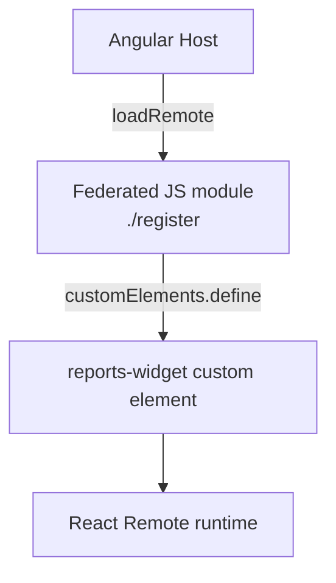

Example exposed module:

```tsx
// React remote: src/register-reports-widget.tsx
import React from 'react';
import { createRoot, Root } from 'react-dom/client';
import { ReportsPanel } from './ReportsPanel';

class ReportsWidgetElement extends HTMLElement {
  private root?: Root;

  connectedCallback() {
    this.root = createRoot(this);
    this.root.render(<ReportsPanel userId={this.getAttribute('user-id') ?? ''} />);
  }

  disconnectedCallback() {
    this.root?.unmount();
  }
}

export function registerReportsWidget() {
  if (!customElements.get('reports-widget')) {
    customElements.define('reports-widget', ReportsWidgetElement);
  }
}
```

Angular host wrapper:

```ts
import { Component, CUSTOM_ELEMENTS_SCHEMA, OnInit } from '@angular/core';
import { loadRemote } from '../federation-loader';

@Component({
  selector: 'app-reports-route',
  standalone: true,
  schemas: [CUSTOM_ELEMENTS_SCHEMA],
  template: '<reports-widget user-id="123"></reports-widget>',
})
export class ReportsRoute implements OnInit {
  async ngOnInit() {
    const remote = await loadRemote<{ registerReportsWidget: () => void }>(
      'reports_app',
      './register',
    );
    remote.registerReportsWidget();
  }
}
```

Data passing:

- Attributes for strings and simple values.
- DOM properties for objects.
- Custom events for output.
- Backend APIs for authoritative data.

Framework runtimes:

- Do not share Angular with React.
- React remote may share `react` and `react-dom` with other React remotes if compatible.
- Angular host should continue sharing Angular only with Angular remotes.

Advantages:

- Lets a React team deliver a feature into an Angular shell.
- Keeps framework lifecycles separate.

Limitations:

- Extra wrapper code.
- Styling isolation must be planned.
- React lifecycle is not managed by Angular unless the wrapper cleans it up.

Current repository example:

```text
shell-app HomePage
  -> ProductSpotlightRemoteComponent
    -> loadRemoteFromEntry('http://localhost:4203/remoteEntry.json', 'product_spotlight_app', './register')
      -> product-spotlight-app/src/remote/register.ts
        -> customElements.define('product-spotlight-widget', React-backed element)
```

The React remote exposes a JavaScript module:

```js
// product-spotlight-app/federation.config.mjs
export default withNativeFederation({
  name: 'product_spotlight_app',
  exposes: {
    './register': './src/remote/register.ts',
  },
  shared: {},
});
```

The app is organized by responsibility:

```text
product-spotlight-app/src/
  remote/
    register.ts
    product-spotlight-element.tsx
  features/product-spotlight/
    product-spotlight.tsx
    product-spotlight.styles.ts
    product-spotlight.types.ts
    product-spotlight.utils.ts
    api/product-spotlight.api.ts
  main.tsx
```

Why this structure is used:

| File or folder | Responsibility |
| --- | --- |
| `src/remote/register.ts` | Native Federation exposed module; registers `<product-spotlight-widget>`. |
| `src/remote/product-spotlight-element.tsx` | Web Component lifecycle, Shadow DOM setup, React root mount/unmount, DOM events to Angular. |
| `src/features/product-spotlight/product-spotlight.tsx` | React UI and hooks for loading/rendering spotlight products. |
| `src/features/product-spotlight/api/product-spotlight.api.ts` | Public product API request logic. |
| `src/features/product-spotlight/product-spotlight.types.ts` | API and UI data contracts. |
| `src/features/product-spotlight/product-spotlight.utils.ts` | Pure formatting and selection helpers such as best deal, image URL, and money formatting. |
| `src/features/product-spotlight/product-spotlight.styles.ts` | Shadow-DOM-local CSS string rendered with the React widget. |
| `src/main.tsx` | Standalone preview bootstrap; imports the registration module so the widget can be viewed outside Angular. |

The old root files `src/register.tsx`, `src/ProductSpotlight.tsx`, `src/api.ts`, and `src/types.ts` are compatibility facades. New code should use the structured `remote/` and `features/product-spotlight/` paths.

The Angular shell loads that module from the wrapper component:

```ts
const remote = await loadRemoteFromEntry<ProductSpotlightRegisterModule>(
  environment.productSpotlightRemoteEntry,
  'product_spotlight_app',
  './register',
);

remote.registerProductSpotlightElement();
```

The custom element sends DOM events back to Angular:

```ts
this.dispatchEvent(
  new CustomEvent('product-spotlight-select', {
    bubbles: true,
    composed: true,
    detail: { id: product.id, slug: product.slug, name: product.name },
  }),
);
```

The Angular wrapper listens to the event and navigates with Angular Router. React does not know about Angular Router, and Angular does not know about React components.

The React remote uses the existing backend product API:

```text
GET http://localhost:3000/api/v1/products?limit=6&sortBy=price&sortOrder=asc&inStock=true
```

React dependencies are not shared with the Angular apps in this example. The remote bundles its own `react` and `react-dom` because it is the only React app in this repository.

#### 7.1.1 React Widget Inside an Angular Page

Use this when the React remote is only part of an Angular page, such as the current product spotlight on the shell home page.

Current repository flow:

```text
/                         Angular shell home route
  -> HomePage             Angular page component
    -> ProductSpotlightRemoteComponent
      -> loads product_spotlight_app ./register
      -> renders <product-spotlight-widget>
```

The Angular route remains local:

```ts
{
  path: '',
  loadComponent: () => import('./features/home/home.page').then((m) => m.HomePage),
}
```

The home page imports the Angular wrapper component:

```ts
@Component({
  standalone: true,
  imports: [RouterLink, MoneyPipe, ProductSpotlightRemoteComponent],
})
export class HomePage {}
```

The wrapper is responsible for Native Federation loading, Web Component registration, event listeners, and Angular Router navigation.

#### 7.1.2 React Remote as a Full Angular Route

Use this when a React feature should behave like a full page inside the Angular shell and should have its own browser URL, for example:

```text
/price-lens
/price-lens/search/:query
/reports
/recommendations
```

For a full-page React remote, prefer a framework-neutral mount API:

```ts
mount(element: HTMLElement, options?: MountOptions): { unmount: () => void }
```

Do not expose React components or React Router route objects directly to Angular. Angular Router cannot render React elements. The host should create an Angular route that renders a small wrapper component, and that wrapper should mount React into a normal DOM element.

Recommended ownership split:

| Concern | Owner |
| --- | --- |
| Top-level shell layout | Angular host |
| Header, footer, auth shell, app navigation | Angular host |
| Top-level route prefix such as `/price-lens` | Angular host |
| React feature UI and internal state | React remote |
| React child routes below the prefix | React remote |
| API calls for the React feature | React remote or its backend client |
| Authoritative business logic | Backend |
| Remote loading fallback | Angular wrapper |
| Remote unmount cleanup | Angular wrapper |

High-level flow:

```text
Browser opens /react-feature
  -> Angular Router matches /react-feature
    -> Angular wrapper component loads remote ./mount
      -> remote.mount(outletElement, { routeBasePath: '/react-feature' })
        -> React createRoot(outletElement)
          -> React BrowserRouter basename="/react-feature"
            -> React AppRoutes renders feature pages
```

##### Create The React Remote App

Create the React app as an independent app. It must run standalone and must also expose a Native Federation module.

Minimum useful packages:

```bash
npm install react react-dom react-router-dom
npm install -D vite typescript @vitejs/plugin-react esbuild
npm install @softarc/native-federation @softarc/native-federation-esbuild
npm install -D @types/react @types/react-dom
```

Recommended quality packages:

```bash
npm install -D eslint typescript-eslint eslint-plugin-react-hooks eslint-plugin-react-refresh
```

Use `react-router-dom` when the remote has more than one internal view. Keep data fetching simple at first with `fetch`; add TanStack Query only when you need caching, retries, request deduplication, pagination, or background refresh.

Suggested file structure:

```text
react-feature-app/
  federation.config.mjs
  index.html
  package.json
  scripts/
    build.mjs
  src/
    App.tsx
    App.css
    api.ts
    config.ts
    index.css
    main.tsx
    mount.tsx
    routes/
      AppRoutes.tsx
    pages/
      FeatureHomePage.tsx
      FeatureDetailPage.tsx
    types.ts
```

The React remote should be usable in two modes:

```text
Standalone mode:
  browser -> http://localhost:4204/
  src/main.tsx renders the app into #root

Federated mode:
  Angular shell -> loadRemote(remoteName, './mount')
  src/mount.tsx renders the app into an Angular-owned DOM element
```

##### Configure Native Federation In The React Remote

Remote config:

```js
// react-feature-app/federation.config.mjs
import { withNativeFederation } from '@softarc/native-federation/config';

export default withNativeFederation({
  name: 'react_feature_app',

  exposes: {
    './mount': './src/mount.tsx',
  },

  shared: {},

  skip: [],

  features: {
    denseChunking: true,
  },
});
```

For an Angular host and React remote, keep `shared: {}` unless there is another React app intentionally sharing the exact same React runtime. Angular should not share Angular packages with React. React should not depend on Angular services, injectors, route objects, or components.

The exposed module key and host loading key must match exactly:

```text
Remote name in federation.config.mjs: react_feature_app
Host manifest key:                    react_feature_app
Host loadRemote name:                 react_feature_app

Remote exposes key:                   ./mount
Host loadRemote exposed module:       ./mount
```

##### Add A Mount API

The mount API is the boundary between Angular and React.

```tsx
// react-feature-app/src/mount.tsx
import { StrictMode } from 'react';
import { createRoot, type Root } from 'react-dom/client';
import { BrowserRouter } from 'react-router-dom';
import App from './App';
import './index.css';

export interface ReactFeatureMountOptions {
  routeBasePath?: string;
}

const styleId = 'react-feature-app-styles';

function ensureRemoteStylesheet(): void {
  if (document.getElementById(styleId)) return;

  const stylesheet = document.createElement('link');
  stylesheet.id = styleId;
  stylesheet.rel = 'stylesheet';
  stylesheet.href = new URL('./mount.css', import.meta.url).toString();
  document.head.appendChild(stylesheet);
}

export function mount(element: HTMLElement, options: ReactFeatureMountOptions = {}) {
  ensureRemoteStylesheet();

  const root: Root = createRoot(element);

  root.render(
    <StrictMode>
      <BrowserRouter basename={options.routeBasePath ?? '/react-feature'}>
        <App />
      </BrowserRouter>
    </StrictMode>,
  );

  return {
    unmount: () => root.unmount(),
  };
}
```

Always return an `unmount` function. Angular destroys and recreates route components during navigation. If the wrapper does not call `unmount`, React event handlers, timers, and subscriptions can leak.

The stylesheet injection is also important. Native Federation can load `mount.js` without automatically attaching the generated `mount.css`. If that happens, the React app renders in the host as plain HTML. Loading `mount.css` from `import.meta.url` makes the CSS work from localhost and from a deployed remote URL.

##### Add Standalone React Bootstrap

Standalone bootstrap is separate from federated mounting:

```tsx
// react-feature-app/src/main.tsx
import { createRoot } from 'react-dom/client';
import { BrowserRouter } from 'react-router-dom';
import './index.css';
import App from './App';

createRoot(document.getElementById('root')!).render(
  <BrowserRouter>
    <App />
  </BrowserRouter>,
);
```

Do not put the host route basename in standalone `main.tsx`. The basename belongs in `mount.tsx`, because only the host knows where the remote is mounted.

Common result if this is wrong:

```text
Opening http://localhost:4204/ shows a blank page because BrowserRouter basename="/react-feature" does not match "/".
```

##### Add React Routes

Use normal React Router routes inside the remote:

```tsx
// react-feature-app/src/routes/AppRoutes.tsx
import { Navigate, Route, Routes } from 'react-router-dom';
import FeatureHomePage from '../pages/FeatureHomePage';
import FeatureDetailPage from '../pages/FeatureDetailPage';

export default function AppRoutes() {
  return (
    <Routes>
      <Route path="/" element={<FeatureHomePage />} />
      <Route path="/details/:id" element={<FeatureDetailPage />} />
      <Route path="/react-feature" element={<FeatureHomePage />} />
      <Route path="/react-feature/details/:id" element={<FeatureDetailPage />} />
      <Route path="*" element={<Navigate to="/" replace />} />
    </Routes>
  );
}
```

Why include both route shapes:

```text
Embedded in Angular:
  Browser URL: /react-feature/details/123
  React basename: /react-feature
  React route sees: /details/123

Standalone preview:
  Browser URL: /react-feature/details/123
  No basename
  React route sees: /react-feature/details/123
```

For a production standalone deployment, you can instead configure the web server and app basename consistently. For local MFE development, supporting both shapes prevents blank routes.

##### Build The React Remote

React/Vite does not use the Angular Native Federation builder. Use a small build script that creates:

- `dist/remoteEntry.json`
- `dist/mount.js`
- `dist/mount.css`
- `dist/assets/main.js`
- `dist/assets/main.css`
- `dist/index.html`

Recommended `package.json` scripts:

```json
{
  "scripts": {
    "start": "npm run dev",
    "dev": "npm run build:dev && vite preview --port 4204",
    "dev:4204": "npm run build:dev && vite preview --port 4204",
    "build": "node scripts/build.mjs --prod",
    "build:dev": "node scripts/build.mjs",
    "lint": "eslint .",
    "preview": "vite preview",
    "typecheck": "tsc --noEmit"
  }
}
```

The build script should initialize the Native Federation esbuild adapter and use the automatic JSX runtime:

```js
// react-feature-app/scripts/build.mjs
import { mkdir, rm, copyFile, writeFile } from 'node:fs/promises';
import path from 'node:path';
import { fileURLToPath } from 'node:url';
import * as esbuild from 'esbuild';
import { federationBuilder } from '@softarc/native-federation/build';
import { createEsBuildAdapter } from '@softarc/native-federation-esbuild';
import { reactReplacements } from '@softarc/native-federation-esbuild/frameworks/react';

const root = path.resolve(path.dirname(fileURLToPath(import.meta.url)), '..');
const dist = path.join(root, 'dist');
const prod = process.argv.includes('--prod');
const apiBaseUrl = process.env.VITE_REACT_FEATURE_API_BASE_URL ?? 'http://localhost:3000/api/v1';
const define = {
  __REACT_FEATURE_API_BASE_URL__: JSON.stringify(apiBaseUrl),
};

await rm(dist, { recursive: true, force: true });
await mkdir(path.join(dist, 'assets'), { recursive: true });
await copyFile(path.join(root, 'public/favicon.svg'), path.join(dist, 'favicon.svg'));

await federationBuilder.init({
  options: {
    workspaceRoot: root,
    outputPath: 'dist',
    tsConfig: 'tsconfig.app.json',
    federationConfig: 'federation.config.mjs',
    verbose: false,
    dev: !prod,
  },
  adapter: createEsBuildAdapter({
    plugins: [],
    fileReplacements: prod ? reactReplacements.prod : reactReplacements.dev,
    define,
  }),
});

await esbuild.build({
  entryPoints: [path.join(root, 'src/main.tsx')],
  bundle: true,
  format: 'esm',
  target: 'es2022',
  platform: 'browser',
  tsconfig: path.join(root, 'tsconfig.app.json'),
  jsx: 'automatic',
  define,
  sourcemap: !prod,
  minify: prod,
  outdir: path.join(dist, 'assets'),
  loader: {
    '.css': 'css',
    '.svg': 'file',
    '.png': 'file',
    '.jpg': 'file',
    '.jpeg': 'file',
    '.webp': 'file',
  },
});

await writeFile(
  path.join(dist, 'index.html'),
  `<!doctype html>
<html lang="en">
  <head>
    <meta charset="UTF-8" />
    <link rel="icon" type="image/svg+xml" href="/favicon.svg" />
    <meta name="viewport" content="width=device-width, initial-scale=1.0" />
    <title>React Feature App</title>
    <link rel="stylesheet" href="/assets/main.css" />
  </head>
  <body>
    <div id="root"></div>
    <script type="module" src="/assets/main.js"></script>
  </body>
</html>
`,
);

await federationBuilder.build();
await federationBuilder.close();
```

The `jsx: 'automatic'` setting prevents this runtime error:

```text
ReferenceError: React is not defined
```

That error happens when the build emits classic JSX calls but the generated module does not have a `React` binding in scope.

##### Configure API And Environment Values

Do not read `import.meta.env` directly inside the federated module if the module can be executed outside Vite's normal app runtime. Use a build-time define constant:

```ts
// react-feature-app/src/config.ts
declare const __REACT_FEATURE_API_BASE_URL__: string | undefined;

const configuredApiBaseUrl =
  typeof __REACT_FEATURE_API_BASE_URL__ === 'string' && __REACT_FEATURE_API_BASE_URL__.length > 0
    ? __REACT_FEATURE_API_BASE_URL__
    : undefined;

export const REACT_FEATURE_API_BASE_URL = configuredApiBaseUrl ?? 'http://localhost:3000/api/v1';
```

This avoids:

```text
Cannot read properties of undefined (reading 'VITE_SOME_VALUE')
```

The React remote should own feature-specific API calls. The Angular shell can pass route base paths or stable user/session context, but it should not be required to pass every feature configuration value unless that is the explicit host-remote contract.

##### Style The React Remote For An Angular Host

A full-page remote should match the host theme, but keep its CSS scoped:

```css
/* react-feature-app/src/index.css */
:root {
  --react-feature-text: var(--color-text-secondary, #475569);
  --react-feature-heading: var(--color-text-primary, #10201d);
  --react-feature-surface: var(--color-surface, #ffffff);
  --react-feature-border: var(--color-border, #d7e1dc);
  --react-feature-primary: var(--color-primary, #12473f);
  --react-feature-primary-hover: var(--color-primary-hover, #0b332e);
  --react-feature-radius-md: var(--radius-md, 0.5rem);
  --react-feature-shadow: var(--shadow-sm, 0 8px 24px rgba(15, 23, 42, 0.06));
}

body {
  margin: 0;
}
```

```css
/* react-feature-app/src/App.css */
.react-feature {
  color: var(--react-feature-text);
  font-family: Inter, ui-sans-serif, system-ui, sans-serif;
}

.react-feature * {
  box-sizing: border-box;
}

.react-feature .panel {
  border: 1px solid var(--react-feature-border);
  border-radius: var(--react-feature-radius-md);
  background: var(--react-feature-surface);
  box-shadow: var(--react-feature-shadow);
}
```

Avoid these in remote CSS because they can damage the Angular host:

```css
/* Avoid in remote CSS */
#root {
  min-height: 100vh;
}

body {
  display: grid;
  place-items: center;
}

:root {
  color-scheme: light dark;
}

@media (prefers-color-scheme: dark) {
  :root {
    /* overriding host tokens here can change the whole shell */
  }
}
```

Remote CSS rules should mostly live under one app class such as `.react-feature` or `.price-lens`. Use host CSS variables as inputs, then map them to remote-specific variables.

##### Add The Remote To The Angular Host Manifest

Add the remote entry URL to the shell manifest:

```json
// shell-app/public/assets/federation.manifest.json
{
  "auth_app": "http://localhost:4201/remoteEntry.json",
  "admin_app": "http://localhost:4202/remoteEntry.json",
  "price_lens_product_app": "http://localhost:4204/remoteEntry.json",
  "react_feature_app": "http://localhost:4205/remoteEntry.json"
}
```

Only hosts need a manifest. A pure React remote that does not load other remotes does not need `public/assets/federation.manifest.json`.

##### Add The Angular Wrapper Component

The Angular wrapper should be small. Its job is only to load the remote, mount React, show a fallback if loading fails, and unmount React on destroy.

```ts
// shell-app/src/app/features/react-feature/react-feature-remote.component.ts
import { AfterViewInit, Component, ElementRef, OnDestroy, ViewChild } from '@angular/core';
import { loadRemote } from '../../../federation-loader';

type ReactFeatureRemoteModule = {
  mount: (
    element: HTMLElement,
    options?: { routeBasePath?: string },
  ) => { unmount: () => void };
};

@Component({
  selector: 'app-react-feature-remote',
  standalone: true,
  template: `
    <section class="react-feature-shell">
      @if (loadError) {
        <div class="remote-error">
          <h1>Feature unavailable</h1>
          <p>The remote application could not be loaded.</p>
        </div>
      }

      <div #outlet class="react-feature-shell__outlet"></div>
    </section>
  `,
  styles: [
    `
      :host {
        display: block;
      }

      .react-feature-shell {
        min-height: calc(100dvh - 12rem);
      }

      .react-feature-shell__outlet {
        min-height: 100%;
      }

      .remote-error {
        border: 1px solid var(--color-danger-border, #f5b5ae);
        border-radius: var(--radius-md, 0.5rem);
        background: var(--color-danger-surface, #fff8f7);
        color: var(--color-text-primary, #111827);
        padding: 1rem;
      }
    `,
  ],
})
export class ReactFeatureRemoteComponent implements AfterViewInit, OnDestroy {
  @ViewChild('outlet', { static: true })
  private readonly outlet!: ElementRef<HTMLElement>;

  protected loadError = false;
  private remoteRoot?: { unmount: () => void };

  async ngAfterViewInit(): Promise<void> {
    try {
      const remote = await loadRemote<ReactFeatureRemoteModule>('react_feature_app', './mount');

      this.remoteRoot = remote.mount(this.outlet.nativeElement, {
        routeBasePath: '/react-feature',
      });
    } catch (error) {
      console.error(error);
      this.loadError = true;
    }
  }

  ngOnDestroy(): void {
    this.remoteRoot?.unmount();
  }
}
```

Use `loadRemote(...)` when the remote is in the startup manifest. Use `loadRemoteFromEntry(...)` when the remote is optional and should be loaded from an environment URL instead of the manifest.

##### Add Angular Routes

The host must declare every top-level URL that should render the wrapper:

```ts
// shell-app/src/app/app.routes.ts
{
  path: 'react-feature',
  loadComponent: () =>
    import('./features/react-feature/react-feature-remote.component').then(
      (m) => m.ReactFeatureRemoteComponent,
    ),
},
{
  path: 'react-feature/details/:id',
  loadComponent: () =>
    import('./features/react-feature/react-feature-remote.component').then(
      (m) => m.ReactFeatureRemoteComponent,
    ),
}
```

Angular owns these route entries so browser refresh works. React owns the child view that renders after the route is matched.

##### Add Navigation

Use Angular navigation for links that live in the Angular shell:

```html
<a routerLink="/react-feature" routerLinkActive="active">React Feature</a>
```

Use React Router navigation for links inside the React remote:

```tsx
import { Link } from 'react-router-dom';

export function FeatureLink() {
  return <Link to="/details/123">View detail</Link>;
}
```

Do not import Angular Router into React. Do not import React Router into Angular.

##### Communication Between Angular And React

Use the smallest stable contract:

| Need | Recommended contract |
| --- | --- |
| Initial route prefix | `mount(element, { routeBasePath })` |
| Initial primitive values | Mount options or URL params |
| Complex state | Backend API or a versioned plain TypeScript contract |
| React tells Angular something happened | `CustomEvent` from the mount element |
| Angular tells React something changed after mount | Explicit method returned from `mount`, or remount with new options |
| Authentication | Shared backend token/cookie strategy, not shared Angular services |

Example event:

```tsx
element.dispatchEvent(
  new CustomEvent('react-feature-selected', {
    bubbles: true,
    composed: true,
    detail: { id: '123' },
  }),
);
```

Angular can listen on the outlet element and navigate with Angular Router.

##### What To Focus On

Focus on these before adding more features:

- The remote can run standalone.
- The remote can mount in the Angular host.
- `remoteEntry.json`, `mount.js`, and `mount.css` are reachable.
- The route basename is correct in host mode and absent or compatible in standalone mode.
- The mount API returns cleanup.
- Styling is scoped and maps to host CSS variables.
- API configuration is owned by the remote or explicitly passed through a stable mount contract.
- No Angular-specific code exists inside the React app.
- No React-specific code leaks into Angular beyond the wrapper.
- Errors show a user-facing fallback in the Angular wrapper.
- Production deployment publishes all generated remote files together.

Add libraries only when the feature needs them:

| Need | Suggested library |
| --- | --- |
| Internal routing | `react-router-dom` |
| Server-state caching | `@tanstack/react-query` |
| Forms | React controlled inputs first; `react-hook-form` for complex forms |
| Schema validation | `zod` |
| Tables | Native table first; TanStack Table for sorting, column control, virtualization |
| Charts | `recharts` or `echarts` |
| Icons | `lucide-react` |
| Dates | `date-fns` |
| Unit tests | `vitest`, `@testing-library/react`, `@testing-library/user-event` |
| Browser tests | `playwright` |

Do not add Redux, Zustand, query libraries, table libraries, or component kits by default. Federation already adds integration complexity; keep the remote's runtime small until a real feature requirement justifies more dependencies.

##### Development And Verification

Run the backend first if the React remote needs API data:

```bash
cd backend/ecommerce-api
npm run start:dev
```

Run the React remote:

```bash
cd frontend/native-federation/react-feature-app
npm run dev:4204
```

Run the Angular host:

```bash
cd frontend/native-federation/shell-app
npm start
```

Verify these URLs:

```text
http://localhost:4204/
http://localhost:4204/remoteEntry.json
http://localhost:4204/mount.js
http://localhost:4204/mount.css
http://localhost:4200/assets/federation.manifest.json
http://localhost:4200/react-feature
```

Run checks before committing:

```bash
cd frontend/native-federation/react-feature-app
npm run typecheck
npm run lint
npm run build:dev

cd ../shell-app
npx tsc -p tsconfig.app.json --noEmit
```

##### Production Checklist

Before production:

```text
1. Build the React remote with production API/environment values.
2. Deploy remoteEntry.json, mount.js, mount.css, and all referenced assets together.
3. Configure CDN/server cache headers:
   remoteEntry.json -> short cache or revalidate
   mount.js/mount.css/assets -> long cache only if filenames are versioned
4. Update the host manifest to the deployed remoteEntry.json.
5. Keep old remote deployments available during host rollout.
6. Verify direct remote URLs and host route URLs.
7. Monitor remote load failures and API failures separately.
```

##### Troubleshooting

| Problem | Usual cause | Fix |
| --- | --- | --- |
| Host route is blank | React route basename or Angular route prefix mismatch | Pass `routeBasePath` from Angular and make React routes relative to it |
| Standalone remote is blank at `/` | Standalone `main.tsx` uses host-only basename | Remove basename from standalone bootstrap |
| UI renders as plain HTML in host | Remote CSS was not loaded | Inject generated `mount.css` in `mount.tsx` |
| `React is not defined` | Build emitted classic JSX runtime | Use `jsx: 'automatic'` in esbuild |
| `Cannot read import.meta.env...` | Federated module evaluated Vite env access outside Vite runtime | Use build-time `define` constants |
| `remoteEntry.json` 404 | Remote is not running or manifest URL is wrong | Start remote and verify manifest URL |
| Exposed module missing | `exposes` key and `loadRemote` key do not match | Match `./mount` exactly |
| Styles break the Angular shell | Remote CSS uses global `body`, `#root`, or broad `:root` overrides | Scope CSS under a remote root class and map host variables |
| Navigation changes full page unexpectedly | React uses absolute links outside its basename or plain `<a>` for internal routes | Use React Router `Link` inside the remote |
| Memory leak after navigating away | Angular wrapper does not call React unmount | Call `remoteRoot.unmount()` in `ngOnDestroy` |

Shell route:

```ts
// shell-app/src/app/app.routes.ts
{
  path: 'spotlight',
  loadComponent: () =>
    import('./features/product-spotlight/product-spotlight-page.component').then(
      (m) => m.ProductSpotlightPageComponent,
    ),
}
```

Angular page wrapper:

```ts
// shell-app/src/app/features/product-spotlight/product-spotlight-page.component.ts
import { CUSTOM_ELEMENTS_SCHEMA, Component, ElementRef, OnDestroy, OnInit, ViewChild, inject } from '@angular/core';
import { Router } from '@angular/router';
import { environment } from '../../../environments/environment';
import { loadRemoteFromEntry } from '../../../federation-loader';

type ProductSpotlightRegisterModule = {
  registerProductSpotlightElement: (tagName?: string) => void;
};

@Component({
  standalone: true,
  schemas: [CUSTOM_ELEMENTS_SCHEMA],
  template: `
    <main class="page-shell">
      <product-spotlight-widget
        #widget
        [attr.api-base-url]="apiBaseUrl"
        heading="Product deals from a React remote"
        product-url-prefix="/products"
      ></product-spotlight-widget>
    </main>
  `,
})
export class ProductSpotlightPageComponent implements OnInit, OnDestroy {
  @ViewChild('widget') private widget?: ElementRef<HTMLElement>;

  readonly apiBaseUrl = environment.apiBaseUrl;
  private readonly router = inject(Router);
  private removeSelectListener?: () => void;
  private removeViewAllListener?: () => void;

  async ngOnInit(): Promise<void> {
    const remote = await loadRemoteFromEntry<ProductSpotlightRegisterModule>(
      environment.productSpotlightRemoteEntry,
      'product_spotlight_app',
      './register',
    );

    remote.registerProductSpotlightElement();
    queueMicrotask(() => this.listenToWidget());
  }

  ngOnDestroy(): void {
    this.removeSelectListener?.();
    this.removeViewAllListener?.();
  }

  private listenToWidget(): void {
    const element = this.widget?.nativeElement;
    if (!element) return;

    const handleSelect = (event: Event) => {
      const detail = (event as CustomEvent<{ slug?: string }>).detail;
      if (detail?.slug) {
        void this.router.navigate(['/products', detail.slug]);
      }
    };

    const handleViewAll = () => {
      void this.router.navigate(['/products']);
    };

    element.addEventListener('product-spotlight-select', handleSelect);
    element.addEventListener('product-spotlight-view-all', handleViewAll);

    this.removeSelectListener = () => element.removeEventListener('product-spotlight-select', handleSelect);
    this.removeViewAllListener = () => element.removeEventListener('product-spotlight-view-all', handleViewAll);
  }
}
```

Navigation then works like any other Angular route:

```html
<a routerLink="/spotlight">Product spotlight</a>
```

Or programmatically:

```ts
void this.router.navigate(['/spotlight']);
```

If the React remote has its own internal views, keep them inside the custom element or express the state in the URL as Angular route parameters or query parameters:

```ts
{
  path: 'spotlight/:slug',
  loadComponent: () =>
    import('./features/product-spotlight/product-spotlight-page.component').then(
      (m) => m.ProductSpotlightPageComponent,
    ),
}
```

The Angular wrapper can read route params and pass them to the Web Component as attributes or properties. React can update its internal UI, but Angular remains the owner of browser URL navigation.

#### 7.1.3 Price Lens React Remote Setup

`price-lens-product-app` is the repository's route-level React remote that is embedded in the Angular shell through a mount API.

Use this pattern when the React feature is a full application area with its own internal React Router pages, but the Angular shell still owns the top-level URL and navigation.

Current Price Lens flow:

```text
Browser URL
  /price-lens
  /price-lens/search/:query

Angular shell
  -> shell-app/src/app/app.routes.ts
    -> PriceLensRemoteComponent
      -> loadRemote('price_lens_product_app', './mount')
        -> price-lens-product-app/src/mount.tsx
          -> React createRoot(outlet)
          -> BrowserRouter basename="/price-lens"
          -> AppRoutes
```

Remote federation config:

```js
// price-lens-product-app/federation.config.mjs
import { withNativeFederation } from '@softarc/native-federation/config';

export default withNativeFederation({
  name: 'price_lens_product_app',

  exposes: {
    './mount': './src/mount.tsx',
  },

  shared: {},

  skip: [],

  features: {
    denseChunking: true,
  },
});
```

The exposed module must export a stable mount contract:

```tsx
// price-lens-product-app/src/mount.tsx
import { StrictMode } from 'react';
import { createRoot, type Root } from 'react-dom/client';
import { BrowserRouter } from 'react-router-dom';
import App from './App';
import './index.css';

export interface PriceLensMountOptions {
  routeBasePath?: string;
}

const styleId = 'price-lens-product-app-styles';

function ensureRemoteStylesheet(): void {
  if (document.getElementById(styleId)) return;

  const stylesheet = document.createElement('link');
  stylesheet.id = styleId;
  stylesheet.rel = 'stylesheet';
  stylesheet.href = new URL('./mount.css', import.meta.url).toString();
  document.head.appendChild(stylesheet);
}

export function mount(element: HTMLElement, options: PriceLensMountOptions = {}) {
  ensureRemoteStylesheet();

  const root: Root = createRoot(element);

  root.render(
    <StrictMode>
      <BrowserRouter basename={options.routeBasePath ?? '/price-lens'}>
        <App />
      </BrowserRouter>
    </StrictMode>,
  );

  return {
    unmount: () => root.unmount(),
  };
}
```

The CSS loader is important. The Native Federation JavaScript module can render in the host even when its generated CSS is not automatically attached. If `mount.css` is missing from the host page, the UI looks like plain HTML: unstyled buttons, collapsed spacing, no cards, and raw table layout. Loading `mount.css` from `import.meta.url` keeps the CSS tied to the deployed remote location.

The Angular host wrapper owns loading and cleanup:

```ts
// shell-app/src/app/features/price-lens/price-lens-remote.component.ts
import { AfterViewInit, Component, ElementRef, OnDestroy, ViewChild } from '@angular/core';
import { loadRemote } from '../../../federation-loader';

type PriceLensRemoteModule = {
  mount: (
    element: HTMLElement,
    options?: { routeBasePath?: string },
  ) => { unmount: () => void };
};

@Component({
  selector: 'app-price-lens-remote',
  standalone: true,
  template: `
    <section class="price-lens-shell">
      <div #outlet class="price-lens-shell__outlet"></div>
    </section>
  `,
})
export class PriceLensRemoteComponent implements AfterViewInit, OnDestroy {
  @ViewChild('outlet', { static: true })
  private readonly outlet!: ElementRef<HTMLElement>;

  private remoteRoot?: { unmount: () => void };

  async ngAfterViewInit(): Promise<void> {
    const remote = await loadRemote<PriceLensRemoteModule>('price_lens_product_app', './mount');

    this.remoteRoot = remote.mount(this.outlet.nativeElement, {
      routeBasePath: '/price-lens',
    });
  }

  ngOnDestroy(): void {
    this.remoteRoot?.unmount();
  }
}
```

The shell routes mount the same Angular wrapper for the base page and the search page:

```ts
// shell-app/src/app/app.routes.ts
{
  path: 'price-lens',
  loadComponent: () =>
    import('./features/price-lens/price-lens-remote.component').then(
      (m) => m.PriceLensRemoteComponent,
    ),
},
{
  path: 'price-lens/search/:query',
  loadComponent: () =>
    import('./features/price-lens/price-lens-remote.component').then(
      (m) => m.PriceLensRemoteComponent,
    ),
}
```

Inside the React remote, use React Router normally:

```tsx
// price-lens-product-app/src/routes/AppRoutes.tsx
import { Navigate, Route, Routes } from 'react-router-dom';
import PriceLensPage from '../pages/PriceLensPage';

export default function AppRoutes() {
  return (
    <Routes>
      <Route path="/" element={<PriceLensPage />} />
      <Route path="/search/:query" element={<PriceLensPage />} />
      <Route path="/price-lens" element={<PriceLensPage />} />
      <Route path="/price-lens/search/:query" element={<PriceLensPage />} />
      <Route path="*" element={<Navigate to="/" replace />} />
    </Routes>
  );
}
```

The duplicate `/price-lens` route entries are for standalone preview compatibility. In the host, React sees routes relative to the basename `/price-lens`. Standalone mode has no basename so direct links such as `http://localhost:4204/price-lens/search/iphone%2015` still work.

Standalone React bootstrap must not force the `/price-lens` basename:

```tsx
// price-lens-product-app/src/main.tsx
import { createRoot } from 'react-dom/client';
import { BrowserRouter } from 'react-router-dom';
import './index.css';
import App from './App';

createRoot(document.getElementById('root')!).render(
  <BrowserRouter>
    <App />
  </BrowserRouter>,
);
```

If standalone `main.tsx` uses `basename="/price-lens"`, opening `http://localhost:4204/` can render a blank page because the current URL does not match the router basename.

Price Lens owns its API configuration. The shell should not pass `apiBaseUrl` or `productId` for this feature:

```ts
// price-lens-product-app/src/config.ts
declare const __PRICE_LENS_API_BASE_URL__: string | undefined;

const configuredApiBaseUrl =
  typeof __PRICE_LENS_API_BASE_URL__ === 'string' && __PRICE_LENS_API_BASE_URL__.length > 0
    ? __PRICE_LENS_API_BASE_URL__
    : undefined;

export const PRICE_LENS_API_BASE_URL = configuredApiBaseUrl ?? 'http://localhost:3000/api/v1';
```

The API client searches by product name:

```ts
// price-lens-product-app/src/api.ts
export async function searchProductComparison(apiBaseUrl: string, query: string) {
  const baseUrl = apiBaseUrl.replace(/\/$/, '');
  const params = new URLSearchParams({ query });
  const response = await fetch(`${baseUrl}/product-comparison/search/items?${params.toString()}`, {
    headers: { Accept: 'application/json' },
  });

  if (!response.ok) {
    throw new Error(`Product search API returned ${response.status}`);
  }

  const body = await response.json();
  return body.data;
}
```

The backend route is:

```text
GET http://localhost:3000/api/v1/product-comparison/search/items?query=<product-name>
```

The backend returns source-local prices plus normalized `USD` and `NPR` values. Direct live scraping of Amazon, Flipkart, Daraz, and similar marketplaces should be implemented behind backend adapters using official APIs, affiliate APIs, feeds, or a scraping provider. Do not scrape from the browser remote and do not put retailer credentials in frontend code.

Build setup for this React remote is intentionally different from Angular remotes. The app uses `scripts/build.mjs` to run Native Federation's esbuild adapter and also create a standalone Vite preview bundle:

```js
// price-lens-product-app/scripts/build.mjs
await federationBuilder.init({
  options: {
    workspaceRoot: root,
    outputPath: 'dist',
    tsConfig: 'tsconfig.app.json',
    federationConfig: 'federation.config.mjs',
    verbose: false,
    dev: !prod,
  },
  adapter: createEsBuildAdapter({
    plugins: [],
    fileReplacements: prod ? reactReplacements.prod : reactReplacements.dev,
    define,
  }),
});
```

Use automatic JSX transform in the build. Without it, the generated remote can throw `ReferenceError: React is not defined` when Angular loads the federated module:

```js
await esbuild.build({
  entryPoints: [path.join(root, 'src/main.tsx')],
  bundle: true,
  format: 'esm',
  target: 'es2022',
  platform: 'browser',
  tsconfig: path.join(root, 'tsconfig.app.json'),
  jsx: 'automatic',
  define,
  outdir: path.join(dist, 'assets'),
});
```

Development commands:

```bash
cd frontend/native-federation/price-lens-product-app
npm install
npm run dev:4204
```

Expected local URLs:

```text
http://localhost:4204/
http://localhost:4204/price-lens
http://localhost:4204/price-lens/search/iphone%2015
http://localhost:4204/remoteEntry.json
```

Host manifest entry:

```json
{
  "price_lens_product_app": "http://localhost:4204/remoteEntry.json"
}
```

Production deployment checklist for the React mount remote:

```text
1. Build with npm run build.
2. Deploy dist/remoteEntry.json.
3. Deploy dist/mount.js and dist/mount.css together.
4. Deploy dist/assets/* for standalone preview if needed.
5. Set VITE_PRICE_LENS_API_BASE_URL at build time for the target backend.
6. Update the shell manifest to the deployed remoteEntry.json URL.
7. Keep mount(element, options) backward-compatible.
8. Verify /price-lens and /price-lens/search/:query in the shell.
```

Common Price Lens remote failures:

| Problem | Usual cause | Fix |
| --- | --- | --- |
| Blank standalone page at `/` | Standalone React router uses `basename="/price-lens"` | Use no basename in `src/main.tsx`; only pass basename from `mount.tsx` when embedded |
| UI renders like plain HTML in shell | `mount.css` was not loaded into the host document | Inject `mount.css` from `src/mount.tsx` using `new URL('./mount.css', import.meta.url)` |
| `React is not defined` | Build emitted classic JSX runtime but React was not in scope | Configure esbuild with `jsx: 'automatic'` |
| `Cannot read properties of undefined (reading 'VITE_PRICE_LENS_API_BASE_URL')` | Federated build evaluated `import.meta.env` where Vite env is unavailable | Use build-time `define` constant such as `__PRICE_LENS_API_BASE_URL__` |
| API returns 404 for `search/items` | Backend process is still running old compiled code or route order conflicts with `:productId` | Restart backend and keep search route before `:productId` |
| Currency comparison is wrong | Local marketplace currencies were sorted directly | Normalize every offer to USD/NPR before ranking |

#### 7.1.4 Can Angular Load React Routes Directly?

Short answer: not directly as Angular routes.

Angular Router can lazy-load:

- Angular `Routes` through `loadChildren`.
- Angular components through `loadComponent`.

React Router route objects are not Angular `Routes`, and Angular Router cannot render React route elements. This means a React remote cannot expose this and be consumed directly by Angular Router:

```tsx
// React remote
export const routes = [
  { path: '/users', element: <Users /> },
];
```

This will not work as an Angular route contract:

```ts
// Angular host - do not do this for React routes
{
  path: 'react',
  loadChildren: () =>
    loadRemote<{ routes: unknown }>('react_app', './routes').then((m) => m.routes),
}
```

The correct route-owner split is:

```text
Angular Router owns:
  /react
  /react/**

React Router owns:
  /users
  /users/:id
  /settings
```

Browser URLs still look like normal application routes:

```text
/react/users
/react/users/123
/react/settings
```

React sees those routes relative to its basename:

```text
/users
/users/123
/settings
```

Use one reusable Angular outlet component if you do not want to create a custom Angular wrapper for every React route area.

Shell route:

```ts
// shell-app/src/app/app.routes.ts
{
  path: 'react',
  children: [
    {
      path: '',
      loadComponent: () =>
        import('./features/react-remote/react-remote-outlet.component').then(
          (m) => m.ReactRemoteOutletComponent,
        ),
    },
    {
      path: '**',
      loadComponent: () =>
        import('./features/react-remote/react-remote-outlet.component').then(
          (m) => m.ReactRemoteOutletComponent,
        ),
    },
  ],
}
```

The `path: '**'` child is important. Without it, Angular tries to match `/react/users` as Angular child routes and the React app is never mounted.

Reusable Angular outlet:

```ts
// shell-app/src/app/features/react-remote/react-remote-outlet.component.ts
import {
  AfterViewInit,
  Component,
  ElementRef,
  OnDestroy,
  ViewChild,
} from '@angular/core';
import { loadRemote } from '../../../federation-loader';

type ReactRemoteModule = {
  mount: (
    element: HTMLElement,
    options: { basename: string },
  ) => { unmount: () => void };
};

@Component({
  selector: 'app-react-remote-outlet',
  standalone: true,
  template: '<div class="react-remote-outlet" #outlet></div>',
  styles: [
    `
      :host {
        display: block;
        min-height: 100%;
      }

      .react-remote-outlet {
        min-height: 100%;
      }
    `,
  ],
})
export class ReactRemoteOutletComponent implements AfterViewInit, OnDestroy {
  @ViewChild('outlet', { static: true })
  private readonly outlet!: ElementRef<HTMLElement>;

  private remoteRoot?: { unmount: () => void };

  async ngAfterViewInit(): Promise<void> {
    const remote = await loadRemote<ReactRemoteModule>('react_app', './mount');

    this.remoteRoot = remote.mount(this.outlet.nativeElement, {
      basename: '/react',
    });
  }

  ngOnDestroy(): void {
    this.remoteRoot?.unmount();
  }
}
```

Shell manifest:

```json
{
  "auth_app": "http://localhost:4201/remoteEntry.json",
  "admin_app": "http://localhost:4202/remoteEntry.json",
  "react_app": "http://localhost:4203/remoteEntry.json"
}
```

React remote federation config:

```js
// react-app/federation.config.mjs
import { withNativeFederation } from '@softarc/native-federation/config';

export default withNativeFederation({
  name: 'react_app',

  exposes: {
    './mount': './src/mount.tsx',
  },

  shared: {},
});
```

React mount contract:

```tsx
// react-app/src/mount.tsx
import { BrowserRouter, Route, Routes } from 'react-router-dom';
import { createRoot, Root } from 'react-dom/client';
import { Users } from './pages/Users';
import { UserDetails } from './pages/UserDetails';
import { Settings } from './pages/Settings';

type MountOptions = {
  basename: string;
};

export function mount(element: HTMLElement, options: MountOptions) {
  const root: Root = createRoot(element);

  root.render(
    <BrowserRouter basename={options.basename}>
      <Routes>
        <Route path="/" element={<Users />} />
        <Route path="/users" element={<Users />} />
        <Route path="/users/:id" element={<UserDetails />} />
        <Route path="/settings" element={<Settings />} />
      </Routes>
    </BrowserRouter>,
  );

  return {
    unmount: () => root.unmount(),
  };
}
```

Navigation from Angular into the React area:

```html
<a routerLink="/react/users">React users</a>
```

Programmatic Angular navigation:

```ts
void this.router.navigate(['/react', 'users', userId]);
```

Navigation inside React:

```tsx
import { Link } from 'react-router-dom';

export function UsersLink() {
  return <Link to="/users">Users</Link>;
}
```

Because the router has `basename="/react"`, React generates `/react/users` in the browser while route matching inside React remains `/users`.

Current Price Lens implementation in this repository uses this route-level React pattern:

```text
shell-app /price-lens
shell-app /price-lens/search/:query
  -> PriceLensRemoteComponent
    -> loadRemote('price_lens_product_app', './mount')
      -> price-lens-product-app/src/mount.tsx
        -> BrowserRouter basename="/price-lens"
        -> React Price Lens search and comparison UI
```

Shell manifest entry:

```json
{
  "price_lens_product_app": "http://localhost:4204/remoteEntry.json"
}
```

Shell route:

```ts
{
  path: 'price-lens',
  loadComponent: () =>
    import('./features/price-lens/price-lens-remote.component').then(
      (m) => m.PriceLensRemoteComponent,
    ),
},
{
  path: 'price-lens/search/:query',
  loadComponent: () =>
    import('./features/price-lens/price-lens-remote.component').then(
      (m) => m.PriceLensRemoteComponent,
    ),
}
```

The shell header links to `/price-lens`, and product detail pages link to `/price-lens/search/:query` so the React remote can immediately call:

```text
GET /api/v1/product-comparison/search/items?query=<product-name>
```

Use this pattern when:

- The React remote is a route-level application area.
- React should own nested pages such as users, settings, and details.
- Angular should still own the shell layout, authentication gate, top-level navigation, and remote loading.

Do not use this pattern when:

- The remote is only a small widget inside an Angular page. Use the Web Component registration pattern instead.
- The React routes must participate in Angular guards, resolvers, route data, or Angular child outlets individually. In that case, model those URLs as Angular routes and pass route state into React explicitly.

### 7.2 Angular Host to Vue Remote

Is it technically possible? Yes.

Can Angular directly consume a Vue component? Not as an Angular component.

Recommended integration:

- Expose a module that registers a Vue-backed custom element.
- Or expose a `mount(element, props)` function.

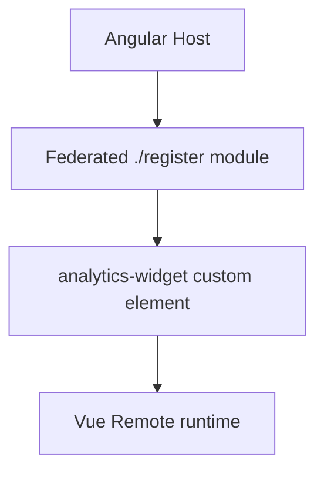

Vue custom element concept:

```ts
// Vue remote
import { defineCustomElement } from 'vue';
import AnalyticsWidget from './AnalyticsWidget.ce.vue';

export function registerAnalyticsWidget() {
  if (!customElements.get('analytics-widget')) {
    customElements.define('analytics-widget', defineCustomElement(AnalyticsWidget));
  }
}
```

Angular host:

```html
<analytics-widget tenant-id="store-1"></analytics-widget>
```

Use `CustomEvent` for events:

```ts
window.dispatchEvent(
  new CustomEvent('analytics:filter-changed', {
    detail: { range: '30d' },
  }),
);
```

Do not share Angular packages with Vue. Share Vue only with Vue remotes that intentionally align runtime versions.

### 7.3 React Host to Angular Remote

Is it technically possible? Yes.

Can React directly render an Angular component? No.

Recommended integration:

- Angular remote exposes a module that registers an Angular Element / custom element.
- React renders the custom element tag.
- Events use DOM events.

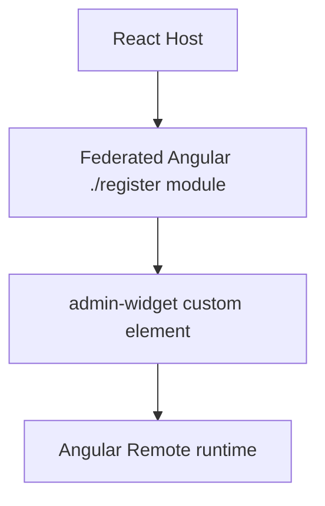

React host concept:

```tsx
useEffect(() => {
  let disposed = false;

  loadRemoteModule('admin_app', './register').then((m) => {
    if (!disposed) m.registerAdminWidget();
  });

  return () => {
    disposed = true;
  };
}, []);

return <admin-widget user-id="123" />;
```

Angular remote bootstrap:

- If the remote exposes an Angular custom element, it must create/register that element.
- Do not expect React to provide Angular dependency injection or Angular change detection.

Dependencies:

- React host shares React with React remotes.
- Angular remote manages its own Angular runtime unless it is also consumed by Angular hosts with compatible sharing.
- Do not share React and Angular as if they were related runtimes.

### 7.4 React Host to Vue Remote

Is it technically possible? Yes.

Can React directly render a Vue component? No.

Recommended integration:

- Vue remote exposes a custom element registration module.
- React host renders the custom element and listens for DOM events.

Use cases:

- Dashboard widget.
- Analytics panel.
- Legacy Vue feature inside a React shell.

Avoid:

- Passing React component instances into Vue.
- Depending on Vue internals from React.

### 7.5 Vue Host to Angular Remote

Is it technically possible? Yes.

Can Vue directly render an Angular component? No.

Recommended integration:

- Angular remote exposes a custom element or mount API.
- Vue host renders the custom element after registration.

```vue
<template>
  <admin-widget :user-id="userId" @admin-saved="onAdminSaved" />
</template>
```

The public API should be attributes, properties, and DOM events.

### 7.6 Vue Host to React Remote

Is it technically possible? Yes.

Can Vue directly render a React component? No.

Recommended integration:

- React remote exposes a custom element or mount API.
- Vue host renders the custom element.

Use cases:

- React-based visualization inside Vue.
- Feature migration from React to Vue or Vue to React.

### 7.7 Next.js and Django With an Angular Host

Short answer:

```text
Next.js can be shown inside an Angular host, but it is usually not a Native Federation remote.
Django can be shown inside an Angular host, but it is not a JavaScript Native Federation remote.
```

Native Federation loads browser JavaScript modules such as Angular routes, React mount functions, or Web Component registration modules. Next.js and Django are full server/application frameworks. They can participate in a micro frontend architecture, but the integration boundary is different.

Use this decision table:

| App type | Can Angular render it with Native Federation? | Recommended integration |
| --- | --- | --- |
| Plain React/Vite app | Yes | Expose `./mount` or `./register` through Native Federation |
| Next.js app using SSR, App Router, API routes, middleware, image optimizer | Not directly | Deploy separately and embed route/page through iframe, or extract a browser-only React widget |
| Next.js static export with browser-only React widget | Sometimes | Prefer extracting the widget into a Vite React remote with `./mount` |
| Django API app | No UI to render | Angular calls Django REST/GraphQL APIs |
| Django server-rendered pages/templates | Not as Native Federation | Embed through iframe or link out to the Django app |
| Django admin | Not as Native Federation | Open as separate app or iframe with strict auth and frame headers |

The clean architecture is:

```text
Angular shell
  -> Native Federation remotes for Angular/React/Vue browser modules
  -> iframe for independently served Next.js/Django pages
  -> HTTP APIs for Django or Next.js backend endpoints
```

#### Next.js As a Remote Page

Use this when the Next.js app needs its own SSR, routing, image optimization, middleware, or API routes.

Recommended setup:

```text
next-dashboard/
  runs on http://localhost:4300
  owns /dashboard, /dashboard/reports, /dashboard/settings

shell-app/
  runs on http://localhost:4200
  owns /next-dashboard
  renders Angular wrapper with iframe src="http://localhost:4300/dashboard"
```

Angular route:

```ts
// shell-app/src/app/app.routes.ts
{
  path: 'next-dashboard',
  loadComponent: () =>
    import('./features/next-dashboard/next-dashboard-remote.component').then(
      (m) => m.NextDashboardRemoteComponent,
    ),
}
```

Angular iframe wrapper:

```ts
// shell-app/src/app/features/next-dashboard/next-dashboard-remote.component.ts
import { Component } from '@angular/core';
import { DomSanitizer, SafeResourceUrl } from '@angular/platform-browser';

@Component({
  selector: 'app-next-dashboard-remote',
  standalone: true,
  template: `
    <section class="external-remote">
      <iframe
        title="Next.js dashboard"
        [src]="remoteUrl"
        loading="lazy"
        referrerpolicy="strict-origin-when-cross-origin"
      ></iframe>
    </section>
  `,
  styles: [
    `
      :host {
        display: block;
      }

      .external-remote {
        min-height: calc(100dvh - 8rem);
      }

      iframe {
        display: block;
        width: 100%;
        min-height: calc(100dvh - 8rem);
        border: 0;
        background: var(--color-surface, #fff);
      }
    `,
  ],
})
export class NextDashboardRemoteComponent {
  protected readonly remoteUrl: SafeResourceUrl;

  constructor(sanitizer: DomSanitizer) {
    this.remoteUrl = sanitizer.bypassSecurityTrustResourceUrl('http://localhost:4300/dashboard');
  }
}
```

Next.js must allow framing by the Angular host. Configure response headers in Next.js:

```js
// next.config.js
const nextConfig = {
  async headers() {
    return [
      {
        source: '/:path*',
        headers: [
          {
            key: 'Content-Security-Policy',
            value: "frame-ancestors 'self' http://localhost:4200",
          },
        ],
      },
    ];
  },
};

module.exports = nextConfig;
```

Do not set `X-Frame-Options: DENY` or `X-Frame-Options: SAMEORIGIN` if the Angular host is on a different origin. Prefer CSP `frame-ancestors` because it can list explicit trusted host origins.

Use `postMessage` for communication between Angular and the framed Next.js app:

```ts
// Angular -> iframe
iframe.contentWindow?.postMessage(
  { type: 'shell:navigation-context', payload: { userId: '123' } },
  'http://localhost:4300',
);
```

```ts
// Next.js browser component
window.parent.postMessage(
  { type: 'next-dashboard:selected', payload: { reportId: 'sales' } },
  'http://localhost:4200',
);
```

Validate every `message` event origin on both sides:

```ts
window.addEventListener('message', (event) => {
  if (event.origin !== 'http://localhost:4300') return;
  // handle trusted message
});
```

#### Authentication and Authorization For Iframe Remotes

Authentication for iframe remotes must be handled as authentication between two separate web applications. The Angular shell can decide whether the iframe route is visible, but the framed Next.js or Django app must still authenticate and authorize every page and API request on its own server.

Do not use these patterns:

```text
Do not pass access tokens in iframe URLs.
Do not put JWTs in query strings.
Do not trust userId, role, or permissions received from postMessage.
Do not rely only on Angular route guards to protect the iframe app.
Do not disable CSRF or frame protections globally just to make the iframe load.
```

Recommended options:

| Pattern | When to use | How it works |
| --- | --- | --- |
| Same-site SSO cookie | Best option when apps share a parent domain | User logs in once; shell and iframe app read their own server session from shared identity cookies |
| OIDC/OAuth login inside iframe app | Apps are on separate domains or independently owned | Iframe app redirects to identity provider if it has no session |
| Backend-for-frontend session | Shell and iframe use the same auth backend | Each app gets a server-side session cookie; APIs validate server sessions |
| Token exchange endpoint | Shell has a token and iframe needs its own session | Shell calls backend to create a short-lived, one-time exchange code; iframe redeems it server-side |
| API-only Django | No iframe UI is needed | Angular calls Django APIs with normal auth headers/cookies |

The safest architecture:

```text
Identity Provider / Auth API
  -> issues secure session/token

Angular shell
  -> protects /next-dashboard route with Angular guard
  -> renders iframe only for signed-in users

Next.js or Django iframe app
  -> checks its own session on every request
  -> checks roles/permissions on the server
  -> redirects to login or returns 403 when unauthorized
```

Angular route guard example:

```ts
// shell-app/src/app/core/auth/auth.guard.ts
import { CanMatchFn, Router } from '@angular/router';
import { inject } from '@angular/core';
import { AuthFacade } from './auth.facade';

export const signedInGuard: CanMatchFn = () => {
  const auth = inject(AuthFacade);
  const router = inject(Router);

  if (auth.isAuthenticated()) {
    return true;
  }

  return router.createUrlTree(['/auth/login']);
};
```

Host route:

```ts
{
  path: 'next-dashboard',
  canMatch: [signedInGuard],
  loadComponent: () =>
    import('./features/next-dashboard/next-dashboard-remote.component').then(
      (m) => m.NextDashboardRemoteComponent,
    ),
}
```

This improves UX by preventing anonymous users from seeing an embedded login failure, but it is not enough for security. The iframe app must still validate the user.

##### Same-Site Cookie Setup

Use this when the shell and iframe app can live under the same parent site:

```text
https://app.example.com          Angular shell
https://next.example.com         Next.js app
https://django.example.com       Django app
https://auth.example.com         Identity/auth service
```

Cookie guidance:

```text
Use HttpOnly session cookies where possible.
Use Secure in production.
Use SameSite=Lax for same-site top-level navigation.
Use SameSite=None; Secure only when the iframe is truly cross-site and must receive cookies.
Prefer subdomains under the same registrable domain to reduce third-party-cookie problems.
```

Do not store long-lived access tokens in `localStorage` just to share them with iframe apps. The iframe is a separate browsing context and should get its own server-validated session.

##### Token Exchange For Iframe Session Bootstrap

Use this only when the shell is already authenticated and the iframe app needs to create its own session without asking the user to log in again.

Recommended flow:

```text
1. User logs into Angular shell.
2. Angular shell calls Auth API: POST /iframe-session/exchange-code.
3. Auth API validates the shell session and returns a one-time code.
4. Angular sets iframe src to https://next.example.com/embed?code=<one-time-code>.
5. Next.js/Django server redeems the code with Auth API.
6. Iframe app sets its own HttpOnly session cookie.
7. Iframe redirects to the real embedded page without the code in the URL.
```

The exchange code must be:

```text
Short lived, usually 30-60 seconds.
Single use.
Bound to the target iframe app.
Bound to the authenticated user.
Redeemed server-to-server, not trusted in browser JavaScript.
Removed from browser history after redemption.
```

Angular wrapper example:

```ts
// shell-app/src/app/features/next-dashboard/next-dashboard-remote.component.ts
import { Component, inject } from '@angular/core';
import { DomSanitizer, SafeResourceUrl } from '@angular/platform-browser';
import { HttpClient } from '@angular/common/http';
import { firstValueFrom } from 'rxjs';

@Component({
  selector: 'app-next-dashboard-remote',
  standalone: true,
  template: `
    @if (remoteUrl) {
      <iframe title="Next.js dashboard" [src]="remoteUrl"></iframe>
    } @else {
      <p>Preparing dashboard session...</p>
    }
  `,
})
export class NextDashboardRemoteComponent {
  protected remoteUrl?: SafeResourceUrl;

  private readonly http = inject(HttpClient);
  private readonly sanitizer = inject(DomSanitizer);

  async ngOnInit(): Promise<void> {
    const response = await firstValueFrom(
      this.http.post<{ code: string }>('/api/iframe-session/exchange-code', {
        audience: 'next-dashboard',
      }),
    );

    const url = `https://next.example.com/embed/session?code=${encodeURIComponent(response.code)}`;
    this.remoteUrl = this.sanitizer.bypassSecurityTrustResourceUrl(url);
  }
}
```

Next.js redemption route concept:

```ts
// next-dashboard/app/embed/session/route.ts
import { NextRequest, NextResponse } from 'next/server';

export async function GET(request: NextRequest) {
  const code = request.nextUrl.searchParams.get('code');
  if (!code) return NextResponse.redirect(new URL('/login', request.url));

  const session = await redeemIframeCode(code, 'next-dashboard');
  if (!session) return NextResponse.redirect(new URL('/login', request.url));

  const response = NextResponse.redirect(new URL('/dashboard', request.url));
  response.cookies.set('next_dashboard_session', session.id, {
    httpOnly: true,
    secure: true,
    sameSite: 'none',
    path: '/',
  });
  return response;
}
```

Django redemption view concept:

```py
# django_app/views.py
from django.shortcuts import redirect

def iframe_session(request):
    code = request.GET.get("code")
    session = redeem_iframe_code(code, audience="django-admin")

    if not session:
        return redirect("/login/")

    response = redirect("/admin/")
    response.set_cookie(
        "django_iframe_session",
        session.id,
        httponly=True,
        secure=True,
        samesite="None",
        path="/",
    )
    return response
```

##### Authorization In The Iframe App

Authorization must be enforced server-side by the iframe application.

Next.js examples:

```ts
// next-dashboard/middleware.ts
import { NextRequest, NextResponse } from 'next/server';

export function middleware(request: NextRequest) {
  const session = request.cookies.get('next_dashboard_session');

  if (!session) {
    return NextResponse.redirect(new URL('/login', request.url));
  }

  return NextResponse.next();
}

export const config = {
  matcher: ['/dashboard/:path*'],
};
```

```ts
// next-dashboard/app/dashboard/page.tsx
import { forbidden, redirect } from 'next/navigation';

export default async function DashboardPage() {
  const user = await getCurrentUser();
  if (!user) redirect('/login');
  if (!user.permissions.includes('dashboard:read')) forbidden();

  return <main>Dashboard</main>;
}
```

Django examples:

```py
# django_app/views.py
from django.contrib.auth.decorators import login_required, permission_required

@login_required
@permission_required("reports.view_report", raise_exception=True)
def reports_dashboard(request):
    ...
```

```py
# django_app/settings.py
LOGIN_URL = "/login/"
CSRF_TRUSTED_ORIGINS = ["https://app.example.com"]
SESSION_COOKIE_HTTPONLY = True
SESSION_COOKIE_SECURE = True
CSRF_COOKIE_SECURE = True
```

When Django is embedded cross-site and must use cookies inside the iframe, set cookie `SameSite=None; Secure` deliberately:

```py
SESSION_COOKIE_SAMESITE = "None"
CSRF_COOKIE_SAMESITE = "None"
```

Use this only for trusted framed deployments. Cross-site iframe cookies are increasingly restricted by browsers, so same-site subdomains or an explicit SSO redirect flow are more reliable.

##### `postMessage` Is Not Authentication

Use `postMessage` only for UI coordination:

```text
Good:
  iframe tells shell "height changed"
  iframe tells shell "navigate to product 123"
  shell tells iframe "theme changed"

Bad:
  shell tells iframe "user is admin"
  shell sends access token to iframe
  iframe trusts userId from shell without server validation
```

If `postMessage` is used, validate:

```text
event.origin
event.source
message type
payload schema
expected audience
```

The server still decides who the user is and what the user can do.

Focus points for Next.js iframe remotes:

- Authentication must work across origins, usually with SSO or same-site cookies.
- The Next.js app needs frame permissions through CSP.
- Styling is isolated by the iframe, so host CSS variables do not automatically apply.
- Deep links are owned by Next.js inside the iframe unless you synchronize URL state with Angular.
- Browser back/forward behavior must be designed intentionally.
- SEO for the framed content belongs to the Next.js deployment, not the Angular shell route.

#### Next.js As a Native Federation Remote

Use this only when you extract a browser-only React surface from Next.js.

Recommended approach:

```text
Do not federate the full Next.js app.
Extract the reusable UI into one of these:
  1. A Vite React remote that exposes ./mount.
  2. A plain React package consumed by a Vite React remote.
  3. A Web Component registration module.
```

A full Next.js app has server-only concepts that do not map cleanly to a browser ESM remote:

- Server Components.
- App Router server rendering.
- Route handlers.
- Middleware.
- Next.js image optimizer.
- Server actions.
- File-system routing.
- Next.js-specific runtime chunks and manifests.

Native Federation should expose browser modules, not a whole Next.js server application. If the feature is mostly client-side React, create a React/Vite remote and keep Next.js for pages that genuinely need Next.js.

#### Product Manager: Next.js App Plus Native Federation Remote

`frontend/native-federation/product-manager` is a dual-build app:

```text
Standalone mode:
  Next.js App Router serves /admin/products and related pages.

Remote mode:
  Vite + Native Federation builds remoteEntry.json and exposes ./register.
  Angular loads ./register and renders <product-manager-mfe>.
```

The important decision is that the Next.js App Router is not exposed to Angular. The browser-only product UI is adapted into a React Web Component remote, while the original Next pages remain available for standalone development and deployment.

Actual local ports in this repository:

```text
shell-app:                http://localhost:4200
auth-app:                 http://localhost:4201/remoteEntry.json
admin-app:                http://localhost:4202/remoteEntry.json
price-lens-product-app:   http://localhost:4204/remoteEntry.json
product-manager remote:   http://localhost:4205/remoteEntry.json
```

##### Product Manager Commands

`product-manager/package.json` intentionally separates Next mode from remote mode:

```json
{
  "scripts": {
    "dev": "npm run remote",
    "next:dev": "next dev --port 4205",
    "build": "next build",
    "remote": "npm run remote:build:dev && npm run remote:preview",
    "remote:build": "node scripts/build.mjs --prod",
    "remote:build:dev": "node scripts/build.mjs",
    "remote:preview": "vite preview --host 0.0.0.0 --port 4205 --strictPort",
    "remote:typecheck": "tsc -p tsconfig.remote.json --noEmit"
  }
}
```

Why this shape is needed:

| Script | Purpose |
| --- | --- |
| `npm run dev` | Starts the federation remote expected by Angular. It must serve `/remoteEntry.json`. |
| `npm run next:dev` | Starts standalone Next.js development. This does not serve `/remoteEntry.json`. |
| `npm run build` | Verifies the standalone Next.js app still builds. |
| `npm run remote:build:dev` | Builds Native Federation metadata and browser ESM bundles for local remote preview. |
| `npm run remote:build` | Builds production-style remote output. |
| `npm run remote:preview` | Serves the generated remote output on `4205`; `--strictPort` prevents accidentally serving on a different port than the host manifest expects. |
| `npm run remote:typecheck` | Type-checks only the remote-compatible browser source. |

If `next dev --port 4205` is running, Angular will fail with `remoteEntry.json` 404 because Next.js is serving the standalone app, not Native Federation assets.

##### Product Manager Federation Config

`product-manager/federation.config.mjs`:

```js
import { withNativeFederation } from '@softarc/native-federation/config';

export default withNativeFederation({
  name: 'productManager',
  exposes: {
    './register': './src/remote/register.ts',
  },
  shared: {},
});
```

Why each part exists:

| Setting | Reason |
| --- | --- |
| `name: 'productManager'` | This is the runtime contract used by `federation.manifest.json` and `loadRemote('productManager', './register')`. It is case-sensitive. |
| `exposes['./register']` | Angular only needs to execute the registration module. It should not import a React component or a Next page directly. |
| `shared: {}` | The Angular host does not use React. The remote owns React, ReactDOM, and React Router to avoid cross-framework runtime coupling. |

##### Product Manager Build Script

`product-manager/scripts/build.mjs` is needed because this is not an Angular CLI remote and not a normal Vite-only app. It drives Native Federation directly:

```text
1. Remove and recreate dist.
2. Initialize federationBuilder with:
   - workspaceRoot: product-manager
   - outputPath: dist
   - tsConfig: tsconfig.remote.json
   - federationConfig: federation.config.mjs
3. Bundle src/main.tsx with esbuild.
4. Write a standalone preview index.html.
5. Build federation metadata and exposed modules.
```

The generated output includes:

```text
dist/
  remoteEntry.json
  register.js
  register.css
  assets/main.js
  assets/main.css
  importmap.json
```

Deploy or serve the whole `dist` folder. Do not deploy only `remoteEntry.json`; it references other generated JS and CSS files.

##### Remote TypeScript Config

`product-manager/tsconfig.remote.json` extends the Next config but scopes typechecking to remote-compatible browser code:

```json
{
  "extends": "./tsconfig.json",
  "compilerOptions": {
    "types": ["vite/client", "node"],
    "incremental": false
  },
  "include": ["src/**/*.ts", "src/**/*.tsx"],
  "exclude": ["node_modules", ".next", "src/app"]
}
```

Why it is needed:

- `src/app` contains Next.js App Router pages and Next-specific routing APIs.
- The remote entry uses Vite `import.meta.env`, so it needs `vite/client` types.
- Shared config code still references `process.env.NEXT_PUBLIC_*` for standalone Next mode, so the remote typecheck includes Node typings.
- Excluding `.next` avoids stale generated Next validator files from failing the remote check.

`src/vite-env.d.ts` declares the `VITE_*` keys used by the remote preview bootstrap so both Next and remote typechecking understand the file.

##### Remote Source Files And Why They Exist

| File | Why it is needed |
| --- | --- |
| `src/main.tsx` | Local remote preview bootstrap. It merges Vite runtime defaults and renders `<ProductManagerRemote />` into `dist/index.html`. |
| `src/remote/register.ts` | The only exposed module. It imports remote CSS, injects generated `register.css` into the host document, and registers the custom element. |
| `src/remote/product-manager-element.tsx` | Defines the browser-native `<product-manager-mfe>` boundary. It creates and destroys the React root and observes `initial-path` changes from Angular. |
| `src/remote/product-manager-app.tsx` | React remote application shell. It uses `MemoryRouter` so Angular keeps ownership of the browser URL. |
| `src/remote/pages/product-list-remote.tsx` | Product list adapter for remote mode. It uses React Router navigation instead of Next navigation. |
| `src/remote/pages/product-create-remote.tsx` | Product create adapter for remote mode. |
| `src/remote/pages/product-edit-remote.tsx` | Product edit adapter for remote mode. |
| `src/remote/remote.css` | Remote UI stylesheet scoped under `.product-manager-root` so it styles the embedded product manager without leaking into the Angular shell. |
| `src/lib/config/product-manager-config.ts` | Runtime config bridge. Angular passes API/auth settings through element attributes; standalone Next falls back to `NEXT_PUBLIC_*`. |
| `src/lib/auth/token-storage.ts` | Reads and writes the same token keys as the Angular admin app: `access_token` and `refresh_token`. |
| `src/lib/auth/api-client.ts` | Axios client. It reads runtime config and localStorage at request time so host-provided settings and refreshed tokens are respected. |
| `src/lib/auth/auth-boundary.tsx` | Blocks product UI until a shared session is available and redirects to the host login route when configured. |
| `src/features/products/*` | Shared product business UI and API code used by both standalone Next screens and remote screens. |

##### Runtime Configuration Contract

Angular creates:

```html
<product-manager-mfe
  initial-path="/products"
  api-base-url="http://localhost:3000"
  refresh-endpoint="/api/v1/auth/refresh"
  refresh-token-field="refreshToken"
  login-url="/auth/login"
  redirect-on-missing-auth="true">
</product-manager-mfe>
```

The element calls `mergeProductManagerConfig(...)`, which writes:

```ts
window.__PRODUCT_MANAGER_CONFIG__
```

The Axios client calls `getProductManagerConfig()` at request time. This is required because a remote should not need a rebuild just because the host environment changes from local to staging or production.

##### Authentication Contract

The current Angular admin app stores:

```text
localStorage['access_token']
localStorage['refresh_token']
```

The product-manager remote reads those same keys. The JavaScript bundle is downloaded from `localhost:4205`, but it executes inside the Angular page. Therefore, when the shell is opened at `http://localhost:4200`, `window.localStorage` means the shell page origin's storage.

Do not use old token names such as `accesstokey` or `refreshtoken` for this repository unless the Angular auth service is changed to use those keys too.

##### Angular Admin Wrapper

`admin-app/src/app/features/products/product-manager-remote/product-manager-remote.component.ts` is the host-side adapter. It:

```text
1. Loads productManager:./register.
2. Reads PRODUCT_MANAGER_ELEMENT from the exposed module.
3. Creates <product-manager-mfe>.
4. Passes API/auth/runtime settings as attributes.
5. Maps Angular URLs to the remote MemoryRouter initial path.
6. Removes the element on route destroy so React unmounts.
```

The admin routes use this wrapper:

```ts
{
  path: 'products',
  loadComponent: () =>
    import('./features/products/product-manager-remote/product-manager-remote.component').then(
      (m) => m.ProductManagerRemoteComponent,
    ),
},
{
  path: 'products/new',
  loadComponent: () =>
    import('./features/products/product-manager-remote/product-manager-remote.component').then(
      (m) => m.ProductManagerRemoteComponent,
    ),
},
{
  path: 'products/:id/edit',
  loadComponent: () =>
    import('./features/products/product-manager-remote/product-manager-remote.component').then(
      (m) => m.ProductManagerRemoteComponent,
    ),
},
```

The custom element observes `initial-path`, so route changes such as `/admin/products/new` or `/admin/products/:id/edit` can remount the React `MemoryRouter` to the matching internal remote path.

##### Style Loading And Isolation

Native Federation loads JavaScript modules. It does not guarantee that CSS imported by a React remote will be applied in every host integration exactly the same way as a standalone Vite page.

For this product manager remote, `src/remote/register.ts` explicitly injects the generated stylesheet:

```ts
const link = document.createElement('link');
link.rel = 'stylesheet';
link.href = new URL('./register.css', import.meta.url).href;
link.dataset.productManagerRemoteStyle = 'true';
document.head.appendChild(link);
```

Why this is needed:

- The Angular host loads `./register`, not the remote preview `index.html`.
- The host document therefore will not automatically include `<link rel="stylesheet" href="/assets/main.css">`.
- Without the injected `register.css`, the remote falls back to browser default styling: full-width form fields, huge product images, unstyled tables, and incorrect spacing.
- The `data-product-manager-remote-style` guard prevents duplicate style links if the route is visited multiple times.

Style rules in `remote.css` must stay scoped:

```css
.product-manager-root .btn {}
.product-manager-root table {}
.product-manager-root .thumb {}
```

Avoid unscoped rules in remote CSS:

```css
body {}
button {}
table {}
img {}
```

Unscoped remote CSS can damage the Angular shell because Web Component custom elements do not automatically isolate global styles unless Shadow DOM is used. This repository currently uses scoped light-DOM styles, not Shadow DOM, so the `.product-manager-root` prefix is the style boundary.

The embedded design intentionally reuses host tokens where they exist:

```css
--pm-surface: var(--color-surface, #fff);
--pm-border: var(--color-border, #d7e1dc);
--pm-text: var(--color-text-primary, #10201d);
--pm-primary: var(--color-primary, #374151);
```

That keeps the remote visually aligned with `admin-app` while still providing fallback values if the remote is opened by itself.

Important embedded layout rules:

```css
.product-manager-root .page {
  padding: 0;
  max-width: none;
}

.product-manager-root .thumb {
  width: 48px !important;
  max-width: 48px;
  height: 48px !important;
  object-fit: cover;
}

.product-manager-root table {
  table-layout: fixed;
  min-width: 880px;
}
```

These prevent the remote from looking like a separate full page and prevent API image URLs from rendering at natural image size inside the Angular host.

#### Django As an Angular-Hosted Remote

Django is not a frontend JavaScript module, so Angular cannot load it through Native Federation.

Use Django in one of two ways:

```text
Option A: Django as backend
  Angular shell or React remote -> HTTP -> Django REST/GraphQL API

Option B: Django as independently served UI
  Angular shell route -> iframe -> Django server-rendered page
```

Use Option A for most product applications. Django owns business logic, data, authentication APIs, and admin operations. Angular owns the UI.

Angular API service example:

```ts
// shell-app/src/app/features/reports/reports.service.ts
import { HttpClient } from '@angular/common/http';
import { Injectable, inject } from '@angular/core';

export interface ReportSummary {
  id: string;
  title: string;
  total: number;
}

@Injectable({ providedIn: 'root' })
export class ReportsService {
  private readonly http = inject(HttpClient);
  private readonly apiBaseUrl = 'http://localhost:8000/api';

  listReports() {
    return this.http.get<ReportSummary[]>(`${this.apiBaseUrl}/reports/`);
  }
}
```

Use Option B when you need to embed an existing Django admin-like screen quickly.

Angular Django iframe wrapper:

```ts
// shell-app/src/app/features/django-admin/django-admin-remote.component.ts
import { Component } from '@angular/core';
import { DomSanitizer, SafeResourceUrl } from '@angular/platform-browser';

@Component({
  selector: 'app-django-admin-remote',
  standalone: true,
  template: `
    <section class="external-remote">
      <iframe
        title="Django admin"
        [src]="remoteUrl"
        referrerpolicy="strict-origin-when-cross-origin"
      ></iframe>
    </section>
  `,
  styles: [
    `
      :host {
        display: block;
      }

      iframe {
        display: block;
        width: 100%;
        min-height: calc(100dvh - 8rem);
        border: 0;
      }
    `,
  ],
})
export class DjangoAdminRemoteComponent {
  protected readonly remoteUrl: SafeResourceUrl;

  constructor(sanitizer: DomSanitizer) {
    this.remoteUrl = sanitizer.bypassSecurityTrustResourceUrl('http://localhost:8000/admin/');
  }
}
```

Django must allow the Angular host to frame it. Prefer CSP `frame-ancestors` through middleware or a package such as `django-csp`:

```py
# settings.py with django-csp
CSP_FRAME_ANCESTORS = ("'self'", "http://localhost:4200")
CSRF_TRUSTED_ORIGINS = ["http://localhost:4200"]
```

Focus points for Django iframe remotes:

- CSRF and session cookies must be configured for the host and Django origins.
- `SameSite`, `Secure`, and domain settings must match the deployment topology.
- CSP and frame headers must explicitly allow the Angular host.
- Django pages will not automatically inherit Angular theme variables.
- Use iframe only for coarse app boundaries, not small widgets.

#### Recommended Architecture For This Repository

For this repository, use these rules:

```text
Angular route remote:
  Use Native Federation and expose Angular Routes.

React feature remote:
  Use Vite React + Native Federation and expose ./mount.

Next.js application:
  Keep standalone Next.js for App Router pages.
  For tight Angular integration, expose browser-only React code through a Web Component or mount API.
  In this repo, product-manager exposes ./register and renders <product-manager-mfe>.

Django application:
  Use as backend API for Angular/React remotes.
  Embed server-rendered Django pages with iframe only when necessary.
```

Do not try to make Django produce `remoteEntry.json`. Django can serve JavaScript files, but it is not a browser module federation runtime. If a Django-backed feature needs to appear as a Native Federation remote, build the UI as Angular, React, or Vue and let that frontend call Django APIs.

#### Local Development Ports

Example local ports:

```text
Angular shell:             http://localhost:4200
Angular auth remote:       http://localhost:4201/remoteEntry.json
Angular admin remote:      http://localhost:4202/remoteEntry.json
React price-lens remote:   http://localhost:4204/remoteEntry.json
Next product remote:       http://localhost:4205/remoteEntry.json
Standalone Next mode:      http://localhost:4205/admin/products when run with npm run next:dev
Django app/API example:    http://localhost:8000
```

Example Angular routes:

```ts
export const routes: Routes = [
  {
    path: 'price-lens',
    loadComponent: () =>
      import('./features/price-lens/price-lens-remote.component').then(
        (m) => m.PriceLensRemoteComponent,
      ),
  },
  {
    path: 'next-dashboard',
    loadComponent: () =>
      import('./features/next-dashboard/next-dashboard-remote.component').then(
        (m) => m.NextDashboardRemoteComponent,
      ),
  },
  {
    path: 'django-admin',
    loadComponent: () =>
      import('./features/django-admin/django-admin-remote.component').then(
        (m) => m.DjangoAdminRemoteComponent,
      ),
  },
];
```

Verification checklist:

```text
For React Native Federation remote:
  1. Open remoteEntry.json.
  2. Confirm the exposed module key exists.
  3. For a mount API remote, load the Angular route that calls remote.mount(...).
  4. For a Web Component remote, confirm customElements.get('product-manager-mfe') after ./register loads.
  5. Confirm the remote CSS file is requested and applied.

For Next.js iframe remote:
  1. Open the Next.js route directly.
  2. Confirm CSP frame-ancestors allows the Angular host.
  3. Open the Angular iframe wrapper route.
  4. Test postMessage only with origin validation.

For Django API:
  1. Open the API endpoint directly.
  2. Confirm CORS, CSRF, and cookies work.
  3. Call the endpoint from Angular HttpClient or the React remote.

For Django iframe:
  1. Open the Django page directly.
  2. Confirm CSP/X-Frame-Options allows the Angular host.
  3. Confirm login/session behavior inside the iframe.

For product-manager in this repo:
  1. Stop any process running next dev on port 4205.
  2. Run npm run dev from frontend/native-federation/product-manager.
  3. Open http://localhost:4205/remoteEntry.json and confirm it returns JSON.
  4. Confirm the response includes Access-Control-Allow-Origin.
  5. Open http://localhost:4200/admin/products from shell-app.
```

## 8. Web Components With Native Federation

Web Components are often the cleanest UI boundary for cross-framework Native Federation.

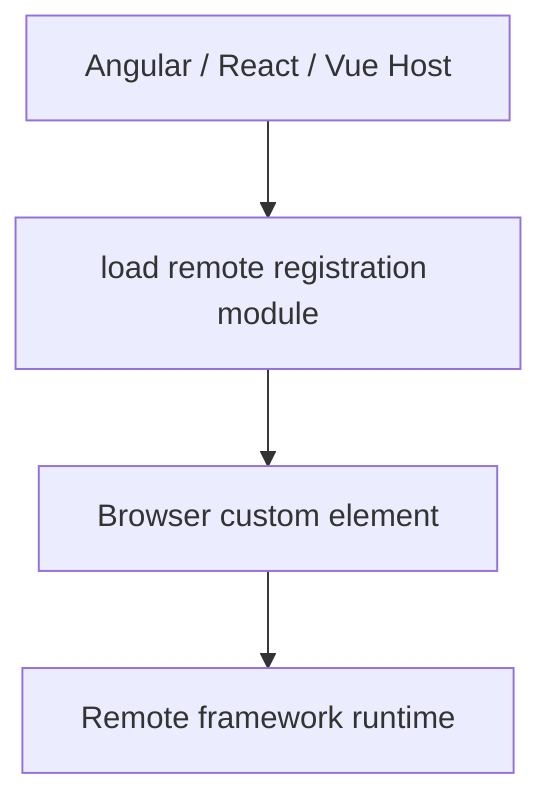

### 8.1 Why Web Components

Web Components are useful because they are browser-native:

- Angular can render a custom element tag.
- React can render a custom element tag.
- Vue can render a custom element tag.
- Plain HTML can render a custom element tag.

The custom element becomes the public UI contract.

Good custom element contract:

```html
<reports-widget user-id="123" theme="light"></reports-widget>
```

```ts
element.addEventListener('report:selected', (event) => {
  const reportId = (event as CustomEvent<{ reportId: string }>).detail.reportId;
});
```

### Web Component Scenario Matrix

| Host | Remote/public UI | Possible? | What is federated? | How data passes | How events pass | Notes |
| --- | --- | --- | --- | --- | --- | --- |
| Angular | Web Component | Yes | JS module that registers the custom element | Attributes or DOM properties | `CustomEvent` | Add `CUSTOM_ELEMENTS_SCHEMA` where Angular templates use the element. |
| React | Web Component | Yes | JS module that registers the custom element | Attributes or DOM properties | `CustomEvent`, often via `addEventListener` | React can render the tag, but custom event handling may need DOM APIs. |
| Vue | Web Component | Yes | JS module that registers the custom element | Attributes or DOM properties | `CustomEvent` | Configure Vue compiler handling for custom elements if needed. |
| Web Component | Angular | Yes | Angular registration module or mount module | Attributes or DOM properties | `CustomEvent` | Angular still owns Angular rendering inside the element. |
| Web Component | React | Yes | React registration module or mount module | Attributes or DOM properties | `CustomEvent` | React still owns React rendering inside the element. |
| Web Component | Vue | Yes | Vue registration module or mount module | Attributes or DOM properties | `CustomEvent` | Vue still owns Vue rendering inside the element. |

Advantages:

- Framework-neutral public UI API.
- Clean lifecycle boundary when connected/disconnected callbacks are implemented correctly.
- Works with Angular, React, Vue, plain HTML, and future hosts.

Limitations:

- Custom element names are global in the page.
- Complex object props need DOM property assignment, not only string attributes.
- Events must be designed as public contracts.
- Shadow DOM can isolate styles, but it also affects event composition and CSS inheritance.

### 8.2 Angular to Web Component

Angular host loading any federated Web Component:

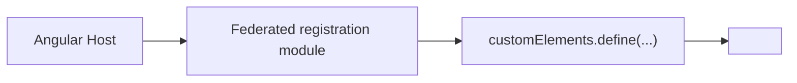

Recommended:

- Load the registration module before rendering the element.
- Add `CUSTOM_ELEMENTS_SCHEMA` where Angular templates use custom elements.
- Use attributes/properties/events.
- Keep the Web Component API framework-neutral.

### 8.3 React to Web Component

React host loading a federated Web Component:

```tsx
function ReportsPage() {
  useEffect(() => {
    loadRemoteModule('reports_app', './register').then((m) => m.registerReportsWidget());
  }, []);

  return <reports-widget user-id="123" />;
}
```

React can render the element, but event handling may need `addEventListener` for custom events depending on React version and event name.

### 8.4 Vue to Web Component

Vue host loading a federated Web Component:

```vue
<template>
  <reports-widget :user-id="userId" />
</template>
```

Load the remote registration module before or during the host component setup. Configure Vue compiler options if the framework warns about unknown custom elements.

### Web Component to Angular, React, or Vue

A Web Component host can also load framework remotes if it exposes a JavaScript module or registers another custom element:

```text
Web Component shell
  |
  | Native Federation loads ./register
  v
Angular / React / Vue remote
```

The same rule applies: the public contract should remain DOM-based.

## 9. Federated JavaScript Modules

Native Federation always federates JavaScript modules. UI is only one use case.

### Pattern A: Federated JavaScript Module

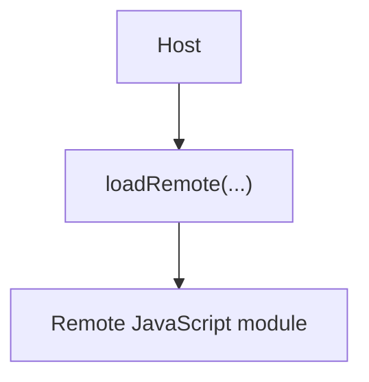

Appropriate for:

- Route definitions in same-framework setups.
- Utility functions.
- API clients.
- Configuration.
- Feature flags.
- Business logic that is framework-independent.

Example:

```ts
const remote = await loadRemote<{
  formatPrice: (amount: number, currency: string) => string;
}>('pricing_app', './formatters');

remote.formatPrice(12.5, 'USD');
```

Use this when the exported API is plain TypeScript/JavaScript and does not require the host to understand a foreign framework component.

### Pattern B: Federated Web Component

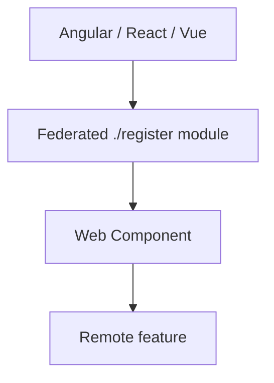

Use this for cross-framework UI.

### Pattern C: Framework-Independent Module

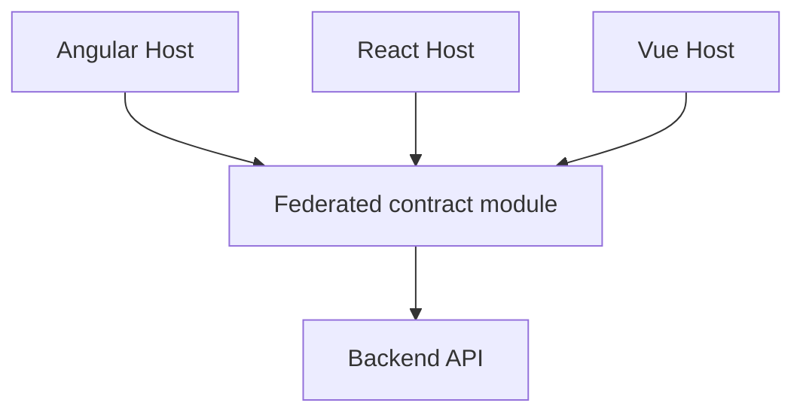

Good candidates:

- Validation rules.
- Formatting utilities.
- API clients.
- Generated API types.
- Feature flag readers.
- Business constants.

Limitations:

- Shared business code couples deployment versions.
- Side effects make modules harder to evolve.
- Framework-independent code should not import Angular, React, or Vue.

## 10. Communication

Native Federation loads code. It is not a communication system.

### 10.1 Same Framework

Angular to Angular can use:

| Strategy | Good for | Coupling |
| --- | --- | --- |
| Route params/query params | Navigation state | Low |
| Angular inputs/outputs | Federated Angular component APIs | Medium |
| Signals in shared library | Small shared Angular state | Medium to high |
| RxJS in shared library | Event streams between Angular apps | Medium to high |
| Backend APIs | Business data | Low |
| Browser `CustomEvent` | Framework-neutral events | Low |

Example Angular-to-Angular event:

```ts
window.dispatchEvent(
  new CustomEvent('auth:login', {
    detail: { userId: user.id },
  }),
);
```

Do not put access tokens, refresh tokens, passwords, or secrets in frontend events.

### 10.2 Cross Framework

Angular to React, Angular to Vue, React to Angular, and Vue to React should prefer browser-level contracts:

| Strategy | Good for | Notes |
| --- | --- | --- |
| Attributes/properties | Passing data into Web Components | Keep values small and serializable. |
| `CustomEvent` | Events out of Web Components | Use `bubbles: true` and `composed: true` when crossing Shadow DOM. |
| URL/query params | Navigation and shareable state | Best for route-level features. |
| Backend APIs | Business workflows | Best source of truth. |
| `postMessage` | iframe or cross-window integration | Validate `origin`. |
| Shared plain JS package | Shared contracts/types/utilities | Avoid framework imports. |

Cross-framework example:

```ts
class ReportsWidget extends HTMLElement {
  selectReport(reportId: string) {
    this.dispatchEvent(
      new CustomEvent('report:selected', {
        detail: { reportId },
        bubbles: true,
        composed: true,
      }),
    );
  }
}
```

Avoid cross-framework communication through:

- Angular service instances used by React or Vue.
- React context consumed by Angular or Vue.
- Vue provide/inject consumed by Angular or React.
- Direct access to private component instances.

### 10.3 Sharing Colors and Theme Between Apps

Native Federation does not share colors by itself. Colors are shared because the host and remotes run in the same browser document when a remote is loaded into a host, and CSS custom properties can cascade through that document.

This repository already uses this pattern.

`shell-app/src/index.html` marks the shell document as the theme owner:

```html
<html lang="en" data-mf-app="shell" data-theme-owner="shell">
```

`shell-app/src/styles.css` defines the real application theme on `:root`:

```css
:root {
  --color-primary: #2563eb;
  --color-primary-hover: #1d4ed8;
  --color-secondary: #c88a2d;
  --color-background: #f5f7f4;
  --color-surface: #ffffff;
  --color-text-primary: #10201d;
  --color-border: #d7e1dc;
}
```

The auth and admin remotes define standalone fallback variables like this:

```css
:root:not([data-theme-owner="shell"]) {
  --color-primary: #374151;
  --color-primary-hover: #1f2937;
  --color-background: #f5f7f4;
  --color-surface: #ffffff;
  --color-text-primary: #10201d;
}
```

How it works:

```text
Remote opened alone on port 4201 or 4202
  |
  | html does not have data-theme-owner="shell"
  v
Remote fallback CSS variables apply

Remote loaded inside shell on port 4200
  |
  | shell document has data-theme-owner="shell"
  v
Shell CSS variables apply
```

Use this when all MFEs should look like one product:

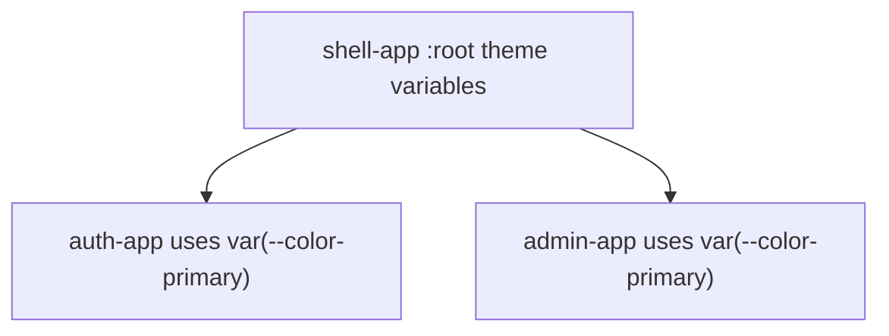

Rules for shared colors:

- Define product-wide variables in the shell.
- Make remotes use `var(--color-...)` instead of hardcoded colors.
- Put remote standalone defaults behind `:root:not([data-theme-owner="shell"])`.
- Keep variable names stable because they become a theme contract.
- Do not rely on Native Federation sharing to distribute CSS variables; CSS cascade does that after the remote is loaded into the shell page.

### 10.4 Different Colors for Different Remotes

Sometimes each remote should keep its own identity. For example, the storefront, auth area, and admin area might intentionally use different accents.

There are two safe patterns.

Pattern 1: Host chooses the active remote theme.

```css
html[data-active-mfe="auth"] {
  --color-primary: #374151;
  --color-primary-hover: #1f2937;
}

html[data-active-mfe="admin"] {
  --color-primary: #0f766e;
  --color-primary-hover: #115e59;
}
```

The host updates `data-active-mfe` when navigation changes:

```ts
import { NavigationEnd, Router } from '@angular/router';
import { filter } from 'rxjs';

router.events
  .pipe(filter((event): event is NavigationEnd => event instanceof NavigationEnd))
  .subscribe((event) => {
    const url = event.urlAfterRedirects;
    const activeMfe = url.startsWith('/admin') ? 'admin' : url.startsWith('/auth') ? 'auth' : 'shell';
    document.documentElement.dataset['activeMfe'] = activeMfe;
  });
```

Use this when the shell owns the whole page theme and only changes tokens based on the active route.

Pattern 2: Remote scopes its own colors under a wrapper.

```html
<section class="admin-theme">
  <router-outlet />
</section>
```

```css
.admin-theme {
  --color-primary: #0f766e;
  --color-primary-hover: #115e59;
  --color-background: #f7faf8;
}
```

Use this when only the remote's internal area should have different colors, while the shell header/footer keep the shell theme.

Avoid this pattern:

```css
:root {
  --color-primary: #0f766e;
}
```

inside a remote. When loaded into the shell, that can overwrite the whole page and accidentally change other MFEs.

### 10.5 Sharing Data Between Native Federation Apps

Native Federation does not share data automatically. It only loads JavaScript modules. Data sharing must use an explicit contract.

Common options:

| Method | Works for same framework? | Works cross-framework? | Good for | Coupling |
| --- | --- | --- | --- | --- |
| Route params/query params | Yes | Yes | Navigation state, filters, IDs | Low |
| Backend APIs | Yes | Yes | Business data and authorization | Low |
| `localStorage` | Yes, same browser origin | Yes, same browser origin | Small persisted client state | Medium |
| `sessionStorage` | Yes, same tab and origin | Yes, same tab and origin | Per-tab temporary state | Medium |
| `CustomEvent` | Yes | Yes | Notifications between apps on the same page | Low |
| `storage` event | Yes, same origin tabs | Yes, same origin tabs | Cross-tab sync after `localStorage` changes | Medium |
| Shared Angular service | Yes, Angular only | No | Small Angular platform state | High |
| Shared RxJS library | Yes, mostly Angular/TS apps | Possible but not ideal | Event streams in same-runtime apps | Medium to high |
| Web Component props/events | Yes | Yes | Cross-framework UI data in/out | Low |

Recommended order:

1. Use backend APIs for business truth.
2. Use route/query parameters for navigation state.
3. Use `CustomEvent` for simple same-page notifications.
4. Use `localStorage` only for small persisted browser state, such as tokens or user summary.
5. Use shared services only when the apps are same-framework and the shared contract is stable.

Example same-page event:

```ts
window.dispatchEvent(
  new CustomEvent('commerce-auth-logout', {
    detail: { reason: 'user-request' },
  }),
);
```

Shell listener:

```ts
window.addEventListener('commerce-auth-logout', () => {
  authFacade.clear();
});
```

Current repository example:

- `admin-app` dispatches `commerce-auth-logout` on logout.
- `shell-app` listens for `commerce-auth-logout` in `AuthFacade`.
- `shell-app` also listens for `storage` and `focus` events to sync auth state from browser storage.

### 10.6 Why `localStorage` and `sessionStorage` Behave This Way

Browser storage is scoped by origin, not by Native Federation app name.

An origin is:

```text
protocol + hostname + port
```

Examples:

```text
http://localhost:4200 -> one origin
http://localhost:4201 -> different origin
http://localhost:4202 -> different origin
```

Important behavior:

| Storage | Shared between same-origin tabs? | Shared between different ports? | Persists after browser restart? | Sends `storage` event to other tabs? |
| --- | --- | --- | --- | --- |
| `localStorage` | Yes | No | Usually yes | Yes |
| `sessionStorage` | No, it is per tab/window | No | No | No for normal cross-tab sync |

This means:

- If `auth-app` is opened standalone at `http://localhost:4201`, its `localStorage` belongs to origin `http://localhost:4201`.
- If `auth-app` is loaded as a remote inside `shell-app` at `http://localhost:4200/auth/login`, its JavaScript runs in the shell page, so storage reads/writes use origin `http://localhost:4200`.
- `admin-app` loaded inside `shell-app` also uses the shell page origin for browser storage.
- Two tabs open to `http://localhost:4200` share `localStorage`.
- A tab open to `http://localhost:4200` does not share `localStorage` with a tab open to `http://localhost:4201`.
- `sessionStorage` is tab-specific. A duplicated tab may copy the initial values in some browsers, but later changes are not a reliable shared state mechanism.

Current repository token keys:

```text
access_token
refresh_token
shell_user
auth_user
admin_user
```

Current shell behavior:

```ts
window.addEventListener('storage', () => this.syncFromStorage());
window.addEventListener('focus', () => this.syncFromStorage());
window.addEventListener('commerce-auth-logout', () => this.clear());
```

Why this is needed:

- `localStorage` changes made in one tab notify other same-origin tabs through the `storage` event.
- The tab that performs the write does not receive its own `storage` event.
- `focus` gives the shell another chance to re-read storage when a user returns to the tab.
- `commerce-auth-logout` handles same-page communication between loaded remotes and the shell.

Security note:

- `localStorage` is convenient but readable by any JavaScript running in the same page origin.
- Because Native Federation remotes run in the host page, a loaded remote is trusted code with access to the same origin storage.
- Never store passwords in browser storage.
- Prefer short-lived access tokens, refresh-token rotation, backend validation, and a strict Content Security Policy where possible.

## 11. Routing

### Same-Framework Routing

Current Angular-to-Angular routing:

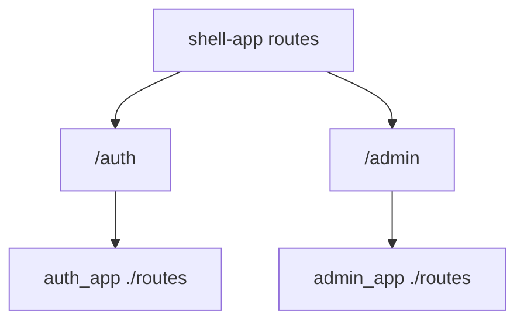

Host responsibility:

- Own the top-level URL.
- Decide when a remote is loaded.
- Provide layout around remote routes if needed.
- Provide loading and error states.
- Provide a host-level `**` route for unknown top-level URLs.
- Provide a remote-load failure fallback for routes such as `/auth` and `/admin`.

Remote responsibility:

- Own internal child routes.
- Own feature-specific guards.
- Own feature components.
- Keep route exports stable.
- Provide a remote-level `**` route for unknown URLs inside the remote route tree.

Current repository state:

| App | Current fallback behavior |
| --- | --- |
| `auth-app` | Has `{ path: '**', redirectTo: '' }` inside its exposed routes. |
| `admin-app` | Has `{ path: '**', redirectTo: '' }` inside its exposed routes. |
| `shell-app` | Does not currently show a final host-level `**` fallback in the inspected route file. Add one if the shell should handle unknown top-level URLs cleanly. |

### Cross-Framework Routing

Example: Angular host to React remote.

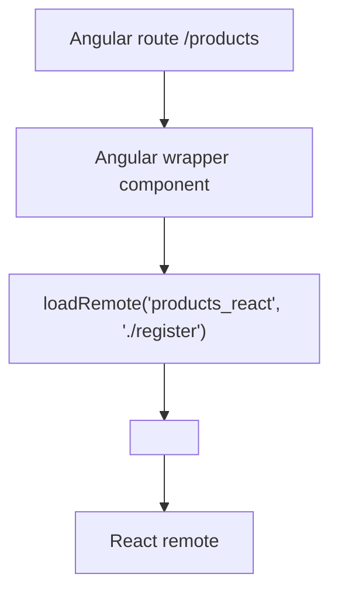

For cross-framework UI, the host route normally renders a wrapper component. The wrapper loads the remote module and mounts a Web Component or calls a mount API.

Do not expose React Router routes and expect Angular Router to understand them. Do not expose Angular `Routes` and expect React Router or Vue Router to consume them directly.

Angular-style navigation to a React remote means this shape:

```text
Angular Router URL
  -> Angular shell route
    -> Angular wrapper component
      -> Native Federation loads React registration module
        -> wrapper renders React-backed custom element
```

Example shell route:

```ts
{
  path: 'spotlight',
  loadComponent: () =>
    import('./features/product-spotlight/product-spotlight-page.component').then(
      (m) => m.ProductSpotlightPageComponent,
    ),
}
```

Example shell navigation:

```html
<a routerLink="/spotlight">Product spotlight</a>
```

Example event-to-router handoff from the wrapper:

```ts
element.addEventListener('product-spotlight-select', (event: Event) => {
  const detail = (event as CustomEvent<{ slug?: string }>).detail;
  if (detail?.slug) {
    void this.router.navigate(['/products', detail.slug]);
  }
});
```

This gives users normal Angular Router behavior: address-bar URLs, `RouterLink`, guards around the wrapper route, lazy loading, shell layout, and browser back/forward support. The React remote owns only the UI inside its Web Component or mount target.

## 12. Shared Dependencies

Shared dependencies are one of the most important Native Federation decisions.

### Current Angular Sharing

The current apps use:

```js
shareAll({ singleton: true, strictVersion: true, requiredVersion: 'auto', build: 'package' })
```

They also override `@angular/core` with `includeSecondaries: false` and skip several Angular secondary internals and unused RxJS entry points.

Current skip list includes:

```js
[
  'rxjs/ajax',
  'rxjs/fetch',
  'rxjs/testing',
  'rxjs/webSocket',
  '@angular/core/event-dispatch-contract.min.js',
  '@angular/core/primitives/di',
  '@angular/core/primitives/event-dispatch',
  '@angular/core/primitives/signals',
  '@angular/core/rxjs-interop',
]
```

### When To Share

Share when:

- The dependency must be singleton for correctness.
- Host and remote use compatible versions.
- The dependency is part of a deliberate platform contract.
- Duplicating it would break runtime behavior.

Angular-to-Angular:

```js
shared: {
  ...shareAll({ singleton: true, strictVersion: true, requiredVersion: 'auto', build: 'package' }),
}
```

React-to-React:

```js
shared: {
  react: { singleton: true, strictVersion: true, requiredVersion: 'auto' },
  'react-dom': { singleton: true, strictVersion: true, requiredVersion: 'auto' },
}
```

Vue-to-Vue:

```js
shared: {
  vue: { singleton: true, strictVersion: true, requiredVersion: 'auto' },
}
```

### When Not To Share

Do not share:

- Angular packages with React or Vue remotes.
- React packages with Angular or Vue remotes.
- Vue packages with Angular or React remotes.
- Remote-private feature libraries.
- Libraries with incompatible versions.
- Libraries where independent upgrades matter more than deduplication.

Cross-framework sharing guidance:

| Host | Remote | Share framework runtime? |
| --- | --- | --- |
| Angular | React | Share Angular only with Angular remotes; share React only among compatible React remotes. |
| Angular | Vue | Share Angular only with Angular remotes; share Vue only among compatible Vue remotes. |
| React | Angular | Share React only with React remotes; Angular remote manages Angular with compatible Angular consumers. |
| Vue | React | Share Vue only with Vue remotes; share React only among compatible React remotes. |

Blindly sharing framework-specific packages across different frameworks is usually inappropriate because the frameworks do not use each other's runtimes.

## 13. Runtime Loading

This repository uses `@angular-architects/native-federation@22.1.1`.

The package still exports top-level `loadRemoteModule`, but its installed TypeScript declaration marks it deprecated and recommends using the `loadRemoteModule` returned by `initFederation(...)`.

The repository includes wrapper files in `shell-app/src/federation-loader.ts` and `admin-app/src/federation-loader.ts`:

```ts
import { initFederation, NativeFederationResult } from '@angular-architects/native-federation';

let federation: Promise<NativeFederationResult> | undefined;

export function startFederation(manifestUrl?: string) {
  federation = initFederation(manifestUrl);
  return federation;
}

export async function loadRemote<T = unknown>(
  remoteName: string,
  exposedModule: string,
): Promise<T> {
  if (!federation) throw new Error('Native Federation has not been initialized.');
  const { loadRemoteModule } = await federation;
  return loadRemoteModule<T>(remoteName, exposedModule);
}
```

Current `main.ts` files call `initFederation(...)` directly. If route loading uses the wrapper above, `main.ts` should initialize through the wrapper so both pieces use the same stored federation promise:

```ts
import { startFederation } from './federation-loader';

startFederation('/assets/federation.manifest.json')
  .then(() => import('./bootstrap'))
  .catch((err: unknown) => console.error(err));
```

For a pure remote that does not load other remotes:

```ts
import { initFederation } from '@angular-architects/native-federation';

initFederation()
  .then(() => import('./bootstrap'))
  .catch((err: unknown) => console.error(err));
```

Version-specific note:

- In this installed package, `loadRemoteModule(remoteName, exposedModule)` still exists.
- It is marked deprecated in the local declaration file.
- Prefer the `loadRemoteModule` returned from `initFederation(...)`, either directly or through an app-local wrapper.

## 14. Step-by-Step Implementation Guide

Use this section when implementing the same Angular-to-Angular Native Federation setup used by this repository.

Target architecture:

```text
shell-app
  /auth  -> auth_app ./routes
  /admin -> admin_app ./routes

admin-app
  /auth -> auth_app ./routes

auth-app
  exposes ./routes

product-manager
  exposes ./register
  registers <product-manager-mfe>
  used by admin-app product routes
```

### 14.1 Choose The Application Role

Before changing files, decide the role of the app. The role determines which files and commands are required.

| Role | Meaning | Needs `remoteEntry.json`? | Needs host manifest? | Typical files |
| --- | --- | --- | --- | --- |
| Host only | Loads other apps but is not loaded by another app. | Usually no, unless it also exposes modules later. | Yes | `federation.config.mjs`, `public/assets/federation.manifest.json`, `src/main.ts`, `src/bootstrap.ts`, `src/federation-loader.ts` |
| Remote only | Exposes modules for another app to load. | Yes | No, unless it also loads remotes. | `federation.config.mjs`, exposed source files, federation build config |
| Host plus remote | Is loaded by one app and loads another app. | Yes | Yes | Host files plus remote `exposes` |
| Normal app | Does not load or expose remotes. | No | No | No federation files |

Use this decision rule:

```text
Does this app need to load another deployed frontend at runtime?
  Yes -> it is a host.

Does another deployed frontend need to load this app at runtime?
  Yes -> it is a remote.

Both yes -> host plus remote.
Both no -> do not add Native Federation.
```

The exposed contract must be small and stable:

| Framework case | Recommended exposed contract |
| --- | --- |
| Angular remote consumed by Angular host | `./routes` exporting Angular `Routes`, or a standalone Angular component |
| React remote consumed by Angular host | `./register` registering a Web Component, or `./mount` exporting a mount function |
| React remote consumed by React host | React component, React routes, Web Component, or mount function |
| Next.js app consumed by Angular host | Browser-only React adapter through `./register` or `./mount`; do not expose App Router pages |
| Server-rendered Next/Django app that must keep SSR | iframe or separate navigation, not Native Federation browser modules |

### 14.2 Make A Pure Angular Application A Host

Use this when a normal Angular app should load one or more remotes at runtime.

Step 1: Install the Angular Native Federation adapter.

```bash
npm install @angular-architects/native-federation
```

Step 2: Initialize the app as a dynamic host.

```bash
ng g @angular-architects/native-federation:init --project shell-app --port 4200 --type dynamic-host
```

Use the real Angular project name from `angular.json`. The schematic normally updates `angular.json`, creates `federation.config.mjs`, and splits bootstrap into `main.ts` and `bootstrap.ts`.

Step 3: Verify `angular.json` uses the Native Federation wrapper builder.

```json
{
  "build": {
    "builder": "@angular-architects/native-federation:build"
  },
  "serve": {
    "builder": "@angular-architects/native-federation:build"
  },
  "esbuild": {
    "builder": "@angular/build:application"
  }
}
```

The Native Federation builder wraps the normal Angular esbuild application build. It does not replace Angular with webpack.

Step 4: Configure the host's `federation.config.mjs`.

```js
import { withNativeFederation, shareAll } from '@angular-architects/native-federation/config';

export default withNativeFederation({
  name: 'shell_app',
  remotes: {
    auth_app: 'http://localhost:4201/remoteEntry.json',
    admin_app: 'http://localhost:4202/remoteEntry.json',
  },
  shared: {
    ...shareAll({ singleton: true, strictVersion: true, requiredVersion: 'auto', build: 'package' }),
  },
});
```

Why:

- `name` gives this app a stable federation identity.
- `remotes` documents build-time known remotes.
- `shared` keeps Angular runtime packages compatible across Angular host and Angular remotes.

Step 5: Add the runtime manifest.

`public/assets/federation.manifest.json`:

```json
{
  "auth_app": "http://localhost:4201/remoteEntry.json",
  "admin_app": "http://localhost:4202/remoteEntry.json",
  "productManager": "http://localhost:4205/remoteEntry.json"
}
```

Why:

- The manifest is the runtime address book.
- Production can point the same host build to different remote URLs.
- The keys must match remote `name` values exactly.

Step 6: Initialize federation before Angular bootstrap.

`src/main.ts`:

```ts
import { startFederation } from './federation-loader';

startFederation('/assets/federation.manifest.json')
  .then(() => import('./bootstrap'))
  .catch((err: unknown) => console.error(err));
```

`src/bootstrap.ts`:

```ts
import { bootstrapApplication } from '@angular/platform-browser';
import { App } from './app/app';
import { appConfig } from './app/app.config';

bootstrapApplication(App, appConfig).catch((err: unknown) => console.error(err));
```

Why:

- `main.ts` should avoid importing Angular app code before federation initializes.
- `bootstrap.ts` imports Angular and starts the application only after Native Federation prepares import maps.

Step 7: Add a host loader wrapper.

`src/federation-loader.ts`:

```ts
import { initFederation, NativeFederationResult } from '@angular-architects/native-federation';

let federation: Promise<NativeFederationResult> | undefined;

export function startFederation(manifestUrl?: string) {
  federation = initFederation(manifestUrl);
  return federation;
}

export async function loadRemote<T = unknown>(remoteName: string, exposedModule: string): Promise<T> {
  const federationResult = federation ?? startFederation('/assets/federation.manifest.json');
  const { loadRemoteModule } = await federationResult;
  return loadRemoteModule<T>(remoteName, exposedModule);
}
```

Why:

- Route code gets one local `loadRemote(...)` API.
- Host plus remote apps still work when loaded inside another shell because the loader can initialize lazily.

Step 8: Load Angular remote routes.

```ts
import { Routes } from '@angular/router';
import { loadRemote } from '../federation-loader';

export const routes: Routes = [
  {
    path: 'auth',
    loadChildren: () =>
      loadRemote<{ routes: Routes }>('auth_app', './routes').then((m) => m.routes),
  },
];
```

Step 9: Load React/Web Component remotes through an Angular wrapper.

```ts
{
  path: 'products',
  loadComponent: () =>
    import('./features/products/product-manager-remote/product-manager-remote.component').then(
      (m) => m.ProductManagerRemoteComponent,
    ),
}
```

Step 10: Verify.

```bash
npm run build
npm start
```

Then open:

```text
http://localhost:4200/assets/federation.manifest.json
http://localhost:4201/remoteEntry.json
http://localhost:4200/auth/login
```

### 14.3 Make A Pure Angular Application A Remote

Use this when an Angular app should expose routes or components to an Angular host.

Step 1: Install and initialize as a remote.

```bash
npm install @angular-architects/native-federation
ng g @angular-architects/native-federation:init --project auth-app --port 4201 --type remote
```

Step 2: Expose Angular routes.

`federation.config.mjs`:

```js
import { withNativeFederation, shareAll } from '@angular-architects/native-federation/config';

export default withNativeFederation({
  name: 'auth_app',
  exposes: {
    './routes': './src/app/app.routes.ts',
  },
  shared: {
    ...shareAll({ singleton: true, strictVersion: true, requiredVersion: 'auto', build: 'package' }),
  },
});
```

Step 3: Export route definitions from the exposed file.

```ts
import { Routes } from '@angular/router';

export const routes: Routes = [
  {
    path: 'login',
    loadComponent: () => import('./features/auth/login/login').then((m) => m.Login),
  },
];
```

Step 4: Keep routes relative to the host mount path.

If the host mounts this remote at `/auth`, the remote route should be `login`, not `/auth/login`.

```text
Host path:   /auth
Remote path: login
Final URL:   /auth/login
```

Step 5: Keep bootstrap split.

Remote apps still need Native Federation initialization before Angular bootstrap so shared Angular packages resolve correctly.

Step 6: Verify the remote.

```bash
npm run build
npm start
```

Then open:

```text
http://localhost:4201/remoteEntry.json
```

The host manifest must use:

```json
{
  "auth_app": "http://localhost:4201/remoteEntry.json"
}
```

Step 7: Do not add host-only files unless the remote also loads other remotes.

A pure Angular remote does not need `public/assets/federation.manifest.json` or `src/federation-loader.ts` unless it also consumes another remote.

### 14.4 Make A Pure Angular Application Host Plus Remote

Use this when an Angular app is loaded by a parent shell and also loads its own remotes. In this repo, `admin-app` is host plus remote.

Step 1: Configure both `exposes` and `remotes`.

```js
export default withNativeFederation({
  name: 'admin_app',
  exposes: {
    './routes': './src/app/app.routes.ts',
  },
  remotes: {
    auth_app: 'http://localhost:4201/remoteEntry.json',
    productManager: 'http://localhost:4205/remoteEntry.json',
  },
  shared: {
    ...shareAll({ singleton: true, strictVersion: true, requiredVersion: 'auto', build: 'package' }),
  },
});
```

Step 2: Add its own manifest because it loads remotes.

`admin-app/public/assets/federation.manifest.json`:

```json
{
  "auth_app": "http://localhost:4201/remoteEntry.json",
  "productManager": "http://localhost:4205/remoteEntry.json"
}
```

Step 3: Make the parent shell manifest include every remote needed during nested loading.

`shell-app/public/assets/federation.manifest.json`:

```json
{
  "auth_app": "http://localhost:4201/remoteEntry.json",
  "admin_app": "http://localhost:4202/remoteEntry.json",
  "price_lens_product_app": "http://localhost:4204/remoteEntry.json",
  "productManager": "http://localhost:4205/remoteEntry.json"
}
```

Why:

- When admin runs standalone at `4202`, it uses its own manifest.
- When admin is loaded inside shell at `4200/admin`, the browser page belongs to the shell.
- Listing nested remotes in the shell manifest avoids missing remote resolution when a child host route loads another remote.

Step 4: Use a lazy-safe federation loader.

Use the `federation-loader.ts` pattern from section 14.2 so the app works both standalone and nested inside the shell.

Step 5: Keep route links prefix-aware.

If a host plus remote app can run at `/products` standalone and `/admin/products` inside shell, generate links through a helper such as `AdminRouteService` instead of hardcoding one base path.

### 14.5 Make A Pure React Application A Remote

Use this when a React app should be loaded by Angular or another host as browser JavaScript.

Step 1: Install dependencies.

```bash
npm install react react-dom react-router-dom
npm install @softarc/native-federation @softarc/native-federation-esbuild
npm install -D vite @vitejs/plugin-react esbuild typescript @types/react @types/react-dom
```

Step 2: Create `federation.config.mjs`.

For a Web Component remote:

```js
import { withNativeFederation } from '@softarc/native-federation/config';

export default withNativeFederation({
  name: 'react_feature_app',
  exposes: {
    './register': './src/remote/register.tsx',
  },
  shared: {},
});
```

For a mount API remote:

```js
export default withNativeFederation({
  name: 'react_feature_app',
  exposes: {
    './mount': './src/mount.tsx',
  },
  shared: {},
});
```

Step 3: Choose the integration boundary.

| Boundary | Use when | Angular host does |
| --- | --- | --- |
| Web Component `./register` | The remote should look like a custom HTML element. | Loads `./register`, then creates the element. |
| Mount API `./mount` | The host wants explicit mount/unmount control with a DOM node. | Loads `./mount`, calls `mount(outlet, options)`, then calls returned `unmount`. |

Step 4: Implement a Web Component registration module.

```tsx
import './remote.css';
import { createRoot, type Root } from 'react-dom/client';
import { ReactFeatureApp } from './react-feature-app';

const TAG_NAME = 'react-feature-mfe';

class ReactFeatureElement extends HTMLElement {
  private root: Root | null = null;

  connectedCallback() {
    if (this.root) return;
    const mount = document.createElement('div');
    this.appendChild(mount);
    this.root = createRoot(mount);
    this.root.render(<ReactFeatureApp />);
  }

  disconnectedCallback() {
    this.root?.unmount();
    this.root = null;
  }
}

if (!customElements.get(TAG_NAME)) {
  customElements.define(TAG_NAME, ReactFeatureElement);
}
```

Step 5: Or implement a mount API.

```tsx
import { createRoot } from 'react-dom/client';
import { ReactFeatureApp } from './react-feature-app';
import './remote.css';

export function mount(element: HTMLElement) {
  const root = createRoot(element);
  root.render(<ReactFeatureApp />);

  return {
    unmount: () => root.unmount(),
  };
}
```

Step 6: Add CSS loading for host rendering.

If the generated CSS is not automatically attached when the host loads the remote module, inject it from the exposed module:

```ts
const link = document.createElement('link');
link.rel = 'stylesheet';
link.href = new URL('./register.css', import.meta.url).href;
link.dataset.reactFeatureStyle = 'true';
document.head.appendChild(link);
```

For a mount API remote, use the generated CSS next to that exposed module, for example `new URL('./mount.css', import.meta.url)`.

Step 7: Scope CSS.

```css
.react-feature-root .button {}
.react-feature-root table {}
.react-feature-root img {}
```

Do not write broad remote CSS:

```css
body {}
button {}
table {}
img {}
```

Step 8: Add a build script if the app is not already using the Angular Native Federation builder.

Use the same pattern as `product-manager/scripts/build.mjs` or `price-lens-product-app/scripts/build.mjs`: initialize `federationBuilder`, bundle the React entry with esbuild, and run `federationBuilder.build()`.

Step 9: Serve the generated output with CORS enabled.

```ts
export default defineConfig({
  plugins: [react()],
  preview: {
    cors: true,
    headers: {
      'Access-Control-Allow-Origin': '*',
      'Access-Control-Allow-Methods': 'GET, HEAD, OPTIONS',
      'Access-Control-Allow-Headers': '*',
    },
  },
});
```

Step 10: Verify.

```bash
npm run remote:build:dev
npm run remote:preview
```

Open:

```text
http://localhost:<remote-port>/remoteEntry.json
```

Then load the host route that consumes it.

### 14.6 Make A Pure React Application A Host

Use this when a React app should load remote browser modules.

Step 1: Install the Native Federation runtime/build packages.

```bash
npm install @softarc/native-federation
npm install -D @softarc/native-federation-esbuild vite @vitejs/plugin-react esbuild typescript
```

Step 2: Add a host manifest.

```json
{
  "react_feature_app": "http://localhost:4204/remoteEntry.json",
  "productManager": "http://localhost:4205/remoteEntry.json"
}
```

Step 3: Initialize federation before rendering React.

Conceptual shape:

```ts
import { initFederation } from '@softarc/native-federation';

initFederation('/assets/federation.manifest.json')
  .then(() => import('./bootstrap'))
  .catch((error) => console.error(error));
```

`bootstrap.tsx` should import React and call `createRoot(...)`.

Step 4: Load a Web Component remote.

```tsx
import { useEffect, useRef } from 'react';
import { loadRemoteModule } from '@softarc/native-federation';

export function ProductManagerRemoteView() {
  const outlet = useRef<HTMLDivElement>(null);

  useEffect(() => {
    let element: HTMLElement | undefined;

    void loadRemoteModule('productManager', './register').then((remote: { PRODUCT_MANAGER_ELEMENT: string }) => {
      element = document.createElement(remote.PRODUCT_MANAGER_ELEMENT);
      element.setAttribute('initial-path', '/products');
      outlet.current?.replaceChildren(element);
    });

    return () => element?.remove();
  }, []);

  return <div ref={outlet} />;
}
```

Step 5: Load a mount API remote.

```tsx
useEffect(() => {
  let remoteRoot: { unmount: () => void } | undefined;

  void loadRemoteModule('price_lens_product_app', './mount').then((remote: PriceLensRemoteModule) => {
    if (outlet.current) {
      remoteRoot = remote.mount(outlet.current, { routeBasePath: '/price-lens' });
    }
  });

  return () => remoteRoot?.unmount();
}, []);
```

Step 6: Keep React host routing separate from remote internals.

The React host owns the top-level route where the remote appears. The remote owns its internal route state unless you define an explicit route synchronization contract.

### 14.7 Make A Next.js Application A Remote

Use this when an existing Next.js app has browser-only React feature code that must render inside an Angular or React host.

Do not expose these as Native Federation modules:

```text
src/app/page.tsx
src/app/**/page.tsx
route handlers
middleware
server actions
server components
Next.js image optimizer
```

Instead, keep two modes:

```text
Standalone Next mode:
  src/app/** pages
  next dev / next build

Remote mode:
  src/remote/** browser-only adapter
  Vite + Native Federation output
  remoteEntry.json
```

Step 1: Identify shared browser-safe feature code.

Good shared code:

```text
src/features/products/components/product-form.tsx
src/features/products/api/products.api.ts
src/features/products/types/product.types.ts
src/lib/auth/api-client.ts
```

Avoid importing Next-only APIs into remote files:

```text
next/link
next/navigation
next/image
next/server
```

Step 2: Add remote dependencies.

```bash
npm install react-router-dom
npm install @softarc/native-federation @softarc/native-federation-esbuild
npm install -D vite @vitejs/plugin-react esbuild
```

Step 3: Add `federation.config.mjs`.

```js
import { withNativeFederation } from '@softarc/native-federation/config';

export default withNativeFederation({
  name: 'productManager',
  exposes: {
    './register': './src/remote/register.ts',
  },
  shared: {},
});
```

Step 4: Add remote-only TypeScript config.

```json
{
  "extends": "./tsconfig.json",
  "compilerOptions": {
    "types": ["vite/client", "node"],
    "incremental": false
  },
  "include": ["src/**/*.ts", "src/**/*.tsx"],
  "exclude": ["node_modules", ".next", "src/app"]
}
```

Step 5: Create React Router adapters under `src/remote/pages`.

Standalone Next screen:

```tsx
import { useRouter } from 'next/navigation';

router.push('/admin/products/new');
```

Remote screen:

```tsx
import { useNavigate } from 'react-router-dom';

navigate('/products/new');
```

Step 6: Create the remote app with `MemoryRouter`.

```tsx
import { MemoryRouter, Navigate, Route, Routes } from 'react-router-dom';

export function ProductManagerRemote({ initialPath = '/products' }: { initialPath?: string }) {
  return (
    <div className="product-manager-root">
      <MemoryRouter initialEntries={[initialPath]}>
        <Routes>
          <Route path="/" element={<Navigate to="/products" replace />} />
          <Route path="/products" element={<ProductListRemote />} />
          <Route path="/products/new" element={<ProductCreateRemote />} />
          <Route path="/products/:id/edit" element={<ProductEditRemote />} />
        </Routes>
      </MemoryRouter>
    </div>
  );
}
```

Why `MemoryRouter`:

- Angular owns the browser URL.
- React owns internal product-manager navigation.
- The two routers do not compete for `window.history`.

Step 7: Create the custom element.

```tsx
export class ProductManagerElement extends HTMLElement {
  static get observedAttributes() {
    return ['initial-path'];
  }

  connectedCallback() {
    // merge runtime config, create mount node, create React root, render remote app
  }

  attributeChangedCallback() {
    // rerender or remount when Angular changes initial-path
  }

  disconnectedCallback() {
    // unmount React root
  }
}
```

Step 8: Create the exposed registration module.

```ts
import './remote.css';
import { ProductManagerElement } from './product-manager-element';

export const PRODUCT_MANAGER_ELEMENT = 'product-manager-mfe';

function ensureRemoteStylesheet() {
  if (document.querySelector('link[data-product-manager-remote-style]')) return;

  const link = document.createElement('link');
  link.rel = 'stylesheet';
  link.href = new URL('./register.css', import.meta.url).href;
  link.dataset.productManagerRemoteStyle = 'true';
  document.head.appendChild(link);
}

ensureRemoteStylesheet();

if (!customElements.get(PRODUCT_MANAGER_ELEMENT)) {
  customElements.define(PRODUCT_MANAGER_ELEMENT, ProductManagerElement);
}
```

Step 9: Add runtime config through element attributes.

The host passes:

```html
<product-manager-mfe
  initial-path="/products"
  api-base-url="http://localhost:3000"
  refresh-endpoint="/api/v1/auth/refresh"
  refresh-token-field="refreshToken"
  login-url="/auth/login"
  redirect-on-missing-auth="true">
</product-manager-mfe>
```

The remote stores this in `window.__PRODUCT_MANAGER_CONFIG__` and the API client reads it at request time.

Step 10: Configure package scripts.

```json
{
  "scripts": {
    "dev": "npm run remote",
    "next:dev": "next dev --port 4205",
    "build": "next build",
    "remote": "npm run remote:build:dev && npm run remote:preview",
    "remote:build": "node scripts/build.mjs --prod",
    "remote:build:dev": "node scripts/build.mjs",
    "remote:preview": "vite preview --host 0.0.0.0 --port 4205 --strictPort",
    "remote:typecheck": "tsc -p tsconfig.remote.json --noEmit"
  }
}
```

Step 11: Configure Vite preview CORS.

```ts
export default defineConfig({
  plugins: [react()],
  preview: {
    cors: true,
    headers: {
      'Access-Control-Allow-Origin': '*',
      'Access-Control-Allow-Methods': 'GET, HEAD, OPTIONS',
      'Access-Control-Allow-Headers': '*',
    },
  },
});
```

Step 12: Add the remote to the Angular host manifest.

```json
{
  "productManager": "http://localhost:4205/remoteEntry.json"
}
```

Step 13: Add an Angular wrapper component.

```ts
const remote = await loadRemote<ProductManagerRegisterModule>('productManager', './register');
const element = document.createElement(remote.PRODUCT_MANAGER_ELEMENT);
element.setAttribute('initial-path', '/products');
element.setAttribute('api-base-url', 'http://localhost:3000');
outlet.nativeElement.replaceChildren(element);
```

Step 14: Verify both modes.

```bash
npm run remote:typecheck
npm run remote:build:dev
npm run build
```

Then run remote mode:

```bash
npm run dev
```

Open:

```text
http://localhost:4205/remoteEntry.json
http://localhost:4200/admin/products
```

For standalone Next mode:

```bash
npm run next:dev
```

Open the standalone Next route directly.

### 14.8 Make A Next.js Application A Host

Use this only when a Next.js app should load browser-native remotes into client components.

Step 1: Keep federation code client-side.

Remote loading touches `window`, `document`, import maps, and custom elements. Put it behind a client boundary:

```tsx
'use client';
```

Step 2: Initialize federation in a client bootstrap or lazy client component.

Conceptual shape:

```tsx
'use client';

import { useEffect, useState } from 'react';
import { initFederation } from '@softarc/native-federation';

export function FederationProvider({ children }: { children: React.ReactNode }) {
  const [ready, setReady] = useState(false);

  useEffect(() => {
    void initFederation('/assets/federation.manifest.json').then(() => setReady(true));
  }, []);

  if (!ready) return null;
  return children;
}
```

Step 3: Load remotes only from client components.

```tsx
'use client';

import { useEffect, useRef } from 'react';
import { loadRemoteModule } from '@softarc/native-federation';

export function RemoteWidget() {
  const outlet = useRef<HTMLDivElement>(null);

  useEffect(() => {
    let element: HTMLElement | undefined;

    void loadRemoteModule('productManager', './register').then((remote: { PRODUCT_MANAGER_ELEMENT: string }) => {
      element = document.createElement(remote.PRODUCT_MANAGER_ELEMENT);
      outlet.current?.replaceChildren(element);
    });

    return () => element?.remove();
  }, []);

  return <div ref={outlet} />;
}
```

Step 4: Do not call federation runtime APIs from Server Components, route handlers, middleware, or server actions.

Those execute in the Next.js server/runtime environment, not as normal browser modules in the page.

Step 5: Decide whether Next should be the host at all.

Use Next.js as a Native Federation host only if:

- the host page is mostly client-rendered,
- the remote is browser-only,
- SEO/SSR expectations do not require the remote content to be server-rendered,
- the deployment can serve a host manifest and remote assets with correct CORS.

If the remote must be SSR-visible or independently authenticated as a server app, use navigation or iframe integration instead of Native Federation.

### What Changes From a Basic Angular App

A basic Angular app usually has this shape:

```text
src/main.ts
  imports Angular
  bootstraps App directly

angular.json
  build -> @angular/build:application
  serve -> @angular/build:dev-server

No federation.config.mjs
No remoteEntry.json
No federation.manifest.json
No runtime remote loading
```

A Native Federation Angular app changes that shape:

```text
src/main.ts
  initializes Native Federation first
  then dynamically imports bootstrap.ts

src/bootstrap.ts
  imports Angular
  bootstraps App

federation.config.mjs
  declares host/remote name, exposed modules, remotes, and shared dependencies

public/assets/federation.manifest.json
  tells a host where remoteEntry.json files are

angular.json
  wraps build/serve with @angular-architects/native-federation:build
  keeps Angular application build under the esbuild target

app.routes.ts
  host routes call loadRemote(...) for remote routes
  remote routes export routes for the host to consume
```

### Native Federation Files Added or Changed

Before looking at each file, decide the app role. The role controls which files are needed.

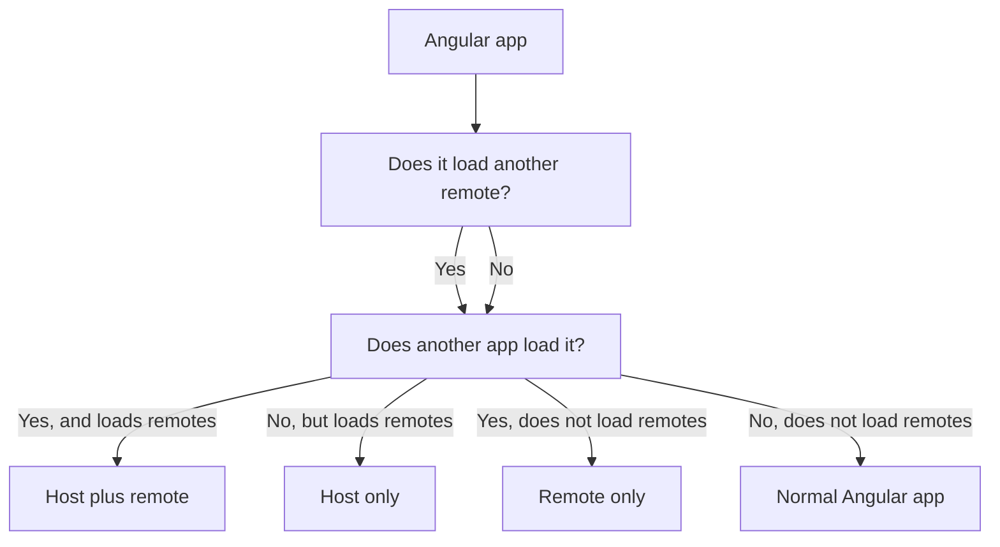

Current repository examples:

| App | Role | Native Federation use case |
| --- | --- | --- |
| `shell-app` | Host only | Storefront shell loads auth and admin features by route. |
| `auth-app` | Remote only | Authentication feature exposes its routes to hosts. |
| `admin-app` | Host plus remote | Admin feature is loaded by the shell and also loads auth routes for its own login flow. |

Role-based file checklist:

| File | Host only | Remote only | Host plus remote | Why |
| --- | --- | --- | --- | --- |
| `@angular-architects/native-federation` in `package.json` | Yes | Yes | Yes | Builder/config/runtime package. |
| `es-module-shims` in `package.json` | Yes | Yes | Yes | Import map support. |
| Native Federation builder in `angular.json` | Yes | Yes | Yes | Generates/uses federation metadata. |
| `federation.config.mjs` | Yes | Yes | Yes | Defines federation behavior for the app. |
| `remotes` in `federation.config.mjs` | Yes | No | Yes | Only apps that consume remotes need this. |
| `exposes` in `federation.config.mjs` | Usually no | Yes | Yes | Only apps consumed by another app need this. |
| `public/assets/federation.manifest.json` | Yes | No | Yes | Only apps that load remotes need remote discovery. |
| `src/federation-loader.ts` | Yes | No | Yes | Only apps that call `loadRemote(...)` need the wrapper. |
| `src/main.ts` with `startFederation(...)` | Yes | No | Yes | Hosts initialize with a manifest and store the federation result. |
| `src/main.ts` with `initFederation()` | No | Yes | No | Pure remotes initialize federation without a manifest. |
| `src/bootstrap.ts` | Yes | Yes | Yes | Keeps Angular bootstrap after federation initialization. |
| Host routes using `loadRemote(...)` | Yes | No | Yes | Only hosts route to remotes. |
| Remote route exports | No | Yes | Yes | Only remotes expose route modules. |
| Native Federation types in `tsconfig.app.json` | Yes | Yes | Yes | Keeps TypeScript aware of package types. |

| File | Added or changed? | Exists in which apps? | What it does |
| --- | --- | --- | --- |
| `package.json` | Changed | `shell-app`, `auth-app`, `admin-app` | Adds `@angular-architects/native-federation` and `es-module-shims`. |
| `angular.json` | Changed | All Native Federation apps | Uses the Native Federation builder wrapper and keeps the Angular esbuild application target. |
| `federation.config.mjs` | Added | All Native Federation apps | Defines app federation name, remotes, exposes, shared packages, skipped packages, and features. |
| `public/assets/federation.manifest.json` | Added | Host apps: `shell-app`, `admin-app` | Maps remote names to remote entry URLs. |
| `src/main.ts` | Changed | All Native Federation apps | Runs `initFederation(...)` or `startFederation(...)` before Angular bootstrap. |
| `src/bootstrap.ts` | Added or split out | All Native Federation apps | Contains the normal Angular `bootstrapApplication(...)` call. |
| `src/federation-loader.ts` | Added only when an app loads remotes | Host and host-plus-remote apps: `shell-app`, `admin-app` | Stores the initialized Native Federation result and loads remote modules. Pure remotes do not need it. |
| `src/app/app.routes.ts` | Changed | Host and remote apps | Hosts load remote routes; remotes export route arrays. |
| `src/app/app.config.ts` | Usually unchanged | All Angular apps | Keeps normal Angular providers. Native Federation is initialized in `main.ts`, not through Angular providers. |
| `tsconfig.app.json` | Changed | All Native Federation apps | Includes Native Federation type declarations through `compilerOptions.types`. |

### `package.json`

Native Federation adds these runtime dependencies:

```json
{
  "dependencies": {
    "@angular-architects/native-federation": "^22.1.1",
    "es-module-shims": "^2.8.0"
  }
}
```

What they do:

| Package | Purpose |
| --- | --- |
| `@angular-architects/native-federation` | Provides the Angular builder, configuration helpers, and runtime initialization APIs. |
| `es-module-shims` | Provides import map behavior needed by Native Federation in browsers and configurations that need shim mode. |

Native Federation is not enabled just by installing the package. The app also needs builder configuration, `federation.config.mjs`, and runtime initialization.

### `angular.json`

Basic Angular app:

```json
"build": {
  "builder": "@angular/build:application"
}
```

Native Federation app:

```json
"build": {
  "builder": "@angular-architects/native-federation:build",
  "options": {
    "cacheExternalArtifacts": true,
    "tsConfig": "tsconfig.app.json"
  },
  "configurations": {
    "production": {
      "target": "shell-app:esbuild:production"
    },
    "development": {
      "target": "shell-app:esbuild:development",
      "dev": true
    }
  }
}
```

What each part does:

| Setting | Meaning |
| --- | --- |
| `@angular-architects/native-federation:build` | Runs the Native Federation wrapper around the Angular build. |
| `cacheExternalArtifacts` | Allows Native Federation to cache generated external/shared artifacts. |
| `tsConfig` | Tells the Native Federation builder which TypeScript config to use. This repo uses `tsconfig.app.json`. |
| `target` | Points Native Federation to the real Angular application build target. |
| `dev: true` | Uses development behavior for local builds and serve. |

The real Angular build remains under the `esbuild` target:

```json
"esbuild": {
  "builder": "@angular/build:application",
  "options": {
    "browser": "src/main.ts",
    "tsConfig": "tsconfig.app.json",
    "assets": [
      {
        "glob": "**/*",
        "input": "public"
      }
    ],
    "styles": ["src/styles.css"],
    "polyfills": ["es-module-shims"]
  }
}
```

What this does:

- `browser: "src/main.ts"` keeps `main.ts` as the browser entry.
- `assets` copies `public` into the build output, including `assets/federation.manifest.json`.
- `polyfills: ["es-module-shims"]` loads the import map shim needed by Native Federation.
- `styles` keeps the app's global CSS.

### `federation.config.mjs`

This is the main Native Federation configuration file.

Host example from `shell-app`:

```js
import { withNativeFederation, shareAll } from '@angular-architects/native-federation/config';

export default withNativeFederation({
  name: 'shell_app',

  remotes: {
    auth_app: 'http://localhost:4201/remoteEntry.json',
    admin_app: 'http://localhost:4202/remoteEntry.json',
  },

  shared: {
    ...shareAll(
      { singleton: true, strictVersion: true, requiredVersion: 'auto', build: 'package' },
      {
        overrides: {
          '@angular/core': {
            singleton: true,
            strictVersion: true,
            requiredVersion: 'auto',
            build: 'package',
            includeSecondaries: false,
          },
        },
      },
    ),
  },

  skip: [
    'rxjs/ajax',
    'rxjs/fetch',
    'rxjs/testing',
    'rxjs/webSocket',
    '@angular/core/event-dispatch-contract.min.js',
    '@angular/core/primitives/di',
    '@angular/core/primitives/event-dispatch',
    '@angular/core/primitives/signals',
    '@angular/core/rxjs-interop',
  ],

  features: {
    denseChunking: true,
  },
});
```

What each part does:

| Code | Meaning |
| --- | --- |
| `withNativeFederation(...)` | Normalizes the config for the Native Federation builder. |
| `shareAll(...)` | Creates shared dependency configuration from `package.json`. |
| `name: 'shell_app'` | Gives this app a stable federation name. Hosts and remotes reference this name. |
| `remotes` | Lists remote applications this app can consume. Host apps use this. |
| `exposes` | Lists local modules this app exposes to other apps. Remote apps use this. |
| `shared` | Defines dependencies that should be shared instead of duplicated where possible. |
| `singleton: true` | Requests one shared runtime instance for a package. Important for Angular packages. |
| `strictVersion: true` | Fails or warns on incompatible versions instead of silently mixing them. |
| `requiredVersion: 'auto'` | Uses package versions from `package.json`. |
| `build: 'package'` | Builds shared package artifacts for federation. |
| `includeSecondaries: false` | Prevents automatic sharing of every secondary entry point for `@angular/core`; this repo skips several Angular internals explicitly. |
| `skip` | Excludes packages or secondary entry points that should not be emitted/shared. |
| `denseChunking: true` | Groups generated chunk metadata to reduce `remoteEntry.json` metadata size. |

Remote example from `auth-app`:

```js
export default withNativeFederation({
  name: 'auth_app',
  exposes: {
    './routes': './src/app/app.routes.ts',
  },
});
```

What it means:

```text
Other apps can load:
  remote name: auth_app
  exposed module: ./routes

Native Federation maps that to:
  auth-app/src/app/app.routes.ts
```

Host plus remote example from `admin-app`:

```js
export default withNativeFederation({
  name: 'admin_app',
  exposes: {
    './routes': './src/app/app.routes.ts',
  },
  remotes: {
    auth_app: 'http://localhost:4201/remoteEntry.json',
  },
});
```

`admin-app` is both:

- A remote for `shell-app`, because it exposes `./routes`.
- A host for `auth-app`, because it has `remotes.auth_app`.

### `public/assets/federation.manifest.json`

This file exists in host apps.

`shell-app/public/assets/federation.manifest.json`:

```json
{
  "auth_app": "http://localhost:4201/remoteEntry.json",
  "admin_app": "http://localhost:4202/remoteEntry.json"
}
```

What it does:

- The key is the remote name used by `loadRemote(...)`.
- The value is the URL of that remote's generated `remoteEntry.json`.
- The host reads this file during federation initialization.
- The manifest can be replaced per environment without changing TypeScript code.

`admin-app/public/assets/federation.manifest.json`:

```json
{
  "auth_app": "http://localhost:4201/remoteEntry.json"
}
```

`auth-app` does not need this file because it is currently a pure remote and does not load another remote.

### `src/main.ts`

Basic Angular `main.ts` usually bootstraps Angular immediately:

```ts
import { bootstrapApplication } from '@angular/platform-browser';
import { App } from './app/app';
import { appConfig } from './app/app.config';

bootstrapApplication(App, appConfig).catch((err) => console.error(err));
```

Native Federation must initialize first.

Host `main.ts`:

```ts
import { startFederation } from './federation-loader';

startFederation('/assets/federation.manifest.json')
  .then(() => import('./bootstrap'))
  .catch((err: unknown) => console.error(err));
```

Remote-only `main.ts`:

```ts
import { initFederation } from '@angular-architects/native-federation';

initFederation()
  .then(() => import('./bootstrap'))
  .catch((err: unknown) => console.error(err));
```

What this does:

- Initializes Native Federation before Angular imports run.
- Loads the host federation manifest if the app consumes remotes.
- Creates the import map and shared dependency setup.
- Dynamically imports `bootstrap.ts` only after federation setup is ready.

This order is important. If Angular imports run before federation initialization, the browser can fail to resolve package imports such as `@angular/core`.

### `src/bootstrap.ts`

This file contains the normal Angular bootstrap code:

```ts
import { bootstrapApplication } from '@angular/platform-browser';
import { App } from './app/app';
import { appConfig } from './app/app.config';

bootstrapApplication(App, appConfig).catch((err: unknown) => console.error(err));
```

Why it exists:

- It keeps Angular imports out of `main.ts`.
- `main.ts` can initialize Native Federation first.
- Angular starts only after Native Federation has prepared runtime loading.

### `src/federation-loader.ts`

This file exists only in apps that load other remotes.

| App | Needs `federation-loader.ts`? | Why |
| --- | --- | --- |
| `shell-app` | Yes | It is the main host and loads `auth_app`, `admin_app`, `price_lens_product_app`, and `productManager`. |
| `admin-app` | Yes | It is a remote for `shell-app`, but it is also a host for `auth_app` and `productManager`. This makes it a host-plus-remote app. |
| `auth-app` | No | It exposes `./routes` but does not load another remote. |
| `price-lens-product-app` | No | It exposes `./mount` but does not load another remote. |
| `product-manager` | No | It exposes `./register` but does not load another remote. |

If an app only exposes modules and never calls `loadRemote(...)`, do not add `federation-loader.ts` to that app.

```ts
import { initFederation, NativeFederationResult } from '@angular-architects/native-federation';

let federation: Promise<NativeFederationResult> | undefined;

export function startFederation(manifestUrl?: string) {
  federation = initFederation(manifestUrl);
  return federation;
}

export async function loadRemote<T = unknown>(
  remoteName: string,
  exposedModule: string,
): Promise<T> {
  if (!federation) throw new Error('Native Federation has not been initialized.');
  const { loadRemoteModule } = await federation;
  return loadRemoteModule<T>(remoteName, exposedModule);
}
```

What each part does:

| Code | Meaning |
| --- | --- |
| `federation` | Stores the initialized Native Federation promise. |
| `startFederation(...)` | Starts Native Federation and optionally loads the host manifest. |
| `loadRemote(...)` | Loads an exposed module from a remote after federation is initialized. |
| `NativeFederationResult` | Type returned by `initFederation(...)`; includes the preferred `loadRemoteModule`. |
| Error if `federation` is missing | Prevents route loading before Native Federation setup. |

Why use this wrapper:

- In `@angular-architects/native-federation@22.1.1`, the top-level `loadRemoteModule` export still exists, but the package's type declarations mark it deprecated.
- The preferred API is the `loadRemoteModule` returned by `initFederation(...)`.
- This wrapper gives the app one consistent place to initialize and load remotes.

When to use `startFederation(...)` in `main.ts`:

```text
App loads remotes? yes -> use startFederation('/assets/federation.manifest.json')
App loads remotes? no  -> use initFederation()
```

That is why `shell-app` and `admin-app` use `startFederation(...)`, while `auth-app` uses `initFederation()`.

### `src/app/app.routes.ts`

Host route:

```ts
{
  path: 'auth',
  loadChildren: () =>
    loadRemote<{ routes: Routes }>('auth_app', './routes').then((m) => m.routes),
}
```

What it does:

```text
When the user navigates to /auth:
  1. Angular Router calls loadChildren.
  2. loadRemote asks Native Federation for auth_app -> ./routes.
  3. Native Federation loads auth_app remoteEntry.json if needed.
  4. It resolves ./routes to the generated remote module.
  5. The module returns Angular Routes.
  6. Angular Router mounts those routes under /auth.
```

Remote route export:

```ts
import { Routes } from '@angular/router';

export const routes: Routes = [
  {
    path: '',
    loadComponent: () => import('./features/auth/login/login').then((m) => m.Login),
  },
];
```

Why this works:

- The remote exposes `./routes`.
- The source file exports `routes`.
- The host loads `./routes` and reads `m.routes`.
- Both host and remote are Angular apps, so Angular Router understands the route array.

### `src/app/app.config.ts`

In this repository, `app.config.ts` remains a normal Angular application config file. It is not a Native Federation configuration file.

Typical Angular app config:

```ts
import { ApplicationConfig } from '@angular/core';
import { provideRouter } from '@angular/router';
import { routes } from './app.routes';

export const appConfig: ApplicationConfig = {
  providers: [provideRouter(routes)],
};
```

What it does:

| Code | Meaning |
| --- | --- |
| `ApplicationConfig` | Angular application provider configuration. |
| `provideRouter(routes)` | Registers this app's own Angular routes. |
| Other Angular providers | Register normal Angular services such as HTTP, animations, interceptors, or app-level services. |

What it does not do:

- It does not register the Native Federation manifest.
- It does not load remote entries.
- It does not expose remote modules.
- It does not replace `federation.config.mjs`.
- It does not replace `main.ts` federation initialization.

Keep Native Federation concerns in these files instead:

| Concern | File |
| --- | --- |
| Runtime initialization | `src/main.ts` |
| Angular bootstrap after federation setup | `src/bootstrap.ts` |
| Host remote loading helper | `src/federation-loader.ts` |
| Host route integration | `src/app/app.routes.ts` |
| Build-time federation config | `federation.config.mjs` |
| Runtime remote URLs | `public/assets/federation.manifest.json` |

Do not add webpack-style or unrelated federation providers to `app.config.ts` for this repository. With `@angular-architects/native-federation@22.1.1`, the inspected apps use `initFederation(...)` before Angular bootstrap.

### `tsconfig.app.json`

This repository uses `tsconfig.app.json` for both the Angular application build and the Native Federation wrapper build:

```json
{
  "extends": "./tsconfig.json",
  "compilerOptions": {
    "types": [
      "@angular-architects/native-federation"
    ]
  },
  "include": [
    "src/**/*.ts"
  ],
  "exclude": [
    "src/**/*.spec.ts"
  ]
}
```

What it does:

| Setting | Meaning |
| --- | --- |
| `extends` | Reuses the app's base TypeScript settings. |
| `types` | Includes Native Federation type declarations explicitly. |
| `include: ["src/**/*.ts"]` | Includes `main.ts`, `bootstrap.ts`, `federation-loader.ts`, app routes, and exposed route modules. |
| `exclude: ["src/**/*.spec.ts"]` | Keeps unit test files out of the application build. |

`tsconfig.federation.json` is not needed here because `tsconfig.app.json` already covers all Native Federation source files used by these apps.

### Generated `remoteEntry.json`

You do not create `remoteEntry.json` manually. Native Federation generates it when the remote app is built or served.

For this repository:

```text
auth-app running on 4201  -> http://localhost:4201/remoteEntry.json
admin-app running on 4202 -> http://localhost:4202/remoteEntry.json
```

What it contains conceptually:

- The remote name.
- Exposed module metadata.
- Generated chunk references.
- Shared dependency metadata.

The host manifest points to this file. The browser loads it at runtime.

### Step 1: Create or identify the applications

This repository already has three Angular applications:

```text
frontend/native-federation/shell-app
frontend/native-federation/auth-app
frontend/native-federation/admin-app
```

Assign one clear role to each app:

| App | Role |
| --- | --- |
| `shell-app` | Main host application |
| `auth-app` | Remote application |
| `admin-app` | Remote application and secondary host |

### Step 2: Install Native Federation dependencies

Run this in each Angular app:

```bash
npm add @angular-architects/native-federation es-module-shims
```

This repository currently uses:

```text
@angular-architects/native-federation@22.1.1
es-module-shims@2.8.0
```

### Step 3: Configure the Angular builder

Each Native Federation app uses `@angular-architects/native-federation:build` as the public build/serve builder and keeps Angular's application builder under the `esbuild` target.

Current pattern from `angular.json`:

```json
"build": {
  "builder": "@angular-architects/native-federation:build",
  "options": {
    "cacheExternalArtifacts": true,
    "tsConfig": "tsconfig.app.json"
  }
},
"esbuild": {
  "builder": "@angular/build:application",
  "options": {
    "browser": "src/main.ts",
    "tsConfig": "tsconfig.app.json",
    "polyfills": ["es-module-shims"]
  }
}
```

The important parts are:

- Use `@angular-architects/native-federation:build`.
- Keep `es-module-shims` in `polyfills`.
- Keep `src/main.ts` as the browser entry.
- Use `tsconfig.app.json` for both the Native Federation wrapper builder and the Angular application builder when it already includes the application source files.

### Step 4: Add `federation.config.mjs` to each app

Host app example:

```js
import { withNativeFederation, shareAll } from '@angular-architects/native-federation/config';

export default withNativeFederation({
  name: 'shell_app',
  remotes: {
    auth_app: 'http://localhost:4201/remoteEntry.json',
    admin_app: 'http://localhost:4202/remoteEntry.json',
  },
  shared: {
    ...shareAll({ singleton: true, strictVersion: true, requiredVersion: 'auto', build: 'package' }),
  },
});
```

Remote app example:

```js
import { withNativeFederation, shareAll } from '@angular-architects/native-federation/config';

export default withNativeFederation({
  name: 'auth_app',
  exposes: {
    './routes': './src/app/app.routes.ts',
  },
  shared: {
    ...shareAll({ singleton: true, strictVersion: true, requiredVersion: 'auto', build: 'package' }),
  },
});
```

Host plus remote example:

```js
export default withNativeFederation({
  name: 'admin_app',
  exposes: {
    './routes': './src/app/app.routes.ts',
  },
  remotes: {
    auth_app: 'http://localhost:4201/remoteEntry.json',
  },
  shared: {
    ...shareAll({ singleton: true, strictVersion: true, requiredVersion: 'auto', build: 'package' }),
  },
});
```

### Step 5: Create the federation manifest for host apps

For `shell-app`, create:

```text
shell-app/public/assets/federation.manifest.json
```

With:

```json
{
  "auth_app": "http://localhost:4201/remoteEntry.json",
  "admin_app": "http://localhost:4202/remoteEntry.json"
}
```

For `admin-app`, create:

```text
admin-app/public/assets/federation.manifest.json
```

With:

```json
{
  "auth_app": "http://localhost:4201/remoteEntry.json"
}
```

Pure remotes such as `auth-app` do not need a host manifest unless they also load other remotes.

### Step 6: Split `main.ts` and `bootstrap.ts`

Host `main.ts`:

```ts
import { startFederation } from './federation-loader';

startFederation('/assets/federation.manifest.json')
  .then(() => import('./bootstrap'))
  .catch((err: unknown) => console.error(err));
```

Remote-only `main.ts`:

```ts
import { initFederation } from '@angular-architects/native-federation';

initFederation()
  .then(() => import('./bootstrap'))
  .catch((err: unknown) => console.error(err));
```

`bootstrap.ts`:

```ts
import { bootstrapApplication } from '@angular/platform-browser';
import { App } from './app/app';
import { appConfig } from './app/app.config';

bootstrapApplication(App, appConfig).catch((err) => console.error(err));
```

Keep Angular imports in `bootstrap.ts`, not in `main.ts`.

### Step 7: Expose remote routes

In the remote's `federation.config.mjs`:

```js
exposes: {
  './routes': './src/app/app.routes.ts',
}
```

In `src/app/app.routes.ts`:

```ts
import { Routes } from '@angular/router';

export const routes: Routes = [
  {
    path: '',
    loadComponent: () => import('./features/auth/login/login').then((m) => m.Login),
  },
];
```

The host expects the exposed module to export `routes`.

### Step 8: Add a remote loading helper for host apps

For Native Federation `22.1.1`, prefer the `loadRemoteModule` returned by `initFederation(...)`.

Example helper:

```ts
import { initFederation, NativeFederationResult } from '@angular-architects/native-federation';

let federation: Promise<NativeFederationResult> | undefined;

export function startFederation(manifestUrl?: string) {
  federation = initFederation(manifestUrl);
  return federation;
}

export async function loadRemote<T = unknown>(remoteName: string, exposedModule: string): Promise<T> {
  if (!federation) throw new Error('Native Federation has not been initialized.');
  const { loadRemoteModule } = await federation;
  return loadRemoteModule<T>(remoteName, exposedModule);
}
```

If using this helper, initialize with `startFederation(...)` in `main.ts`:

```ts
import { startFederation } from './federation-loader';

startFederation('/assets/federation.manifest.json')
  .then(() => import('./bootstrap'))
  .catch((err: unknown) => console.error(err));
```

### Step 9: Load remote routes from the host router

`shell-app/src/app/app.routes.ts`:

```ts
import { Routes } from '@angular/router';
import { loadRemote } from '../federation-loader';

export const routes: Routes = [
  {
    path: 'auth',
    loadChildren: () =>
      loadRemote<{ routes: Routes }>('auth_app', './routes').then((m) => m.routes),
  },
  {
    path: 'admin',
    loadChildren: () =>
      loadRemote<{ routes: Routes }>('admin_app', './routes').then((m) => m.routes),
  },
];
```

The remote name and exposed key must match exactly:

```text
auth_app + ./routes
admin_app + ./routes
```

### Step 10: Share compatible Angular dependencies

For Angular-to-Angular federation, keep Angular packages compatible and shared as singletons:

```js
shared: {
  ...shareAll({ singleton: true, strictVersion: true, requiredVersion: 'auto', build: 'package' }),
}
```

Verify versions:

```bash
npm ls @angular/core @angular-architects/native-federation rxjs
```

In this repository, all Native Federation apps resolve `@angular/core@22.1.3`.

### Step 11: Start and verify locally

Start remotes first:

```bash
cd frontend/native-federation/auth-app
npm start

cd ../admin-app
npm start

cd ../shell-app
npm start
```

Verify URLs:

```text
http://localhost:4201/remoteEntry.json
http://localhost:4202/remoteEntry.json
http://localhost:4200/assets/federation.manifest.json
http://localhost:4200/auth/login
http://localhost:4200/admin/dashboard
```

### Step 12: Build for production

Build each app independently:

```bash
cd frontend/native-federation/auth-app
npm run build

cd ../admin-app
npm run build

cd ../shell-app
npm run build
```

Deploy each remote's generated `remoteEntry.json` and generated assets together.

### Step 13: Replace local manifest URLs for production

Production manifest example:

```json
{
  "auth_app": "https://cdn.example.com/auth-app/remoteEntry.json",
  "admin_app": "https://cdn.example.com/admin-app/remoteEntry.json"
}
```

Use different manifests for local, staging, and production.

### Step 14: Add error fallbacks

Do not let one unavailable remote break the whole host.

```ts
loadRemote<{ routes: Routes }>('auth_app', './routes')
  .then((m) => m.routes)
  .catch(() => fallbackRoutes);
```

Use a fallback route or component that explains the remote feature is temporarily unavailable.

Handle three different failure cases separately:

| Case | Where to handle it | Example |
| --- | --- | --- |
| Unknown host URL | Host routes | `/unknown-page` should render a shell 404 page. |
| Unknown remote child URL | Remote routes | `/auth/not-real` should be handled by `auth_app` after `/auth` is mounted. |
| Remote cannot load | Host `loadRemote(...)` wrapper or route | `/auth` should show "Auth feature unavailable" if `auth_app` is down. |

Recommended host-level 404 route:

```ts
export const routes: Routes = [
  {
    path: '',
    component: ShellComponent,
    children: [
      // normal local and remote routes first
      {
        path: 'auth',
        loadChildren: () =>
          loadRemoteRoutes('auth_app', './routes'),
      },
      {
        path: 'admin',
        loadChildren: () =>
          loadRemoteRoutes('admin_app', './routes'),
      },
      {
        path: '**',
        loadComponent: () =>
          import('./features/not-found/not-found.page').then((m) => m.NotFoundPage),
      },
    ],
  },
];
```

Recommended remote-level fallback route:

```ts
export const routes: Routes = [
  {
    path: '',
    component: AuthLayout,
    children: [
      { path: '', redirectTo: 'login', pathMatch: 'full' },
      {
        path: 'login',
        loadComponent: () => import('./features/auth/login/login').then((m) => m.Login),
      },
      {
        path: '**',
        loadComponent: () =>
          import('./features/auth/auth-not-found/auth-not-found').then((m) => m.AuthNotFound),
      },
    ],
  },
];
```

Keep the wildcard route last. Angular route matching is ordered, so a `**` route placed too early will capture valid routes before they can load.

### Step 15: Cross-framework implementation path

For Angular to React or Angular to Vue, do not expose a React/Vue component and expect Angular to render it directly.

Use this implementation path:

```text
1. Remote exposes ./register.
2. ./register defines a Web Component or exports mount(element, props).
3. Host loads ./register through Native Federation.
4. Host renders a wrapper component.
5. Wrapper passes data through attributes/properties.
6. Remote sends events through CustomEvent.
7. Host cleans up listeners on destroy/unmount.
```

Use Web Components for cross-framework UI unless you have a strong reason to use a lower-level mount API.

## 15. Development Setup

Install dependencies per app:

```bash
cd frontend/native-federation/auth-app
npm install

cd ../admin-app
npm install

cd ../price-lens-product-app
npm install

cd ../shell-app
npm install
```

Run remotes and hosts:

```bash
cd frontend/native-federation/auth-app
npm start

cd ../admin-app
npm start

cd ../price-lens-product-app
npm run dev:4204

cd ../shell-app
npm start
```

Verify:

```text
http://localhost:4200
http://localhost:4201/remoteEntry.json
http://localhost:4202/remoteEntry.json
http://localhost:4204/remoteEntry.json
http://localhost:4200/assets/federation.manifest.json
```

Important local development rule:

- A route-level remote can be unavailable until that route is visited.
- The manifest and remote entry URLs still need to be reachable when the host initializes or loads the remote, depending on initialization strategy.

## 16. Production Deployment

Native Federation supports independent deployment, but only if contracts remain compatible.

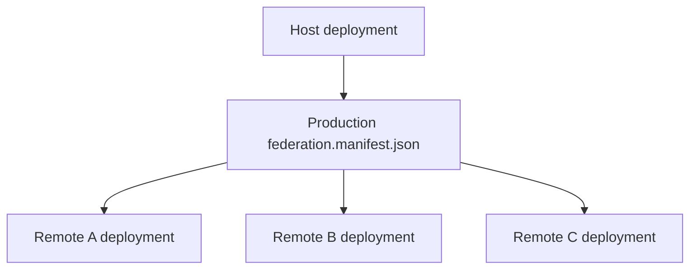

Production recommendations:

- Deploy each remote to a stable base URL.
- Deploy `remoteEntry.json` with the generated assets it references.
- Use environment-specific manifests for local, staging, and production.
- Avoid hardcoded production URLs in source code when a manifest can be replaced at deploy time.
- Keep old remote deployments available during host rollout if users may have cached host assets.
- Monitor remote load failures.

Example production manifest:

```json
{
  "auth_app": "https://cdn.example.com/auth-app/v42/remoteEntry.json",
  "admin_app": "https://cdn.example.com/admin-app/v17/remoteEntry.json",
  "price_lens_product_app": "https://cdn.example.com/price-lens-product-app/v8/remoteEntry.json"
}
```

### Dynamic Manifests

A dynamic manifest can be generated or selected per environment:

```text
local shell -> local remotes
staging shell -> staging remotes
production shell -> production remotes
```

Do not deploy a production shell with localhost remote URLs.

### Remote Unavailable

If a remote is unavailable:

- The host can still load if the failing remote is not required during startup.
- The route or feature that needs the remote should show a controlled error state.
- The host should not crash the whole application for one unavailable optional remote.

Use fallbacks at the route wrapper level where possible.

## 17. Error Handling

Native Federation apps need normal application error handling plus federation-specific error handling. Keep these cases separate:

| Error case | Example URL | Owner | Expected behavior |
| --- | --- | --- | --- |
| Host page not found | `/something-random` | Host | Show shell-level 404 page. |
| Remote child page not found | `/auth/not-real` | Remote after `/auth` loads | Show auth-specific not-found page or redirect inside `auth_app`. |
| Remote unavailable | `/auth/login` while `auth_app` is down | Host | Show remote-unavailable fallback instead of crashing the shell. |
| Exposed module missing | Host asks for `auth_app` `./missing` | Host plus remote contract | Log contract error and show fallback. |
| Remote component throws | Remote route loads but component fails | Remote for feature error, host for outer fallback | Show feature error UI if possible; monitor/log error. |

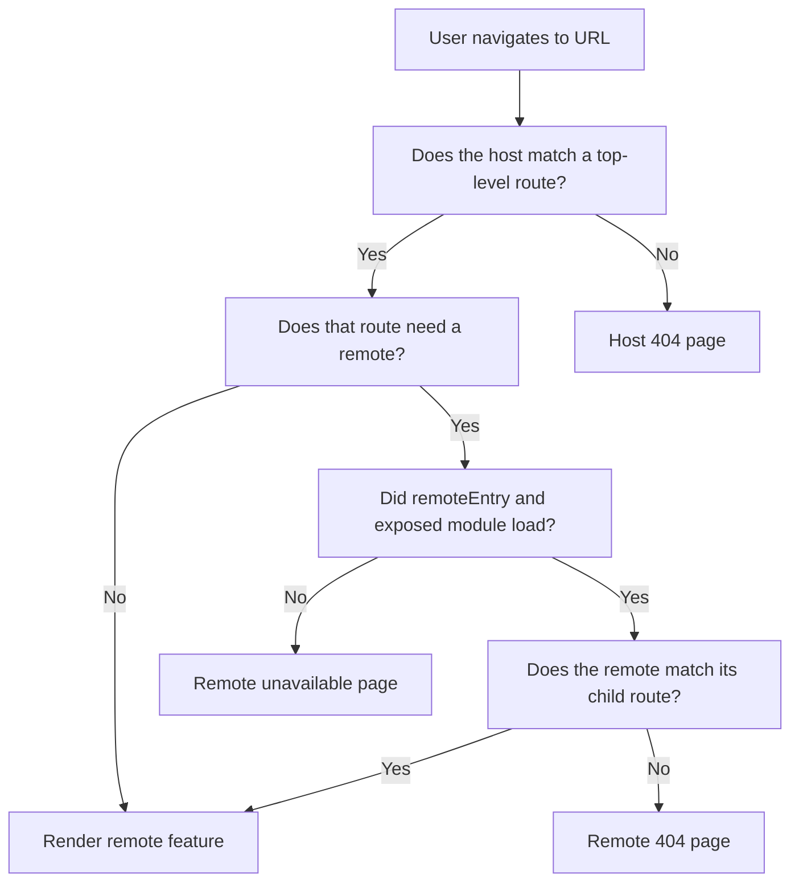

For route-level Angular remotes, wrap remote loading in a helper that can log and return fallback routes:

```ts
import { Routes } from '@angular/router';
import { loadRemote } from '../federation-loader';

const remoteUnavailableRoutes: Routes = [
  {
    path: '',
    loadComponent: () =>
      import('./remote-unavailable.component').then((m) => m.RemoteUnavailableComponent),
  },
];

export function loadRemoteRoutes(remoteName: string, exposedModule: string): Promise<Routes> {
  return loadRemote<{ routes: Routes }>(remoteName, exposedModule)
    .then((m) => m.routes)
    .catch((error) => {
      console.error(`Failed to load ${remoteName}:${exposedModule}`, error);
      return remoteUnavailableRoutes;
    });
}
```

Use that helper in host routes:

```ts
{
  path: 'auth',
  loadChildren: () => loadRemoteRoutes('auth_app', './routes'),
},
{
  path: 'admin',
  loadChildren: () => loadRemoteRoutes('admin_app', './routes'),
}
```

Then keep host-level unknown routes separate:

```ts
{
  path: '**',
  loadComponent: () =>
    import('./features/not-found/not-found.page').then((m) => m.NotFoundPage),
}
```

Remote apps should also handle their own unknown child routes. In the current repository, `auth-app` and `admin-app` already have wildcard redirects:

```ts
{ path: '**', redirectTo: '' }
```

That is acceptable for a simple flow, but a dedicated not-found page is clearer when the remote owns many deep routes:

```ts
{
  path: '**',
  loadComponent: () =>
    import('./features/not-found/remote-not-found.page').then((m) => m.RemoteNotFoundPage),
}
```

The host should not try to know every child URL owned by the remote. For example, the shell should know that `/auth` belongs to `auth_app`; `auth_app` should know whether `/auth/reset-password` or `/auth/not-real` is valid.

For Web Components:

- Show loading while the registration module loads.
- Check `customElements.get(tagName)`.
- Show fallback UI if registration or rendering fails.
- Remove event listeners on destroy/unmount.

## 18. Debugging

Start with the generated metadata and work inward.

1. Open the host manifest URL.
2. Open each remote entry URL.
3. Check browser Network tab for failed JavaScript chunks.
4. Check console for import map/specifier errors.
5. Confirm `main.ts` initializes federation before importing Angular bootstrap.
6. Confirm remote names match exactly.
7. Confirm exposed module keys match exactly.
8. Confirm shared dependency versions.

Useful commands:

```bash
cd frontend/native-federation/shell-app
npm ls @angular/core @angular-architects/native-federation

cd ../auth-app
npm ls @angular/core @angular-architects/native-federation

cd ../admin-app
npm ls @angular/core @angular-architects/native-federation
```

Native Federation names are case-sensitive:

```text
federation.config.mjs name: auth_app
manifest key:             auth_app
loadRemote name:          auth_app
exposed key:              ./routes
```

### Native Federation Troubleshooting

#### Remote Cannot Be Loaded

Problem: The host route is visited, but the remote feature does not load.

Possible cause: The remote dev server or deployed remote is unavailable, the remote entry URL is wrong, or the host cannot reach the remote origin.

How to verify:

```bash
curl http://localhost:4201/remoteEntry.json
curl http://localhost:4202/remoteEntry.json
```

Solution: Start the remote, correct the manifest URL, and confirm the remote entry is served from the same deployment as its generated assets.

#### Host Page Not Found

Problem: An unknown top-level URL shows a blank page, stays on the shell layout with no content, or redirects unexpectedly.

Possible cause: The host does not have a final `**` wildcard route, or the wildcard route is placed before valid local and remote routes.

How to verify: Open a known invalid host URL such as `http://localhost:4200/unknown-route` and inspect the host `src/app/app.routes.ts`.

Solution: Add a final host-level wildcard route after local and remote routes:

```ts
{
  path: '**',
  loadComponent: () =>
    import('./features/not-found/not-found.page').then((m) => m.NotFoundPage),
}
```

#### Remote Page Not Found

Problem: The remote loads, but an unknown child URL inside the remote feature redirects strangely or shows the wrong page.

Possible cause: The remote does not own a clear `**` fallback inside its exposed route tree.

How to verify: Open a known invalid remote URL such as `http://localhost:4200/auth/not-real` and inspect the remote's exposed `src/app/app.routes.ts`.

Solution: Add a final remote-level wildcard route inside the exposed routes:

```ts
{
  path: '**',
  loadComponent: () =>
    import('./features/not-found/remote-not-found.page').then((m) => m.RemoteNotFoundPage),
}
```

For simple auth flows, redirecting unknown child routes back to the default route can be acceptable:

```ts
{ path: '**', redirectTo: '' }
```

Use a real not-found component when the remote has many pages and users need a clear explanation.

#### Wildcard Route Captures Valid Remote Route

Problem: A valid remote route such as `/auth/login` or `/admin/dashboard` shows the not-found page.

Possible cause: The host or remote wildcard route appears before the route that should match.

How to verify: Check route order in `src/app/app.routes.ts`. Angular evaluates routes from top to bottom.

Solution: Keep `**` as the last route at its level. Host wildcard goes after host local routes and remote route prefixes. Remote wildcard goes after the remote's child routes.

#### Manifest Cannot Be Loaded

Problem: The host fails during `initFederation('/assets/federation.manifest.json')`.

Possible cause: The manifest file is missing from `public/assets`, was not included in the build assets, or the deployed host is serving the wrong asset path.

How to verify: Open `http://localhost:4200/assets/federation.manifest.json` in the browser and confirm it returns JSON.

Solution: Put the manifest under the host's `public/assets` folder or adjust the `initFederation(...)` path to the real deployed location.

#### Remote URL Is Incorrect

Problem: The manifest loads, but the host requests a remote from localhost, staging, or another wrong environment.

Possible cause: The wrong environment manifest was deployed.

How to verify: Open the deployed host's `assets/federation.manifest.json` and inspect the URLs.

Solution: Generate or deploy an environment-specific manifest for local, staging, and production.

#### Exposed Module Does Not Exist

Problem: `loadRemote('auth_app', './routes')` fails even though `remoteEntry.json` is reachable.

Possible cause: The exposed module key in the host does not match the remote's `exposes` key.

How to verify: Compare all three values:

```text
remote federation.config.mjs exposes: './routes'
host route loadRemote(...):           './routes'
remote source file export:            export const routes
```

Solution: Make the exposed key and export name match exactly. Native Federation names are case-sensitive.

#### CORS Error

Problem: The browser blocks `remoteEntry.json` or generated remote assets.

Possible cause: The remote server or CDN does not allow the host origin.

How to verify: Check the browser Network tab for blocked requests and missing `Access-Control-Allow-Origin` response headers.

Solution: Configure the remote asset server or CDN to allow the host origin. In production, prefer explicit trusted origins over `"*"`.

For `product-manager`, CORS is configured in `vite.config.ts` for both Vite dev and preview:

```ts
export default defineConfig({
  server: {
    cors: true,
    headers: {
      'Access-Control-Allow-Origin': '*',
      'Access-Control-Allow-Methods': 'GET, HEAD, OPTIONS',
      'Access-Control-Allow-Headers': '*',
    },
  },
  preview: {
    cors: true,
    headers: {
      'Access-Control-Allow-Origin': '*',
      'Access-Control-Allow-Methods': 'GET, HEAD, OPTIONS',
      'Access-Control-Allow-Headers': '*',
    },
  },
});
```

If Vite silently chooses another port because `4205` is busy, the shell manifest will still point at `4205` and the remote will fail. That is why `remote:preview` uses `--strictPort`.

#### Product Manager `remoteEntry.json` Returns 404

Problem: The shell requests `http://localhost:4205/remoteEntry.json`, but the response is 404.

Possible cause: `next dev --port 4205` is running instead of the Vite/Native Federation remote preview.

How to verify: The terminal says:

```text
> next dev --port 4205
GET /remoteEntry.json 404
```

Solution: Stop the Next dev server and run:

```bash
cd frontend/native-federation/product-manager
npm run dev
```

In this repo, `npm run dev` is intentionally mapped to `npm run remote`. Use `npm run next:dev` only when testing the standalone Next.js pages directly.

#### Product Manager Remote Looks Unstyled In Angular

Problem: The product manager renders inside Angular, but the UI looks like default browser HTML. Inputs are full-width stacked, product images are huge, and the table is not card-styled.

Possible cause: The remote JS loaded, but the remote stylesheet did not load into the Angular document.

How to verify:

```js
document.querySelector('link[data-product-manager-remote-style]')
```

It should return a `<link>` element after `productManager:./register` is loaded. Also check Network for `register.css`.

Solution: Keep this logic in `src/remote/register.ts`:

```ts
const link = document.createElement('link');
link.rel = 'stylesheet';
link.href = new URL('./register.css', import.meta.url).href;
link.dataset.productManagerRemoteStyle = 'true';
document.head.appendChild(link);
```

Also keep remote styles scoped under `.product-manager-root`. Do not add global `body`, `button`, `table`, or `img` rules to `remote.css`.

#### Product Manager React Error: Objects Are Not Valid As A React Child

Problem: React throws:

```text
Objects are not valid as a React child
```

Possible cause: The backend returned a relation object for `brand` or `category`, but the table rendered the object directly.

How to verify: Inspect the product list API response. If `brand` or `category` looks like this, it needs formatting before rendering:

```json
{
  "id": "1",
  "name": "Apple",
  "slug": "apple",
  "isActive": true
}
```

Solution: Use `productRelationLabel(...)` for display and `productRelationInputValue(...)` for form defaults. The `Product` type allows both strings and relation objects because backend response DTOs can differ from create/update input DTOs.

#### Product Manager Validation Error: `brandId must be a UUID`

Problem: Creating a product fails with backend validation errors such as:

```text
brandId must be a UUID
each value in categoryIds must be a UUID
```

Possible cause: The frontend is sending brand/category display values or slugs where the backend create DTO expects IDs.

The backend `CreateProductDto` in `backend/ecommerce-api/src/modules/products/dto/create-product.dto.ts` expects:

```ts
brandId?: string;
categoryIds?: string[];
variants: CreateProductVariantDto[];
```

It does not accept:

```ts
brand: string;
category: string;
```

Solution: Load selectable values from the backend lookup endpoints and submit their `id` fields:

```text
GET /api/v1/brands
GET /api/v1/categories
```

The Product Manager form should render a brand `<select>` and category checkboxes from those responses. The submitted payload should contain `brandId` and `categoryIds`, not typed names or slugs.

Also keep these related DTO names aligned:

| UI meaning | Backend field |
| --- | --- |
| Product status | `status` with `DRAFT`, `ACTIVE`, or `ARCHIVED` |
| Initial create price | `variants[0].price` as a decimal string |
| Initial create stock | `variants[0].quantityOnHand` |
| Variant attributes | `options` |
| Image position/order | `sortOrder` |

#### Import Map Issues

Problem: The browser console shows an error such as `Unable to resolve specifier '@angular/core'`.

Possible cause: Angular bootstrapped before Native Federation initialized, `es-module-shims` is missing, or a shared package was skipped incorrectly.

How to verify: Check that `src/main.ts` calls `initFederation(...)` before importing `./bootstrap`, and check `angular.json` for `"polyfills": ["es-module-shims"]`.

Solution: Keep Angular imports out of `main.ts`, keep the `main.ts` and `bootstrap.ts` split, and keep `es-module-shims` configured.

#### Shared Dependency Problems

Problem: The remote loads inconsistently, dependency injection behaves unexpectedly, or strict version checks fail.

Possible cause: Host and remote use incompatible shared dependency versions or a dependency that must be singleton is duplicated.

How to verify:

```bash
cd frontend/native-federation/shell-app
npm ls @angular/core rxjs

cd ../auth-app
npm ls @angular/core rxjs

cd ../admin-app
npm ls @angular/core rxjs
```

Solution: Align Angular and RxJS versions for Angular-to-Angular federation and keep required runtime dependencies shared as singletons.

#### Framework Runtime Problems

Problem: A cross-framework remote loads, but the UI does not render.

Possible cause: The host loaded a framework component but did not call that framework's renderer, mount API, or Web Component registration.

How to verify: Check whether the exposed module exports a plain component, a `mount(...)` function, or a custom element registration function.

Solution: For cross-framework UI, expose a Web Component registration module or a `mount(element, props)` API. Do not expect Angular, React, and Vue components to render each other directly.

#### Version Mismatch

Problem: A host and remote worked locally, but fail after one remote is upgraded.

Possible cause: The remote changed a shared dependency version or changed the exposed module contract without host compatibility.

How to verify: Compare `package.json`, lock files, deployed remote version, and exposed module exports.

Solution: Keep shared runtime versions compatible, version exposed contracts, and deploy host/remote changes in a compatible order.

#### Remote Unavailable

Problem: A deployed route fails because a remote deployment is down or missing generated assets.

Possible cause: Remote assets were not deployed atomically, CDN cache points to missing files, or the remote service is unavailable.

How to verify: Open `remoteEntry.json`, then open the generated asset URLs referenced by that remote entry.

Solution: Deploy remote entry and generated assets together, keep rollback artifacts, and add host fallback UI for remote routes.

#### Cross-Framework Rendering Issues

Problem: A Web Component tag appears in the DOM, but its content is blank.

Possible cause: The registration module did not run, the underlying framework mount failed, required props are missing, or styles/assets failed to load.

How to verify: Run `customElements.get('reports-widget')` in DevTools, inspect console errors, and check generated chunk requests in the Network tab.

Solution: Register the custom element before rendering, pass required data through attributes/properties, and ensure the remote's assets are served from valid URLs.

#### Web Component Registration Issues

Problem: The browser throws a custom element registration error.

Possible cause: The same element name was registered twice, or two remotes use the same tag name.

How to verify: Check `customElements.get('tag-name')` before registration and search remotes for duplicate `customElements.define(...)` names.

Solution: Guard registration with `if (!customElements.get(tagName))`, use globally unique tag names, and treat tag names as public contracts.

## 19. Security

Treat remote JavaScript as trusted application code. If the host loads a remote, that remote runs in the same browser page and can access the same DOM and browser APIs available to page JavaScript.

Security guidance:

- Load remotes only from trusted origins.
- Use HTTPS in production.
- Configure CORS for remote assets intentionally.
- Do not put credentials in CustomEvent payloads.
- Do not rely on frontend route guards for authorization.
- Enforce authorization in backend APIs.
- Use Content Security Policy where practical.
- Pin or control remote URLs through deployment configuration.
- Review exposed module contracts as public application APIs.

## 20. Performance

Native Federation can improve initial bundle size by loading remote features on demand, but it can also hurt performance if overused.

Recommendations:

- Use route-level federation for large feature areas.
- Avoid making every small component a remote.
- Keep shared dependency configuration intentional.
- Cache remote assets with a deployment strategy that supports rollback.
- Preload critical remotes after the initial page is interactive when needed.
- Keep remote entry files reachable and lightweight.
- Monitor remote load time and failure rate.

This project enables:

```js
features: {
  denseChunking: true,
}
```

Dense chunking groups chunks in generated metadata to reduce metadata size.

## 21. Best Practices

Host and remote boundaries:

- Let the host own top-level composition.
- Let remotes own feature internals.
- Keep exposed modules small and stable.
- Prefer route-level remotes for application areas.

Shared dependencies:

- Share Angular packages for Angular-to-Angular.
- Share React packages for React-to-React.
- Share Vue for Vue-to-Vue.
- Do not share unrelated framework runtimes across different frameworks.
- Use strict versions when runtime compatibility matters.

Cross-framework integration:

- Prefer Web Components for UI.
- Prefer plain JavaScript modules for non-UI code.
- Prefer DOM events, URLs, and APIs for communication.
- Keep framework internals private.

Deployment:

- Use environment-specific manifests.
- Version remote deployments.
- Preserve backward compatibility between host and remote contracts.
- Add fallback UI for remote failures.

Security:

- Treat remotes as trusted code.
- Never expose tokens in events or URLs.
- Validate all sensitive actions on the backend.

## 22. Anti-Patterns

Avoid:

- Turning every component into a remote.
- Using Native Federation only for folder organization.
- Sharing every dependency automatically without reviewing the contract impact.
- Sharing incompatible framework runtimes.
- Importing Angular components directly into React or Vue and expecting them to render.
- Importing React components directly into Angular or Vue and expecting them to render.
- Depending on another remote's private service, store, context, or component instance.
- Hardcoding production remote URLs in source code.
- Letting remote-to-remote imports create hidden deployment order.
- Broadcasting sensitive data through browser events.
- Using Native Federation when a normal package or Angular library would be simpler.

## 23. Same vs Cross Framework Comparison

| Host | Remote | Native Federation possible? | Recommended integration | Complexity | Notes |
| --- | --- | --- | --- | --- | --- |
| Angular | Angular | Yes | Federated Angular routes or Angular components | Low | Current repo pattern. Share compatible Angular packages. |
| React | React | Yes | Federated React modules, route objects, or components | Low to medium | Share compatible `react` and `react-dom`. |
| Vue | Vue | Yes | Federated Vue components or route records | Low to medium | Share compatible `vue` when needed. |
| Angular | React | Yes | Web Component or mount API loaded from federated JS module | High | Angular cannot directly render a React component as Angular. |
| Angular | Vue | Yes | Web Component or mount API loaded from federated JS module | High | Angular cannot directly render a Vue component as Angular. |
| React | Angular | Yes | Angular custom element or mount API | High | React cannot directly render an Angular component. |
| React | Vue | Yes | Vue custom element or mount API | High | React cannot directly render a Vue component. |
| Vue | Angular | Yes | Angular custom element or mount API | High | Vue cannot directly render an Angular component. |
| Vue | React | Yes | React-backed custom element or mount API | High | Vue cannot directly render a React component. |
| Angular | Web Component | Yes | Load registration module, render custom element | Medium | Add `CUSTOM_ELEMENTS_SCHEMA` where needed. |
| React | Web Component | Yes | Load registration module, render custom element | Medium | Use DOM listeners for custom events when needed. |
| Vue | Web Component | Yes | Load registration module, render custom element | Medium | Configure unknown custom element handling if needed. |

## 24. Architecture Decision Guide

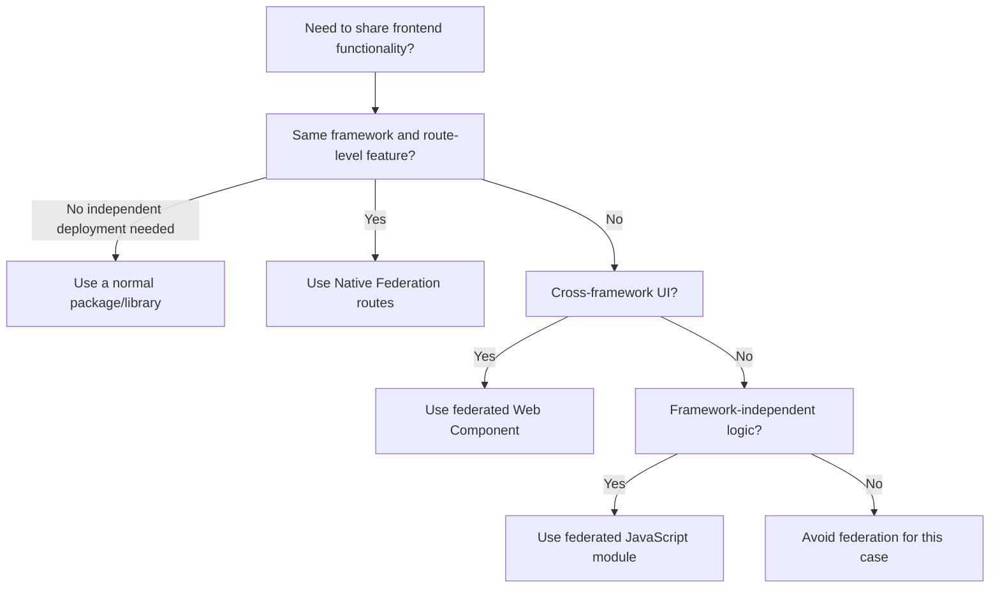

Use Angular-to-Angular Native Federation when:

- Teams need independent deployment.
- The feature boundary is route-level or application-level.
- Angular versions are compatible.
- The remote can expose stable Angular routes or components.

Use cross-framework federation when:

- A team must use a different framework.
- You are migrating between frameworks.
- The boundary can be expressed as a Web Component, mount API, URL, event, or plain JS contract.

Use a normal library when:

- There is no independent deployment requirement.
- The code is small and versioned with the host.
- The feature is deeply coupled to the host.

## 25. FAQ

### What is Native Federation?

Native Federation is an ESM/import-map based runtime loading system that lets a host application load exposed JavaScript modules from independently built remote applications.

### How does this repository use it?

`shell-app` initializes Native Federation with `/assets/federation.manifest.json`, then lazy-loads Angular route remotes and React remotes. `auth_app` and `admin_app` expose `./routes`; `price_lens_product_app` exposes `./mount`; `productManager` exposes `./register` and registers `<product-manager-mfe>`.

### How do I use Angular with Angular?

Expose Angular `Routes` from the remote:

```js
exposes: {
  './routes': './src/app/app.routes.ts',
}
```

Load those routes in the Angular host:

```ts
loadRemote<{ routes: Routes }>('auth_app', './routes').then((m) => m.routes)
```

Share compatible Angular packages as singletons.

### How do I use Angular with React?

Do not import a React component and treat it as Angular. Have the React remote expose a JavaScript module that registers a Web Component or exports a `mount(element, props)` function. The Angular host loads that module and renders an Angular wrapper around the Web Component or mount target.

### How do I use Angular with Vue?

Use the same pattern as React: expose a Vue-backed Web Component registration module or a framework-neutral mount API. Pass data through attributes/properties and receive events through `CustomEvent`.

### How can different frameworks communicate?

Prefer:

- Attributes and properties.
- `CustomEvent`.
- URL and query parameters.
- Backend APIs.
- `postMessage` for iframe/window boundaries.
- Plain shared contract packages.

Avoid sharing framework-specific service instances across frameworks.

### When should I use Web Components?

Use Web Components when a UI feature built in one framework needs to be embedded in a different framework. They create a browser-native boundary that Angular, React, Vue, and plain HTML can all use.

### What should I share?

Share framework runtimes only among compatible apps using the same framework:

- Angular with Angular.
- React with React.
- Vue with Vue.

Share plain contract libraries only when they are stable and intentionally versioned.

### What should I not share?

Do not share incompatible framework runtimes, feature-private dependencies, private stores, private services, or implementation details. Do not share Angular with React or Vue just because all apps are federated.

### How do I deploy independently?

Deploy each remote's `remoteEntry.json` and generated assets to a stable URL. Deploy the host with a manifest pointing to the desired remote versions. Keep exposed module contracts backward-compatible.

### What happens when a remote fails?

The feature that needs the remote fails to load unless the host provides a fallback. Add route-level or wrapper-level error handling so the rest of the host can continue running.

### How do I debug Native Federation?

Check the manifest, remote entry URL, exposed module key, browser Network tab, import map/specifier errors, shared package versions, and bootstrap order.

### When should I choose same-framework vs cross-framework?

Choose same-framework federation when teams can align on one framework. It is simpler and has fewer lifecycle problems. Choose cross-framework federation when there is a real organizational, migration, or legacy reason, and use Web Components or framework-neutral modules at the boundary.

## 26. Native Federation Details Often Missed

The guide above covers the main architecture. These are the smaller Native Federation details that commonly cause confusion during implementation.

### Final Gap Review

After reviewing this repository again, the guide should explicitly protect readers from adding files or APIs that are common in other federation tutorials but are not part of this setup.

What this repository needs:

| Need | Where it belongs |
| --- | --- |
| Enable the Native Federation build wrapper | `angular.json` |
| Define app name, exposes, remotes, shared packages, skipped packages, and features | `federation.config.mjs` |
| Tell a host where remote entries are at runtime | `public/assets/federation.manifest.json` |
| Initialize federation before Angular imports | `src/main.ts` |
| Keep Angular bootstrap separate from federation initialization | `src/bootstrap.ts` |
| Load remote modules from initialized federation result | `src/federation-loader.ts` in host apps only |
| Mount Angular remote routes | `src/app/app.routes.ts` |
| Make TypeScript aware of Native Federation package types | `tsconfig.app.json` |
| Build non-Angular React remotes | Remote-specific build script such as `product-manager/scripts/build.mjs` or `price-lens-product-app/scripts/build.mjs` |
| Keep Next.js code out of remote-only typechecking | `product-manager/tsconfig.remote.json` |
| Register cross-framework UI through a stable browser contract | `product-manager/src/remote/register.ts` and `product-manager/src/remote/product-manager-element.tsx` |
| Load and scope remote CSS for host rendering | `product-manager/src/remote/register.ts` injects `register.css`; styles stay under `.product-manager-root` |

What this repository does not need:

| Do not add | Why |
| --- | --- |
| `webpack.config.js` or `module-federation.config.js` | This is Native Federation with Angular esbuild, not webpack Module Federation. |
| `remoteEntry.js` references | The inspected Native Federation setup serves `remoteEntry.json`. |
| Manual edits to generated `remoteEntry.json` | It is generated output and must be produced by the Native Federation build/serve process. |
| Native Federation providers in `app.config.ts` | Federation initializes before Angular bootstrap in `main.ts`. |
| `src/federation-loader.ts` in a pure remote | Pure remotes expose modules but do not load other remotes. |
| A separate `tsconfig.federation.json` for Angular apps | `tsconfig.app.json` already includes the needed files in the current Angular apps. |
| Next.js App Router pages as exposed modules | Angular cannot execute Next server/runtime features as Native Federation browser modules. Expose a browser-only adapter instead. |
| Global CSS selectors in React remote styles | They can leak into the Angular host. Scope under `.product-manager-root` or use Shadow DOM with explicit CSS injection. |

### `federation.config.mjs` vs `federation.manifest.json`

These two files are related but they are not the same thing.

| File | Time used | Main purpose | Who needs it |
| --- | --- | --- | --- |
| `federation.config.mjs` | Build and serve setup | Defines what this app is, what it exposes, what it consumes, and what it shares. | Every Native Federation app. |
| `public/assets/federation.manifest.json` | Browser runtime | Maps remote names to deployed `remoteEntry.json` URLs. | Only apps that load remotes. |

Example:

```js
// shell-app/federation.config.mjs
export default withNativeFederation({
  name: 'shell_app',
  remotes: {
    auth_app: 'http://localhost:4201/remoteEntry.json',
    admin_app: 'http://localhost:4202/remoteEntry.json',
  },
});
```

```json
{
  "auth_app": "http://localhost:4201/remoteEntry.json",
  "admin_app": "http://localhost:4202/remoteEntry.json"
}
```

How to think about it:

- `federation.config.mjs` is the app's Native Federation configuration.
- `federation.manifest.json` is the host's runtime address book.
- A pure remote needs `federation.config.mjs` so it can expose modules and generate federation metadata.
- A pure remote does not need `federation.manifest.json` unless it also loads another remote.
- Production deployments usually replace or generate the manifest per environment while keeping TypeScript code unchanged.

### Angular Builder Shape

In this repository, the `build` and `serve` targets are Native Federation wrapper targets:

```json
"builder": "@angular-architects/native-federation:build"
```

The real Angular application build is still present under the `esbuild` target:

```json
"builder": "@angular/build:application"
```

That means Native Federation wraps the Angular application build. Do not replace this setup with webpack-specific configuration.

### `tsconfig.app.json` vs `tsconfig.federation.json`

A separate `tsconfig.federation.json` is not required in this repository. The Native Federation builder only needs a valid TypeScript config, and the existing `tsconfig.app.json` already includes the application source files:

```json
{
  "extends": "./tsconfig.json",
  "compilerOptions": {
    "types": [
      "@angular-architects/native-federation"
    ]
  },
  "include": ["src/**/*.ts"],
  "exclude": ["src/**/*.spec.ts"]
}
```

Because `src/**/*.ts` includes `src/main.ts`, `src/federation-loader.ts`, and exposed files such as `src/app/app.routes.ts`, `tsconfig.app.json` is enough for the current `shell-app`, `auth-app`, and `admin-app`.

`product-manager` is different because it is a Next.js app with an additional Vite/Native Federation remote build. It uses `tsconfig.remote.json` to exclude `.next` and `src/app` while still typechecking shared browser code and `src/remote`.

Use a separate federation tsconfig only if you have a concrete reason, such as a more complex workspace where the Native Federation builder needs a different source set from the Angular app build. Otherwise, one app tsconfig is simpler and avoids duplicated compiler settings.

### Remote Contract Typing

Native Federation loads JavaScript at runtime, so TypeScript does not automatically know what a remote exports. This repository uses a generic type at the loading point:

```ts
loadRemote<{ routes: Routes }>('auth_app', './routes').then((m) => m.routes)
```

That is a local compile-time promise. It does not validate the remote at runtime. The remote must actually export:

```ts
export const routes: Routes = [];
```

For larger systems, put shared remote contracts in a small framework-neutral package, or add explicit runtime validation before using the remote export.

### Remote Naming Rules

These three values must match exactly:

```text
remote federation.config.mjs name: auth_app
host manifest key:                  auth_app
host loadRemote name:               auth_app
```

These two values must also match:

```text
remote exposes key:                 ./routes
host loadRemote exposedModule:      ./routes
```

Use stable names. Renaming a remote or exposed module is a breaking change for every host that consumes it.

### Generated Assets and Cache Headers

`remoteEntry.json` is metadata. It points to generated JavaScript assets. A production deployment must publish `remoteEntry.json` and the assets it references together.

Recommended cache behavior:

| Asset | Suggested caching |
| --- | --- |
| `remoteEntry.json` | Short cache or revalidated cache, because it points to the current remote build. |
| Hashed JS/CSS assets | Long cache, because the filename changes when content changes. |
| Host manifest | Short cache or environment-controlled replacement. |

If `remoteEntry.json` points to assets that no longer exist, the host can discover the remote but still fail while loading chunks.

### CORS and Origins

Native Federation fetches remote metadata and assets through normal browser network requests. If the host and remote are on different origins, the remote server or CDN must allow those asset requests.

Local development origins in this repo:

```text
http://localhost:4200 -> shell-app
http://localhost:4201 -> auth-app
http://localhost:4202 -> admin-app
```

Production should use explicit trusted origins where possible.

### SSR Status

This repository is documented as browser-side Native Federation. The current inspected Angular apps use browser application builds and client-side `initFederation(...)`.

Do not assume server-side rendering, hydration, or Node-side federation is configured here. If SSR is added later, document it separately because the federation initialization, dependency loading, and deployment model need additional server-side rules.

### Current Wrapper Consistency Check

The repository contains `federation-loader.ts` wrappers in host apps. Those wrappers store the `initFederation(...)` promise and load remotes from that initialized result.

For this pattern to work consistently, host `main.ts` should initialize through the wrapper:

```ts
import { startFederation } from './federation-loader';

startFederation('/assets/federation.manifest.json')
  .then(() => import('./bootstrap'))
  .catch((err: unknown) => console.error(err));
```

If `main.ts` calls `initFederation(...)` directly while route code calls the wrapper's `loadRemote(...)`, the wrapper's internal federation promise is never set. The document calls out this version-specific pattern because `@angular-architects/native-federation@22.1.1` marks the top-level `loadRemoteModule` helper as deprecated.

### Verification Checklist

Use this after every Native Federation change:

```text
1. npm ls @angular/core @angular-architects/native-federation
2. Open /assets/federation.manifest.json from every host.
3. Open every remoteEntry.json URL from the manifest.
4. Confirm remote names match config, manifest, and loadRemote.
5. Confirm exposed module names match config and loadRemote.
6. Confirm the exposed module exports the expected symbol.
7. Confirm es-module-shims is in Angular polyfills.
8. Confirm main.ts initializes federation before bootstrap.ts imports Angular.
9. Navigate to every remote route from the host.
10. Navigate to an invalid host URL and confirm the host 404 page.
11. Navigate to an invalid remote child URL and confirm the remote fallback.
12. Stop one remote and confirm the host shows remote-unavailable fallback UI.
13. For React/Web Component remotes, confirm the generated CSS file is loaded into the host document.
14. For product-manager, confirm port 4205 is running the remote preview, not Next dev.
```

## 27. Quick Reference

Current repo remote names:

```text
shell_app
auth_app
admin_app
product_spotlight_app
price_lens_product_app
productManager
```

Current remote entries:

```text
http://localhost:4201/remoteEntry.json
http://localhost:4202/remoteEntry.json
http://localhost:4203/remoteEntry.json
http://localhost:4204/remoteEntry.json
http://localhost:4205/remoteEntry.json
```

Current exposed modules:

```text
auth_app  -> ./routes -> ./src/app/app.routes.ts
admin_app -> ./routes -> ./src/app/app.routes.ts
product_spotlight_app -> ./register -> ./src/remote/register.ts
price_lens_product_app -> ./mount -> ./src/mount.tsx
productManager -> ./register -> ./src/remote/register.ts
```

Current host route loading:

```ts
loadRemote<{ routes: Routes }>('auth_app', './routes').then((m) => m.routes);
loadRemote<{ routes: Routes }>('admin_app', './routes').then((m) => m.routes);
```

Current dynamic React remote loading:

```ts
loadRemoteFromEntry<ProductSpotlightRegisterModule>(
  environment.productSpotlightRemoteEntry,
  'product_spotlight_app',
  './register',
);

loadRemote<PriceLensRemoteModule>('price_lens_product_app', './mount').then((remote) =>
  remote.mount(outletElement, { routeBasePath: '/price-lens' }),
);

loadRemote<ProductManagerRegisterModule>('productManager', './register').then((remote) => {
  const element = document.createElement(remote.PRODUCT_MANAGER_ELEMENT);
  element.setAttribute('initial-path', '/products');
  element.setAttribute('api-base-url', 'http://localhost:3000');
  outletElement.replaceChildren(element);
});
```

Correct host bootstrap shape:

```ts
import { startFederation } from './federation-loader';

startFederation('/assets/federation.manifest.json')
  .then(() => import('./bootstrap'))
  .catch((err: unknown) => console.error(err));
```

Remote-only bootstrap shape:

```ts
initFederation()
  .then(() => import('./bootstrap'))
  .catch((err: unknown) => console.error(err));
```

Same-framework rule:

```text
Same framework -> remote can expose framework-native routes/components when versions are compatible.
```

Cross-framework rule:

```text
Different frameworks -> federate JavaScript modules, but integrate UI through Web Components or mount APIs.
```

Dependency sharing rule:

```text
Share compatible framework runtimes within the same framework family.
Do not blindly share framework-specific dependencies across different frameworks.
```

Troubleshooting checklist:

```text
1. Is the manifest reachable?
2. Is remoteEntry.json reachable?
3. Do remote names match?
4. Does the exposed module key exist?
5. Did federation initialize before Angular bootstrap?
6. Is es-module-shims configured?
7. Are shared package versions compatible?
8. Are CORS and asset URLs correct?
9. For cross-framework UI, is the Web Component registered before use?
10. Is there a host-level 404 route?
11. Is there a remote-level 404 or redirect inside each exposed remote route tree?
12. Is there fallback UI for remote failure?
13. For product-manager, is npm run dev serving Vite preview on 4205 instead of Next dev?
14. For product-manager, is register.css loaded in the host document?
```

Product Manager remote command reference:

```bash
cd frontend/native-federation/product-manager
npm run dev
```

Expected remote entry:

```text
http://localhost:4205/remoteEntry.json
```

Standalone Next command:

```bash
cd frontend/native-federation/product-manager
npm run next:dev
```

Use standalone Next mode only when opening the product manager directly. It is not the mode consumed by `admin-app` or `shell-app`.

Admin product route in the shell:

```text
http://localhost:4200/admin/products
```
