# Native Federation Guide

This guide explains Native Federation from first principles and documents the actual Native Federation setup in this repository.

Scope:

- Native Federation with same-framework applications.
- Native Federation with cross-framework applications.
- Angular, React, Vue, and Web Component integration patterns.
- Runtime loading, manifests, shared dependencies, routing, deployment, debugging, and architecture decisions.

This is not a generic Micro Frontend guide and not a Webpack Module Federation tutorial. Traditional Module Federation is mentioned only where it helps explain how Native Federation differs.

## Table of Contents

- [1. Introduction](#1-introduction)
- [2. What Is Native Federation?](#2-what-is-native-federation)
- [3. How Native Federation Works](#3-how-native-federation-works)
- [4. Core Concepts](#4-core-concepts)
- [5. Native Federation Architecture](#5-native-federation-architecture)
- [6. Same-Framework Federation](#6-same-framework-federation)
  - [6.1 Angular to Angular](#61-angular-to-angular)
  - [6.2 React to React](#62-react-to-react)
  - [6.3 Vue to Vue](#63-vue-to-vue)
- [7. Cross-Framework Federation](#7-cross-framework-federation)
  - [7.1 Angular Host to React Remote](#71-angular-host-to-react-remote)
  - [7.2 Angular Host to Vue Remote](#72-angular-host-to-vue-remote)
  - [7.3 React Host to Angular Remote](#73-react-host-to-angular-remote)
  - [7.4 React Host to Vue Remote](#74-react-host-to-vue-remote)
  - [7.5 Vue Host to Angular Remote](#75-vue-host-to-angular-remote)
  - [7.6 Vue Host to React Remote](#76-vue-host-to-react-remote)
- [8. Web Components With Native Federation](#8-web-components-with-native-federation)
- [9. Federated JavaScript Modules](#9-federated-javascript-modules)
- [10. Communication](#10-communication)
  - [10.3 Sharing Colors and Theme Between Apps](#103-sharing-colors-and-theme-between-apps)
  - [10.4 Different Colors for Different Remotes](#104-different-colors-for-different-remotes)
  - [10.5 Sharing Data Between Native Federation Apps](#105-sharing-data-between-native-federation-apps)
  - [10.6 Why localStorage and sessionStorage Behave This Way](#106-why-localstorage-and-sessionstorage-behave-this-way)
- [11. Routing](#11-routing)
- [12. Shared Dependencies](#12-shared-dependencies)
- [13. Runtime Loading](#13-runtime-loading)
- [14. Step-by-Step Implementation Guide](#14-step-by-step-implementation-guide)
  - [What Changes From a Basic Angular App](#what-changes-from-a-basic-angular-app)
  - [Native Federation Files Added or Changed](#native-federation-files-added-or-changed)
- [15. Development Setup](#15-development-setup)
- [16. Production Deployment](#16-production-deployment)
- [17. Error Handling](#17-error-handling)
- [18. Debugging](#18-debugging)
- [19. Security](#19-security)
- [20. Performance](#20-performance)
- [21. Best Practices](#21-best-practices)
- [22. Anti-Patterns](#22-anti-patterns)
- [23. Same vs Cross Framework Comparison](#23-same-vs-cross-framework-comparison)
- [24. Architecture Decision Guide](#24-architecture-decision-guide)
- [25. FAQ](#25-faq)
- [26. Native Federation Details Often Missed](#26-native-federation-details-often-missed)
- [27. Quick Reference](#27-quick-reference)

## How To Read This Guide

Use this order if you are new to Native Federation:

```text
1. Read sections 1-5 for the mental model.
2. Read section 6 for same-framework Angular-to-Angular federation.
3. Read sections 7-10 before attempting cross-framework UI.
4. Use section 14 when implementing or reviewing files.
5. Use sections 15-18 while running, deploying, or debugging.
6. Use sections 23-27 as reference material.
```

If you only want to know what changed compared to a basic Angular app, start at [What Changes From a Basic Angular App](#what-changes-from-a-basic-angular-app).

## 1. Introduction

Native Federation lets one frontend application load JavaScript modules from another independently built frontend application at runtime.

In this repository, the Native Federation implementation is in:

```text
frontend/native-federation/
  shell-app/   # Angular host storefront, port 4200
  auth-app/    # Angular remote, port 4201
  admin-app/   # Angular remote and secondary host, port 4202
  product-spotlight-app/ # React remote Web Component, port 4203
```

The current project has Angular-to-Angular route federation and one Angular-to-React cross-framework example. The React remote is integrated through a Web Component boundary, not by importing a React component directly into Angular.

### Current Repository Facts

These values were inspected from the local project and installed packages.

| Item | Value |
| --- | --- |
| Angular package version | `@angular/core@22.1.3` |
| Angular CLI version | `@angular/cli@22.1.5` |
| Angular builder package | `@angular/build@22.1.5` |
| Native Federation Angular adapter | `@angular-architects/native-federation@22.1.1` |
| Native Federation orchestrator | `@softarc/native-federation-orchestrator@4.6.0` in `auth-app`; `^4.5.2` transitive from the adapter |
| React remote Native Federation core | `@softarc/native-federation@4.5.0` |
| React remote Native Federation esbuild adapter | `@softarc/native-federation-esbuild@4.0.0` |
| React remote version | `react@19.2.8`, `react-dom@19.2.8` |
| Import map shim | `es-module-shims@2.8.0` |
| TypeScript | `~6.0.2` |
| Package manager | `npm@11.13.0` |
| Existing React apps | `product-spotlight-app` |
| Existing Vue apps | None found |

### Existing Native Federation Applications

| App | Role | Federation name | Port | Remote entry |
| --- | --- | --- | --- | --- |
| `shell-app` | Host | `shell_app` | `4200` | Not consumed by another app |
| `auth-app` | Remote | `auth_app` | `4201` | `http://localhost:4201/remoteEntry.json` |
| `admin-app` | Remote plus host | `admin_app` | `4202` | `http://localhost:4202/remoteEntry.json` |
| `product-spotlight-app` | React remote Web Component | `product_spotlight_app` | `4203` | `http://localhost:4203/remoteEntry.json` |

`shell-app` loads:

```json
{
  "auth_app": "http://localhost:4201/remoteEntry.json",
  "admin_app": "http://localhost:4202/remoteEntry.json"
}
```

`admin-app` also loads:

```json
{
  "auth_app": "http://localhost:4201/remoteEntry.json"
}
```

`shell-app` dynamically loads `product_spotlight_app` from `ProductSpotlightRemoteComponent` by remote entry URL. It is not placed in the startup manifest because the home-page spotlight is optional and should not block shell bootstrap if the React remote is unavailable.

## 2. What Is Native Federation?

Native Federation is a runtime module loading approach based on web platform concepts:

- JavaScript ES modules.
- Import maps.
- Dynamic imports.
- Remote metadata files.
- Shared dependency resolution.

The simple idea:

```text
Host application
  |
  | loads metadata for a remote
  v
remoteEntry.json
  |
  | describes exposed modules and shared packages
  v
Remote JavaScript modules
```

In this repository, `shell-app` does not bundle `auth-app` and `admin-app` into its own JavaScript output. Instead, the shell initializes Native Federation, reads a federation manifest, discovers remote entry files, and loads remote route modules only when routes such as `/auth` or `/admin` are visited.

Native Federation exists because modern Angular applications commonly use the Angular application builder and esbuild instead of webpack. Native Federation provides federation without requiring a webpack-specific build pipeline.

### What Native Federation Does

Native Federation helps with:

- Discovering remote applications.
- Loading remote JavaScript modules at runtime.
- Mapping exposed module names such as `./routes` to real generated files.
- Sharing dependencies such as Angular packages between compatible applications.
- Supporting independent builds and deployments.

Native Federation does not automatically solve:

- Authentication.
- Authorization.
- Cross-application communication.
- Shared state.
- UI consistency.
- Backend data ownership.
- Cross-framework rendering.
- Version governance.

Those are application architecture concerns layered on top of federation.

## 3. How Native Federation Works

Native Federation has two sides:

- A remote exposes JavaScript modules.
- A host loads those modules at runtime.

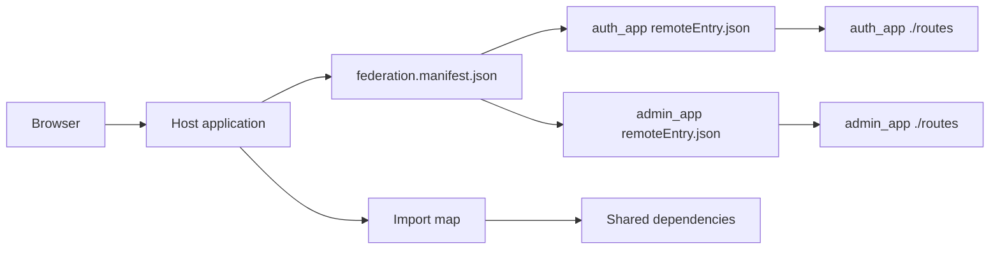

Runtime flow in this repository:

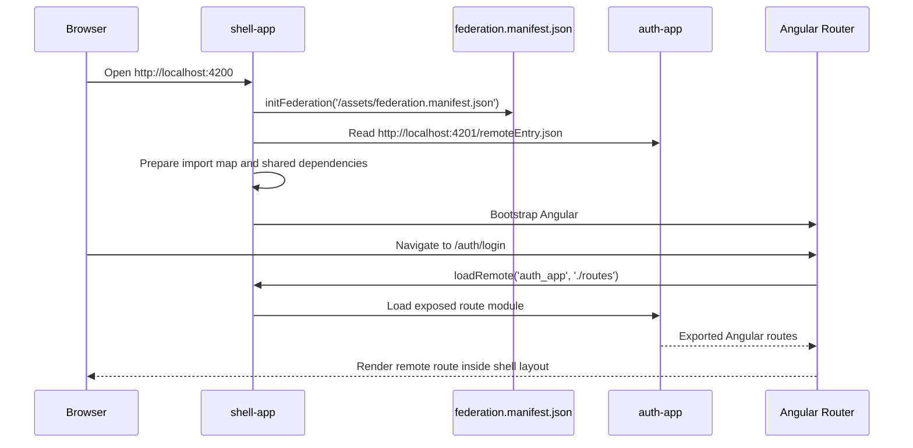

### ES Modules

ES modules are JavaScript modules loaded with `import` and `export`.

Example:

```ts
export const routes = [];
```

Native Federation exposes and loads JavaScript modules. It does not expose framework objects magically. If the exposed module contains Angular routes, an Angular host can use those routes naturally. If the exposed module contains React code, an Angular host still needs an integration boundary.

### Import Maps

An import map tells the browser or `es-module-shims` where module specifiers should resolve.

Conceptual example:

```json
{
  "imports": {
    "@angular/core": "http://localhost:4200/shared/@angular/core.js"
  }
}
```

In this repository, `es-module-shims` is included as an Angular polyfill in each Native Federation app:

```json
"polyfills": ["es-module-shims"]
```

This matters because Angular source files import packages such as `@angular/core`. The browser cannot resolve those package names by itself. Native Federation prepares the mapping before Angular is bootstrapped.

### Federation Manifest

A federation manifest is a host-side file that maps remote names to remote entry URLs.

`shell-app/public/assets/federation.manifest.json`:

```json
{
  "auth_app": "http://localhost:4201/remoteEntry.json",
  "admin_app": "http://localhost:4202/remoteEntry.json"
}
```

The manifest is loaded by `shell-app/src/main.ts`:

```ts
import { initFederation } from '@angular-architects/native-federation';

initFederation('/assets/federation.manifest.json')
  .then(() => import('./bootstrap'))
  .catch((err: unknown) => console.error(err));
```

### Remote Entry

A remote entry is generated by Native Federation. In this project the URL ends in:

```text
remoteEntry.json
```

Do not use `remoteEntry.js` examples from webpack-oriented guides for this repository. Native Federation uses `remoteEntry.json` here.

### Bootstrap Order

Native Federation must initialize before Angular bootstraps.

Correct pattern:

```text
main.ts
  initFederation(...)
  then import('./bootstrap')

bootstrap.ts
  imports Angular packages
  bootstrapApplication(...)
```

This prevents package specifiers such as `@angular/core` from being imported before the import map is ready.

## 4. Core Concepts

| Concept | Meaning |
| --- | --- |
| Host | Application that loads remote modules. In this repo: `shell-app`. |
| Remote | Application that exposes modules. In this repo: `auth-app`, `admin-app`. |
| Host plus remote | App that is consumed by another host and also consumes remotes. In this repo: `admin-app`. |
| Exposed module | A JavaScript module made available by a remote, such as `./routes`. |
| Shared dependency | A package resolved once where possible, such as `@angular/core`. |
| Federation manifest | Host file mapping remote names to `remoteEntry.json` URLs. |
| Remote entry | Remote metadata generated by Native Federation. |
| Dynamic loading | Loading a remote module only when needed, usually during route navigation. |
| Independent deployment | Deploying host and remotes separately while preserving contracts. |

## 5. Native Federation Architecture

Current repository architecture:

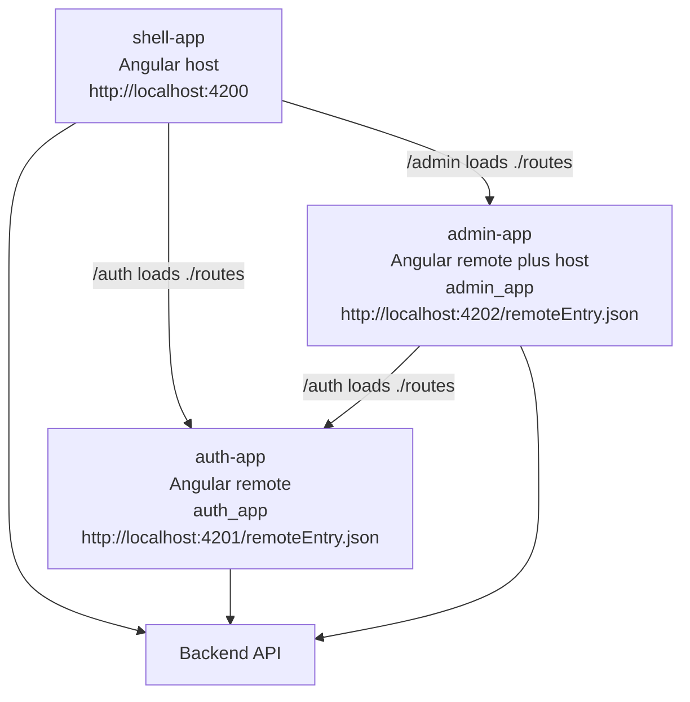

Current exposed modules:

| Remote | Exposed name | Source file | What is exported |
| --- | --- | --- | --- |
| `auth_app` | `./routes` | `./src/app/app.routes.ts` | `routes: Routes` |
| `admin_app` | `./routes` | `./src/app/app.routes.ts` | `routes: Routes` |

Current host routes:

```ts
{
  path: 'auth',
  loadChildren: () =>
    loadRemote<{ routes: Routes }>('auth_app', './routes').then((m) => m.routes),
},
{
  path: 'admin',
  loadChildren: () =>
    loadRemote<{ routes: Routes }>('admin_app', './routes').then((m) => m.routes),
},
```

## 6. Same-Framework Federation

Same-framework federation means the host and remote use the same frontend framework.

Examples:

- Angular host to Angular remote.
- React host to React remote.
- Vue host to Vue remote.

Same-framework federation is usually the simplest and most natural form of Native Federation because the host and remote share the same component model, runtime expectations, routing concepts, and dependency ecosystem.

### 6.1 Angular to Angular

This repository is an Angular-to-Angular example.

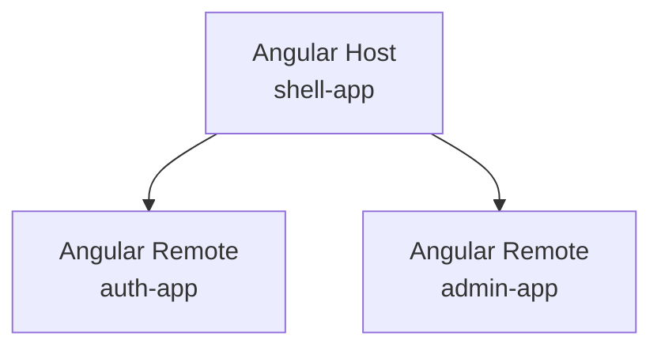

#### Host Configuration

`shell-app/federation.config.mjs`:

```js
import { withNativeFederation, shareAll } from '@angular-architects/native-federation/config';

export default withNativeFederation({
  name: 'shell_app',

  remotes: {
    auth_app: 'http://localhost:4201/remoteEntry.json',
    admin_app: 'http://localhost:4202/remoteEntry.json',
  },

  shared: {
    ...shareAll(
      { singleton: true, strictVersion: true, requiredVersion: 'auto', build: 'package' },
      {
        overrides: {
          '@angular/core': {
            singleton: true,
            strictVersion: true,
            requiredVersion: 'auto',
            build: 'package',
            includeSecondaries: false,
          },
        },
      },
    ),
  },
});
```

The host also has `public/assets/federation.manifest.json` with the remote entry URLs.

#### Remote Configuration

`auth-app/federation.config.mjs`:

```js
import { withNativeFederation, shareAll } from '@angular-architects/native-federation/config';

export default withNativeFederation({
  name: 'auth_app',
  exposes: {
    './routes': './src/app/app.routes.ts',
  },
  shared: {
    ...shareAll({ singleton: true, strictVersion: true, requiredVersion: 'auto', build: 'package' }),
  },
});
```

`admin-app` uses the same exposed route pattern, but it also has a `remotes` entry for `auth_app`.

#### Exposes

The remote exposes a JavaScript module. In this project that module exports Angular route definitions:

```ts
import { Routes } from '@angular/router';

export const routes: Routes = [
  {
    path: '',
    loadComponent: () => import('./features/auth/login/login').then((m) => m.Login),
  },
];
```

The host consumes that module and passes the routes to Angular Router.

#### Routing

`shell-app` owns the top-level route prefix:

```text
/auth  -> auth_app ./routes
/admin -> admin_app ./routes
```

The remote owns everything below its prefix:

```text
/auth/login
/auth/register
/auth/forgot-password

/admin/dashboard
/admin/products
/admin/orders
```

The host decides where a remote is mounted. The remote decides its own internal route structure.

#### Shared Angular Dependencies

For Angular-to-Angular, share compatible Angular runtime packages:

- `@angular/core`
- `@angular/common`
- `@angular/router`
- `@angular/forms`
- `@angular/platform-browser`
- `rxjs`
- `tslib`

This project uses:

```js
shareAll({ singleton: true, strictVersion: true, requiredVersion: 'auto', build: 'package' })
```

That is appropriate because all Native Federation apps use Angular 22.1.x.

#### Version Compatibility

Angular-to-Angular federation should keep host and remotes on compatible Angular versions. In this project, all three Native Federation apps resolve `@angular/core@22.1.3`.

With `strictVersion: true`, version mismatches are surfaced instead of silently loading incompatible combinations.

#### Sharing Libraries

Share libraries only when there is a reason:

- Share Angular runtime packages in Angular-to-Angular federation.
- Share stable internal contracts if they are published as a real package.
- Share UI libraries only if all apps intentionally use the same version and styling model.

Do not share every feature dependency just to reduce bytes. Excessive sharing creates deployment coupling.

#### Communication Between Angular MFEs

Angular-to-Angular can use:

- Route parameters.
- Query parameters.
- Angular inputs and outputs when a remote exposes a component meant for Angular use.
- Angular signals or RxJS in a deliberately shared library.
- Browser `CustomEvent` for framework-neutral events.
- Backend APIs for authoritative business state.

Prefer URL and API boundaries for business workflows. Use shared Angular services only for small platform-level contracts that are stable across deployments.

#### Development

Start remotes first, then the host:

```bash
cd frontend/native-federation/auth-app
npm start

cd ../admin-app
npm start

cd ../shell-app
npm start
```

Expected local URLs:

```text
shell-app: http://localhost:4200
auth-app:  http://localhost:4201
admin-app: http://localhost:4202
```

Verify remote entries:

```bash
curl http://localhost:4201/remoteEntry.json
curl http://localhost:4202/remoteEntry.json
```

#### Production Deployment

In production, replace localhost manifest URLs with deployed remote entry URLs:

```json
{
  "auth_app": "https://auth.example.com/remoteEntry.json",
  "admin_app": "https://admin.example.com/remoteEntry.json"
}
```

Each remote must deploy its generated `remoteEntry.json` and referenced assets together.

#### Common Problems

| Problem | Usual cause |
| --- | --- |
| `remoteEntry.json` 404 | Remote not running or manifest URL is wrong. |
| `Unable to resolve specifier '@angular/core'` | Angular imported before Native Federation initialized, missing shim, or bad shared config. |
| Version error | Host and remote Angular versions do not satisfy strict sharing. |
| Route loads but page is blank | Remote route module loaded, but a component import or provider failed. |
| Auth state differs | Apps have separate services or token storage expectations. |

### 6.2 React to React

Native Federation can be used with React applications when the build and runtime setup produce ESM-compatible remote modules and a Native Federation-compatible remote entry.

React-to-React is technically possible because both sides understand React components.

Recommended integration:

```text
React Host
  |
  | loads remote JS module
  v
React Remote exports a React component or route object
```

What is federated:

- A JavaScript module that exports React components, route objects, hooks, or mount functions.

Dependencies to consider sharing:

- `react`
- `react-dom`
- Routing library, only if the host and remote intentionally share router assumptions.

Important constraints:

- Keep `react` and `react-dom` compatible and singleton when rendering shared React component trees.
- Do not expose remote internals that assume a private host state shape.
- Use props and callbacks for component-level communication.
- Use URLs, events, and APIs for app-level communication.

This repository does not contain a React Native Federation app, so React examples here are architectural examples, not local runnable code.

### 6.3 Vue to Vue

Native Federation can be used with Vue applications when the build and runtime setup produce ESM-compatible exposed modules.

Vue-to-Vue is technically possible because both sides understand Vue components and the Vue runtime.

Recommended integration:

```text
Vue Host
  |
  | loads remote JS module
  v
Vue Remote exports a Vue component, route record, or mount function
```

Dependencies to consider sharing:

- `vue`
- Router/store libraries only when the host and remote deliberately share them.

Important constraints:

- Keep Vue runtime versions compatible.
- Prefer route-level boundaries over many tiny federated widgets.
- Keep remote route internals inside the remote.
- Avoid sharing remote-private stores unless they are a stable platform contract.

This repository does not contain a Vue Native Federation app.

## 7. Cross-Framework Federation

Cross-framework federation means the host and remote use different frontend frameworks.

Native Federation can load JavaScript modules across frameworks because JavaScript modules are framework-neutral. Rendering framework components across framework boundaries is not automatic.

The key distinction:

```text
Native Federation can load a JavaScript module.
Native Federation does not make an Angular component become a React component.
Native Federation does not make a Vue component become an Angular component.
```

### Framework Component vs JavaScript Module vs Web Component

| Thing | What it is | Cross-framework usable directly? |
| --- | --- | --- |
| Framework component | Angular component, React component, or Vue component | Usually no. It needs that framework's renderer and lifecycle. |
| JavaScript module | File with `export` values loaded by Native Federation | Yes, but the exported value still needs a usable contract. |
| Web Component / Custom Element | Browser-native custom HTML element registered with `customElements.define` | Yes, if it exposes attributes/properties/events as its public API. |

Example:

```text
React component
  function ReportsPanel() { ... }
  Not directly renderable by Angular.

JavaScript module
  export function registerReportsElement() { ... }
  Loadable by Angular through Native Federation.

Web Component
  <reports-panel user-id="123"></reports-panel>
  Usable by Angular, React, Vue, or plain HTML.
```

### Cross-Framework Scenario Matrix

| Host | Remote | Possible? | What is federated? | Direct framework component consumption? | Recommended architecture |
| --- | --- | --- | --- | --- | --- |
| Angular | React | Yes | React remote JavaScript module | No | Federated Web Component registration or `mount(element, props)`. |
| Angular | Vue | Yes | Vue remote JavaScript module | No | Federated Web Component registration or `mount(element, props)`. |
| React | Angular | Yes | Angular remote JavaScript module | No | Angular custom element registration or Angular-owned mount API. |
| React | Vue | Yes | Vue remote JavaScript module | No | Vue custom element registration or Vue-owned mount API. |
| Vue | Angular | Yes | Angular remote JavaScript module | No | Angular custom element registration or Angular-owned mount API. |
| Vue | React | Yes | React remote JavaScript module | No | React-backed custom element or React-owned mount API. |

Cross-framework defaults:

- The remote bootstraps enough of its own framework runtime to render its own UI.
- The host loads a JavaScript module through Native Federation.
- Data should pass through attributes, DOM properties, URL state, or backend APIs.
- Events should use `CustomEvent` or other browser-level events.
- Framework runtimes are not shared across different framework families.
- Share React with React, Vue with Vue, and Angular with Angular only when versions are compatible.

What to share:

- Plain contracts, types, validation utilities, and API clients when they are framework-independent.
- Same-framework runtime dependencies between compatible apps.

What not to share:

- Angular packages with React or Vue apps.
- React packages with Angular or Vue apps.
- Vue packages with Angular or React apps.
- Private stores, contexts, dependency injection services, or component instances.

Realistic cross-framework use cases:

- A React reporting feature embedded in an Angular commerce shell.
- A Vue analytics widget embedded in a React operations portal.
- An Angular admin workflow preserved during a React migration.
- A framework-neutral custom element published by one team and consumed by several hosts.

Main limitation:

- Native Federation solves loading. It does not erase framework lifecycle, rendering, styling, or state model differences.

### 7.1 Angular Host to React Remote

Is it technically possible? Yes.

What is federated? A JavaScript module from the React remote.

Can Angular directly consume a React component? Not as an Angular component.

Recommended integration:

- Expose a module that registers a Web Component.
- Or expose a framework-neutral `mount(element, props)` function and call it from an Angular wrapper component.

Preferred architecture:

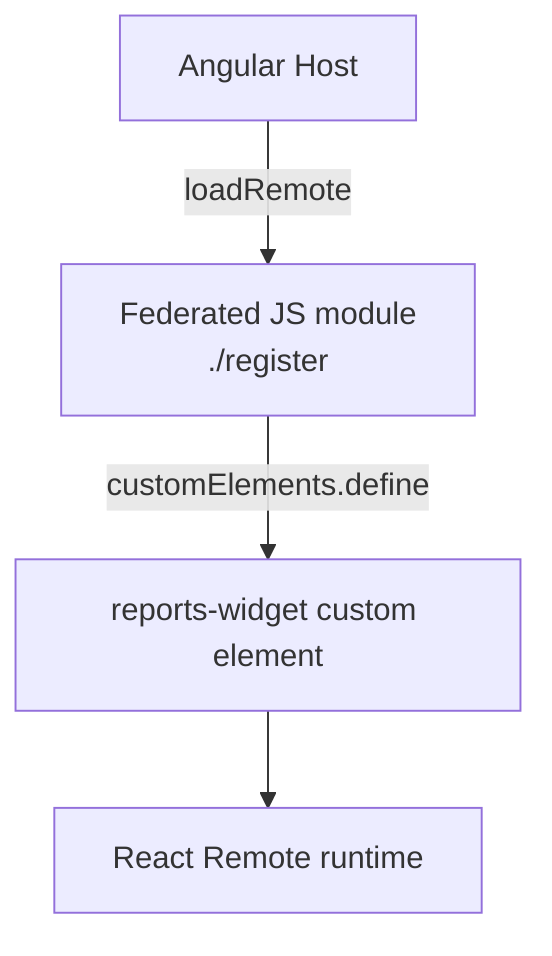

Example exposed module:

```tsx
// React remote: src/register-reports-widget.tsx
import React from 'react';
import { createRoot, Root } from 'react-dom/client';
import { ReportsPanel } from './ReportsPanel';

class ReportsWidgetElement extends HTMLElement {
  private root?: Root;

  connectedCallback() {
    this.root = createRoot(this);
    this.root.render(<ReportsPanel userId={this.getAttribute('user-id') ?? ''} />);
  }

  disconnectedCallback() {
    this.root?.unmount();
  }
}

export function registerReportsWidget() {
  if (!customElements.get('reports-widget')) {
    customElements.define('reports-widget', ReportsWidgetElement);
  }
}
```

Angular host wrapper:

```ts
import { Component, CUSTOM_ELEMENTS_SCHEMA, OnInit } from '@angular/core';
import { loadRemote } from '../federation-loader';

@Component({
  selector: 'app-reports-route',
  standalone: true,
  schemas: [CUSTOM_ELEMENTS_SCHEMA],
  template: '<reports-widget user-id="123"></reports-widget>',
})
export class ReportsRoute implements OnInit {
  async ngOnInit() {
    const remote = await loadRemote<{ registerReportsWidget: () => void }>(
      'reports_app',
      './register',
    );
    remote.registerReportsWidget();
  }
}
```

Data passing:

- Attributes for strings and simple values.
- DOM properties for objects.
- Custom events for output.
- Backend APIs for authoritative data.

Framework runtimes:

- Do not share Angular with React.
- React remote may share `react` and `react-dom` with other React remotes if compatible.
- Angular host should continue sharing Angular only with Angular remotes.

Advantages:

- Lets a React team deliver a feature into an Angular shell.
- Keeps framework lifecycles separate.

Limitations:

- Extra wrapper code.
- Styling isolation must be planned.
- React lifecycle is not managed by Angular unless the wrapper cleans it up.

Current repository example:

```text
shell-app HomePage
  -> ProductSpotlightRemoteComponent
    -> loadRemoteFromEntry('http://localhost:4203/remoteEntry.json', 'product_spotlight_app', './register')
      -> product-spotlight-app/src/register.tsx
        -> customElements.define('product-spotlight-widget', React-backed element)
```

The React remote exposes a JavaScript module:

```js
// product-spotlight-app/federation.config.mjs
export default withNativeFederation({
  name: 'product_spotlight_app',
  exposes: {
    './register': './src/register.tsx',
  },
  shared: {},
});
```

The Angular shell loads that module from the wrapper component:

```ts
const remote = await loadRemoteFromEntry<ProductSpotlightRegisterModule>(
  environment.productSpotlightRemoteEntry,
  'product_spotlight_app',
  './register',
);

remote.registerProductSpotlightElement();
```

The custom element sends DOM events back to Angular:

```ts
this.dispatchEvent(
  new CustomEvent('product-spotlight-select', {
    bubbles: true,
    composed: true,
    detail: { id: product.id, slug: product.slug, name: product.name },
  }),
);
```

The Angular wrapper listens to the event and navigates with Angular Router. React does not know about Angular Router, and Angular does not know about React components.

The React remote uses the existing backend product API:

```text
GET http://localhost:3000/api/v1/products?limit=6&sortBy=price&sortOrder=asc&inStock=true
```

React dependencies are not shared with the Angular apps in this example. The remote bundles its own `react` and `react-dom` because it is the only React app in this repository.

### 7.2 Angular Host to Vue Remote

Is it technically possible? Yes.

Can Angular directly consume a Vue component? Not as an Angular component.

Recommended integration:

- Expose a module that registers a Vue-backed custom element.
- Or expose a `mount(element, props)` function.

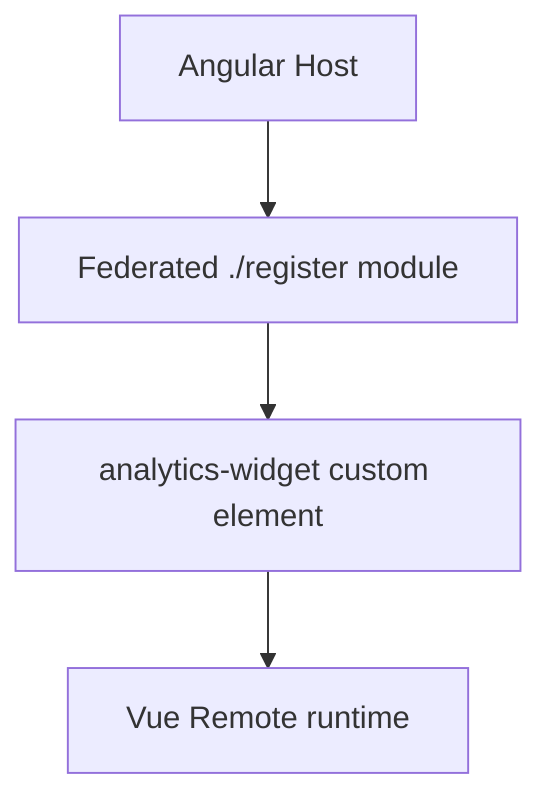

Vue custom element concept:

```ts
// Vue remote
import { defineCustomElement } from 'vue';
import AnalyticsWidget from './AnalyticsWidget.ce.vue';

export function registerAnalyticsWidget() {
  if (!customElements.get('analytics-widget')) {
    customElements.define('analytics-widget', defineCustomElement(AnalyticsWidget));
  }
}
```

Angular host:

```html
<analytics-widget tenant-id="store-1"></analytics-widget>
```

Use `CustomEvent` for events:

```ts
window.dispatchEvent(
  new CustomEvent('analytics:filter-changed', {
    detail: { range: '30d' },
  }),
);
```

Do not share Angular packages with Vue. Share Vue only with Vue remotes that intentionally align runtime versions.

### 7.3 React Host to Angular Remote

Is it technically possible? Yes.

Can React directly render an Angular component? No.

Recommended integration:

- Angular remote exposes a module that registers an Angular Element / custom element.
- React renders the custom element tag.
- Events use DOM events.

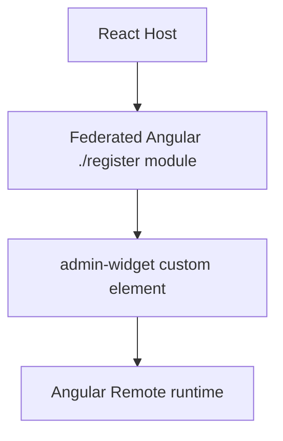

React host concept:

```tsx
useEffect(() => {
  let disposed = false;

  loadRemoteModule('admin_app', './register').then((m) => {
    if (!disposed) m.registerAdminWidget();
  });

  return () => {
    disposed = true;
  };
}, []);

return <admin-widget user-id="123" />;
```

Angular remote bootstrap:

- If the remote exposes an Angular custom element, it must create/register that element.
- Do not expect React to provide Angular dependency injection or Angular change detection.

Dependencies:

- React host shares React with React remotes.
- Angular remote manages its own Angular runtime unless it is also consumed by Angular hosts with compatible sharing.
- Do not share React and Angular as if they were related runtimes.

### 7.4 React Host to Vue Remote

Is it technically possible? Yes.

Can React directly render a Vue component? No.

Recommended integration:

- Vue remote exposes a custom element registration module.
- React host renders the custom element and listens for DOM events.

Use cases:

- Dashboard widget.
- Analytics panel.
- Legacy Vue feature inside a React shell.

Avoid:

- Passing React component instances into Vue.
- Depending on Vue internals from React.

### 7.5 Vue Host to Angular Remote

Is it technically possible? Yes.

Can Vue directly render an Angular component? No.

Recommended integration:

- Angular remote exposes a custom element or mount API.
- Vue host renders the custom element after registration.

```vue
<template>
  <admin-widget :user-id="userId" @admin-saved="onAdminSaved" />
</template>
```

The public API should be attributes, properties, and DOM events.

### 7.6 Vue Host to React Remote

Is it technically possible? Yes.

Can Vue directly render a React component? No.

Recommended integration:

- React remote exposes a custom element or mount API.
- Vue host renders the custom element.

Use cases:

- React-based visualization inside Vue.
- Feature migration from React to Vue or Vue to React.

## 8. Web Components With Native Federation

Web Components are often the cleanest UI boundary for cross-framework Native Federation.

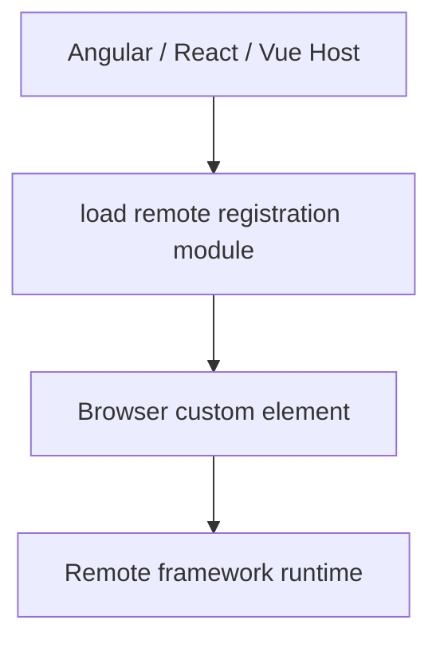

### 8.1 Why Web Components

Web Components are useful because they are browser-native:

- Angular can render a custom element tag.
- React can render a custom element tag.
- Vue can render a custom element tag.
- Plain HTML can render a custom element tag.

The custom element becomes the public UI contract.

Good custom element contract:

```html
<reports-widget user-id="123" theme="light"></reports-widget>
```

```ts
element.addEventListener('report:selected', (event) => {
  const reportId = (event as CustomEvent<{ reportId: string }>).detail.reportId;
});
```

### Web Component Scenario Matrix

| Host | Remote/public UI | Possible? | What is federated? | How data passes | How events pass | Notes |
| --- | --- | --- | --- | --- | --- | --- |
| Angular | Web Component | Yes | JS module that registers the custom element | Attributes or DOM properties | `CustomEvent` | Add `CUSTOM_ELEMENTS_SCHEMA` where Angular templates use the element. |
| React | Web Component | Yes | JS module that registers the custom element | Attributes or DOM properties | `CustomEvent`, often via `addEventListener` | React can render the tag, but custom event handling may need DOM APIs. |
| Vue | Web Component | Yes | JS module that registers the custom element | Attributes or DOM properties | `CustomEvent` | Configure Vue compiler handling for custom elements if needed. |
| Web Component | Angular | Yes | Angular registration module or mount module | Attributes or DOM properties | `CustomEvent` | Angular still owns Angular rendering inside the element. |
| Web Component | React | Yes | React registration module or mount module | Attributes or DOM properties | `CustomEvent` | React still owns React rendering inside the element. |
| Web Component | Vue | Yes | Vue registration module or mount module | Attributes or DOM properties | `CustomEvent` | Vue still owns Vue rendering inside the element. |

Advantages:

- Framework-neutral public UI API.
- Clean lifecycle boundary when connected/disconnected callbacks are implemented correctly.
- Works with Angular, React, Vue, plain HTML, and future hosts.

Limitations:

- Custom element names are global in the page.
- Complex object props need DOM property assignment, not only string attributes.
- Events must be designed as public contracts.
- Shadow DOM can isolate styles, but it also affects event composition and CSS inheritance.

### 8.2 Angular to Web Component

Angular host loading any federated Web Component:

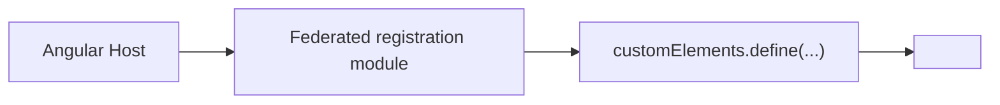

Recommended:

- Load the registration module before rendering the element.
- Add `CUSTOM_ELEMENTS_SCHEMA` where Angular templates use custom elements.
- Use attributes/properties/events.
- Keep the Web Component API framework-neutral.

### 8.3 React to Web Component

React host loading a federated Web Component:

```tsx
function ReportsPage() {
  useEffect(() => {
    loadRemoteModule('reports_app', './register').then((m) => m.registerReportsWidget());
  }, []);

  return <reports-widget user-id="123" />;
}
```

React can render the element, but event handling may need `addEventListener` for custom events depending on React version and event name.

### 8.4 Vue to Web Component

Vue host loading a federated Web Component:

```vue
<template>
  <reports-widget :user-id="userId" />
</template>
```

Load the remote registration module before or during the host component setup. Configure Vue compiler options if the framework warns about unknown custom elements.

### Web Component to Angular, React, or Vue

A Web Component host can also load framework remotes if it exposes a JavaScript module or registers another custom element:

```text
Web Component shell
  |
  | Native Federation loads ./register
  v
Angular / React / Vue remote
```

The same rule applies: the public contract should remain DOM-based.

## 9. Federated JavaScript Modules

Native Federation always federates JavaScript modules. UI is only one use case.

### Pattern A: Federated JavaScript Module

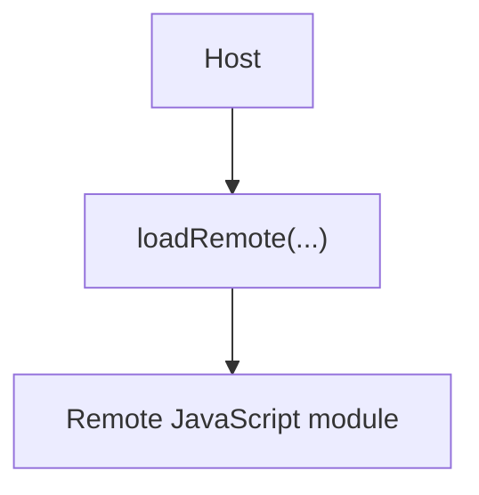

Appropriate for:

- Route definitions in same-framework setups.
- Utility functions.
- API clients.
- Configuration.
- Feature flags.
- Business logic that is framework-independent.

Example:

```ts
const remote = await loadRemote<{
  formatPrice: (amount: number, currency: string) => string;
}>('pricing_app', './formatters');

remote.formatPrice(12.5, 'USD');
```

Use this when the exported API is plain TypeScript/JavaScript and does not require the host to understand a foreign framework component.

### Pattern B: Federated Web Component

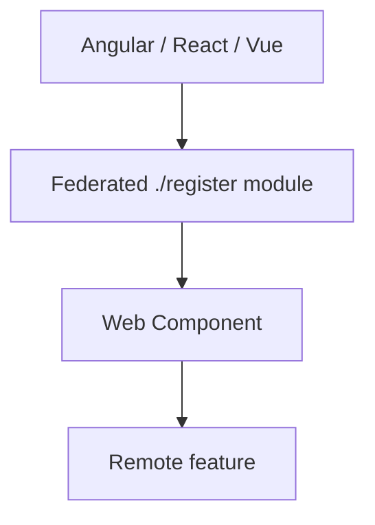

Use this for cross-framework UI.

### Pattern C: Framework-Independent Module

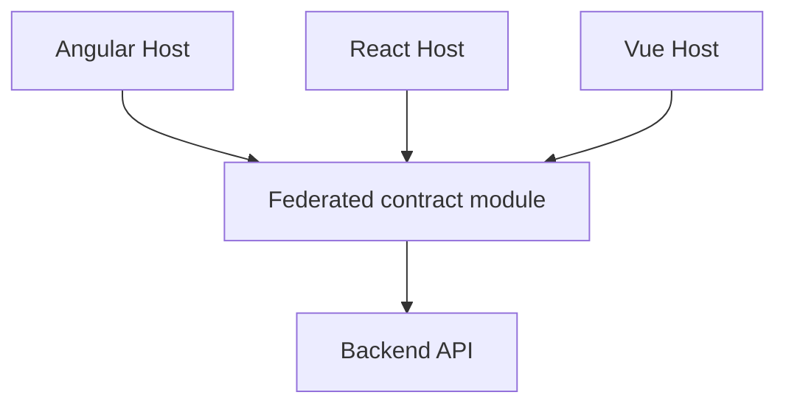

Good candidates:

- Validation rules.
- Formatting utilities.
- API clients.
- Generated API types.
- Feature flag readers.
- Business constants.

Limitations:

- Shared business code couples deployment versions.
- Side effects make modules harder to evolve.
- Framework-independent code should not import Angular, React, or Vue.

## 10. Communication

Native Federation loads code. It is not a communication system.

### 10.1 Same Framework

Angular to Angular can use:

| Strategy | Good for | Coupling |
| --- | --- | --- |
| Route params/query params | Navigation state | Low |
| Angular inputs/outputs | Federated Angular component APIs | Medium |
| Signals in shared library | Small shared Angular state | Medium to high |
| RxJS in shared library | Event streams between Angular apps | Medium to high |
| Backend APIs | Business data | Low |
| Browser `CustomEvent` | Framework-neutral events | Low |

Example Angular-to-Angular event:

```ts
window.dispatchEvent(
  new CustomEvent('auth:login', {
    detail: { userId: user.id },
  }),
);
```

Do not put access tokens, refresh tokens, passwords, or secrets in frontend events.

### 10.2 Cross Framework

Angular to React, Angular to Vue, React to Angular, and Vue to React should prefer browser-level contracts:

| Strategy | Good for | Notes |
| --- | --- | --- |
| Attributes/properties | Passing data into Web Components | Keep values small and serializable. |
| `CustomEvent` | Events out of Web Components | Use `bubbles: true` and `composed: true` when crossing Shadow DOM. |
| URL/query params | Navigation and shareable state | Best for route-level features. |
| Backend APIs | Business workflows | Best source of truth. |
| `postMessage` | iframe or cross-window integration | Validate `origin`. |
| Shared plain JS package | Shared contracts/types/utilities | Avoid framework imports. |

Cross-framework example:

```ts
class ReportsWidget extends HTMLElement {
  selectReport(reportId: string) {
    this.dispatchEvent(
      new CustomEvent('report:selected', {
        detail: { reportId },
        bubbles: true,
        composed: true,
      }),
    );
  }
}
```

Avoid cross-framework communication through:

- Angular service instances used by React or Vue.
- React context consumed by Angular or Vue.
- Vue provide/inject consumed by Angular or React.
- Direct access to private component instances.

### 10.3 Sharing Colors and Theme Between Apps

Native Federation does not share colors by itself. Colors are shared because the host and remotes run in the same browser document when a remote is loaded into a host, and CSS custom properties can cascade through that document.

This repository already uses this pattern.

`shell-app/src/index.html` marks the shell document as the theme owner:

```html
<html lang="en" data-mf-app="shell" data-theme-owner="shell">
```

`shell-app/src/styles.css` defines the real application theme on `:root`:

```css
:root {
  --color-primary: #2563eb;
  --color-primary-hover: #1d4ed8;
  --color-secondary: #c88a2d;
  --color-background: #f5f7f4;
  --color-surface: #ffffff;
  --color-text-primary: #10201d;
  --color-border: #d7e1dc;
}
```

The auth and admin remotes define standalone fallback variables like this:

```css
:root:not([data-theme-owner="shell"]) {
  --color-primary: #374151;
  --color-primary-hover: #1f2937;
  --color-background: #f5f7f4;
  --color-surface: #ffffff;
  --color-text-primary: #10201d;
}
```

How it works:

```text
Remote opened alone on port 4201 or 4202
  |
  | html does not have data-theme-owner="shell"
  v
Remote fallback CSS variables apply

Remote loaded inside shell on port 4200
  |
  | shell document has data-theme-owner="shell"
  v
Shell CSS variables apply
```

Use this when all MFEs should look like one product:

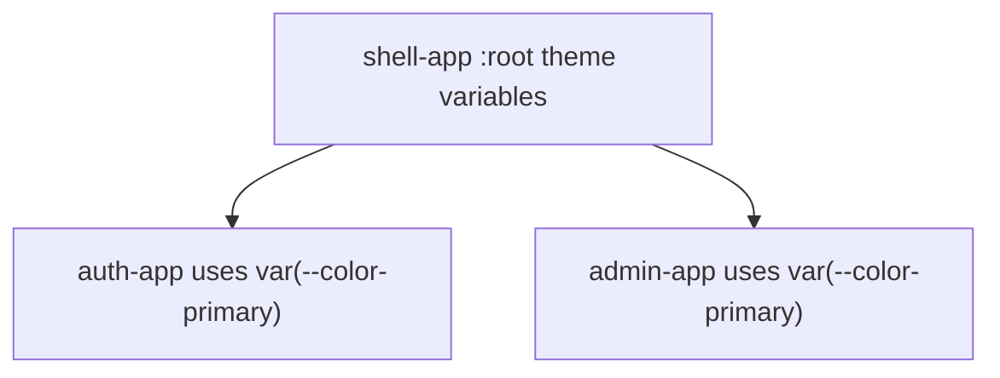

Rules for shared colors:

- Define product-wide variables in the shell.
- Make remotes use `var(--color-...)` instead of hardcoded colors.
- Put remote standalone defaults behind `:root:not([data-theme-owner="shell"])`.
- Keep variable names stable because they become a theme contract.
- Do not rely on Native Federation sharing to distribute CSS variables; CSS cascade does that after the remote is loaded into the shell page.

### 10.4 Different Colors for Different Remotes

Sometimes each remote should keep its own identity. For example, the storefront, auth area, and admin area might intentionally use different accents.

There are two safe patterns.

Pattern 1: Host chooses the active remote theme.

```css
html[data-active-mfe="auth"] {
  --color-primary: #374151;
  --color-primary-hover: #1f2937;
}

html[data-active-mfe="admin"] {
  --color-primary: #0f766e;
  --color-primary-hover: #115e59;
}
```

The host updates `data-active-mfe` when navigation changes:

```ts
import { NavigationEnd, Router } from '@angular/router';
import { filter } from 'rxjs';

router.events
  .pipe(filter((event): event is NavigationEnd => event instanceof NavigationEnd))
  .subscribe((event) => {
    const url = event.urlAfterRedirects;
    const activeMfe = url.startsWith('/admin') ? 'admin' : url.startsWith('/auth') ? 'auth' : 'shell';
    document.documentElement.dataset['activeMfe'] = activeMfe;
  });
```

Use this when the shell owns the whole page theme and only changes tokens based on the active route.

Pattern 2: Remote scopes its own colors under a wrapper.

```html
<section class="admin-theme">
  <router-outlet />
</section>
```

```css
.admin-theme {
  --color-primary: #0f766e;
  --color-primary-hover: #115e59;
  --color-background: #f7faf8;
}
```

Use this when only the remote's internal area should have different colors, while the shell header/footer keep the shell theme.

Avoid this pattern:

```css
:root {
  --color-primary: #0f766e;
}
```

inside a remote. When loaded into the shell, that can overwrite the whole page and accidentally change other MFEs.

### 10.5 Sharing Data Between Native Federation Apps

Native Federation does not share data automatically. It only loads JavaScript modules. Data sharing must use an explicit contract.

Common options:

| Method | Works for same framework? | Works cross-framework? | Good for | Coupling |
| --- | --- | --- | --- | --- |
| Route params/query params | Yes | Yes | Navigation state, filters, IDs | Low |
| Backend APIs | Yes | Yes | Business data and authorization | Low |
| `localStorage` | Yes, same browser origin | Yes, same browser origin | Small persisted client state | Medium |
| `sessionStorage` | Yes, same tab and origin | Yes, same tab and origin | Per-tab temporary state | Medium |
| `CustomEvent` | Yes | Yes | Notifications between apps on the same page | Low |
| `storage` event | Yes, same origin tabs | Yes, same origin tabs | Cross-tab sync after `localStorage` changes | Medium |
| Shared Angular service | Yes, Angular only | No | Small Angular platform state | High |
| Shared RxJS library | Yes, mostly Angular/TS apps | Possible but not ideal | Event streams in same-runtime apps | Medium to high |
| Web Component props/events | Yes | Yes | Cross-framework UI data in/out | Low |

Recommended order:

1. Use backend APIs for business truth.
2. Use route/query parameters for navigation state.
3. Use `CustomEvent` for simple same-page notifications.
4. Use `localStorage` only for small persisted browser state, such as tokens or user summary.
5. Use shared services only when the apps are same-framework and the shared contract is stable.

Example same-page event:

```ts
window.dispatchEvent(
  new CustomEvent('commerce-auth-logout', {
    detail: { reason: 'user-request' },
  }),
);
```

Shell listener:

```ts
window.addEventListener('commerce-auth-logout', () => {
  authFacade.clear();
});
```

Current repository example:

- `admin-app` dispatches `commerce-auth-logout` on logout.
- `shell-app` listens for `commerce-auth-logout` in `AuthFacade`.
- `shell-app` also listens for `storage` and `focus` events to sync auth state from browser storage.

### 10.6 Why `localStorage` and `sessionStorage` Behave This Way

Browser storage is scoped by origin, not by Native Federation app name.

An origin is:

```text
protocol + hostname + port
```

Examples:

```text
http://localhost:4200 -> one origin
http://localhost:4201 -> different origin
http://localhost:4202 -> different origin
```

Important behavior:

| Storage | Shared between same-origin tabs? | Shared between different ports? | Persists after browser restart? | Sends `storage` event to other tabs? |
| --- | --- | --- | --- | --- |
| `localStorage` | Yes | No | Usually yes | Yes |
| `sessionStorage` | No, it is per tab/window | No | No | No for normal cross-tab sync |

This means:

- If `auth-app` is opened standalone at `http://localhost:4201`, its `localStorage` belongs to origin `http://localhost:4201`.
- If `auth-app` is loaded as a remote inside `shell-app` at `http://localhost:4200/auth/login`, its JavaScript runs in the shell page, so storage reads/writes use origin `http://localhost:4200`.
- `admin-app` loaded inside `shell-app` also uses the shell page origin for browser storage.
- Two tabs open to `http://localhost:4200` share `localStorage`.
- A tab open to `http://localhost:4200` does not share `localStorage` with a tab open to `http://localhost:4201`.
- `sessionStorage` is tab-specific. A duplicated tab may copy the initial values in some browsers, but later changes are not a reliable shared state mechanism.

Current repository token keys:

```text
access_token
refresh_token
shell_user
auth_user
admin_user
```

Current shell behavior:

```ts
window.addEventListener('storage', () => this.syncFromStorage());
window.addEventListener('focus', () => this.syncFromStorage());
window.addEventListener('commerce-auth-logout', () => this.clear());
```

Why this is needed:

- `localStorage` changes made in one tab notify other same-origin tabs through the `storage` event.
- The tab that performs the write does not receive its own `storage` event.
- `focus` gives the shell another chance to re-read storage when a user returns to the tab.
- `commerce-auth-logout` handles same-page communication between loaded remotes and the shell.

Security note:

- `localStorage` is convenient but readable by any JavaScript running in the same page origin.
- Because Native Federation remotes run in the host page, a loaded remote is trusted code with access to the same origin storage.
- Never store passwords in browser storage.
- Prefer short-lived access tokens, refresh-token rotation, backend validation, and a strict Content Security Policy where possible.

## 11. Routing

### Same-Framework Routing

Current Angular-to-Angular routing:

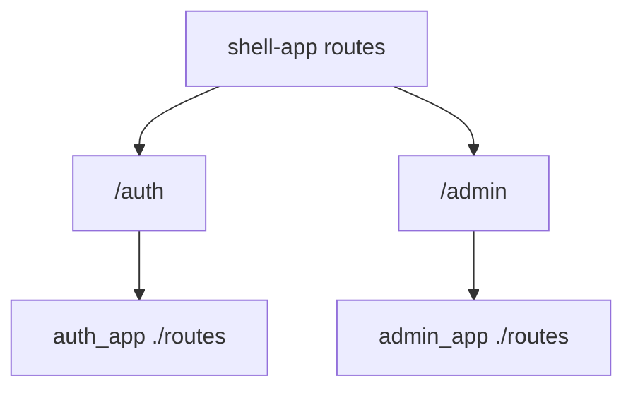

Host responsibility:

- Own the top-level URL.
- Decide when a remote is loaded.
- Provide layout around remote routes if needed.
- Provide loading and error states.
- Provide a host-level `**` route for unknown top-level URLs.
- Provide a remote-load failure fallback for routes such as `/auth` and `/admin`.

Remote responsibility:

- Own internal child routes.
- Own feature-specific guards.
- Own feature components.
- Keep route exports stable.
- Provide a remote-level `**` route for unknown URLs inside the remote route tree.

Current repository state:

| App | Current fallback behavior |
| --- | --- |
| `auth-app` | Has `{ path: '**', redirectTo: '' }` inside its exposed routes. |
| `admin-app` | Has `{ path: '**', redirectTo: '' }` inside its exposed routes. |
| `shell-app` | Does not currently show a final host-level `**` fallback in the inspected route file. Add one if the shell should handle unknown top-level URLs cleanly. |

### Cross-Framework Routing

Example: Angular host to React remote.

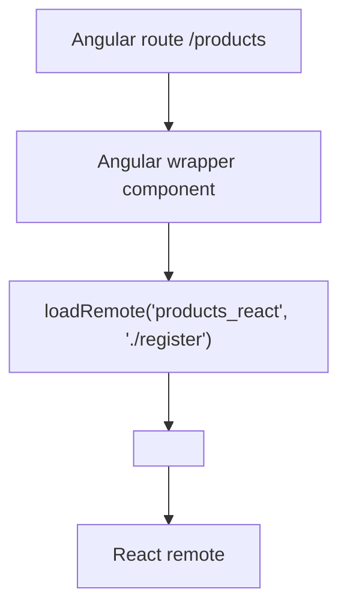

For cross-framework UI, the host route normally renders a wrapper component. The wrapper loads the remote module and mounts a Web Component or calls a mount API.

Do not expose React Router routes and expect Angular Router to understand them. Do not expose Angular `Routes` and expect React Router or Vue Router to consume them directly.

## 12. Shared Dependencies

Shared dependencies are one of the most important Native Federation decisions.

### Current Angular Sharing

The current apps use:

```js
shareAll({ singleton: true, strictVersion: true, requiredVersion: 'auto', build: 'package' })
```

They also override `@angular/core` with `includeSecondaries: false` and skip several Angular secondary internals and unused RxJS entry points.

Current skip list includes:

```js
[
  'rxjs/ajax',
  'rxjs/fetch',
  'rxjs/testing',
  'rxjs/webSocket',
  '@angular/core/event-dispatch-contract.min.js',
  '@angular/core/primitives/di',
  '@angular/core/primitives/event-dispatch',
  '@angular/core/primitives/signals',
  '@angular/core/rxjs-interop',
]
```

### When To Share

Share when:

- The dependency must be singleton for correctness.
- Host and remote use compatible versions.
- The dependency is part of a deliberate platform contract.
- Duplicating it would break runtime behavior.

Angular-to-Angular:

```js
shared: {
  ...shareAll({ singleton: true, strictVersion: true, requiredVersion: 'auto', build: 'package' }),
}
```

React-to-React:

```js
shared: {
  react: { singleton: true, strictVersion: true, requiredVersion: 'auto' },
  'react-dom': { singleton: true, strictVersion: true, requiredVersion: 'auto' },
}
```

Vue-to-Vue:

```js
shared: {
  vue: { singleton: true, strictVersion: true, requiredVersion: 'auto' },
}
```

### When Not To Share

Do not share:

- Angular packages with React or Vue remotes.
- React packages with Angular or Vue remotes.
- Vue packages with Angular or React remotes.
- Remote-private feature libraries.
- Libraries with incompatible versions.
- Libraries where independent upgrades matter more than deduplication.

Cross-framework sharing guidance:

| Host | Remote | Share framework runtime? |
| --- | --- | --- |
| Angular | React | Share Angular only with Angular remotes; share React only among compatible React remotes. |
| Angular | Vue | Share Angular only with Angular remotes; share Vue only among compatible Vue remotes. |
| React | Angular | Share React only with React remotes; Angular remote manages Angular with compatible Angular consumers. |
| Vue | React | Share Vue only with Vue remotes; share React only among compatible React remotes. |

Blindly sharing framework-specific packages across different frameworks is usually inappropriate because the frameworks do not use each other's runtimes.

## 13. Runtime Loading

This repository uses `@angular-architects/native-federation@22.1.1`.

The package still exports top-level `loadRemoteModule`, but its installed TypeScript declaration marks it deprecated and recommends using the `loadRemoteModule` returned by `initFederation(...)`.

The repository includes wrapper files in `shell-app/src/federation-loader.ts` and `admin-app/src/federation-loader.ts`:

```ts
import { initFederation, NativeFederationResult } from '@angular-architects/native-federation';

let federation: Promise<NativeFederationResult> | undefined;

export function startFederation(manifestUrl?: string) {
  federation = initFederation(manifestUrl);
  return federation;
}

export async function loadRemote<T = unknown>(
  remoteName: string,
  exposedModule: string,
): Promise<T> {
  if (!federation) throw new Error('Native Federation has not been initialized.');
  const { loadRemoteModule } = await federation;
  return loadRemoteModule<T>(remoteName, exposedModule);
}
```

Current `main.ts` files call `initFederation(...)` directly. If route loading uses the wrapper above, `main.ts` should initialize through the wrapper so both pieces use the same stored federation promise:

```ts
import { startFederation } from './federation-loader';

startFederation('/assets/federation.manifest.json')
  .then(() => import('./bootstrap'))
  .catch((err: unknown) => console.error(err));
```

For a pure remote that does not load other remotes:

```ts
import { initFederation } from '@angular-architects/native-federation';

initFederation()
  .then(() => import('./bootstrap'))
  .catch((err: unknown) => console.error(err));
```

Version-specific note:

- In this installed package, `loadRemoteModule(remoteName, exposedModule)` still exists.
- It is marked deprecated in the local declaration file.
- Prefer the `loadRemoteModule` returned from `initFederation(...)`, either directly or through an app-local wrapper.

## 14. Step-by-Step Implementation Guide

Use this section when implementing the same Angular-to-Angular Native Federation setup used by this repository.

Target architecture:

```text
shell-app
  /auth  -> auth_app ./routes
  /admin -> admin_app ./routes

admin-app
  /auth -> auth_app ./routes

auth-app
  exposes ./routes
```

### What Changes From a Basic Angular App

A basic Angular app usually has this shape:

```text
src/main.ts
  imports Angular
  bootstraps App directly

angular.json
  build -> @angular/build:application
  serve -> @angular/build:dev-server

No federation.config.mjs
No remoteEntry.json
No federation.manifest.json
No runtime remote loading
```

A Native Federation Angular app changes that shape:

```text
src/main.ts
  initializes Native Federation first
  then dynamically imports bootstrap.ts

src/bootstrap.ts
  imports Angular
  bootstraps App

federation.config.mjs
  declares host/remote name, exposed modules, remotes, and shared dependencies

public/assets/federation.manifest.json
  tells a host where remoteEntry.json files are

angular.json
  wraps build/serve with @angular-architects/native-federation:build
  keeps Angular application build under the esbuild target

app.routes.ts
  host routes call loadRemote(...) for remote routes
  remote routes export routes for the host to consume
```

### Native Federation Files Added or Changed

Before looking at each file, decide the app role. The role controls which files are needed.

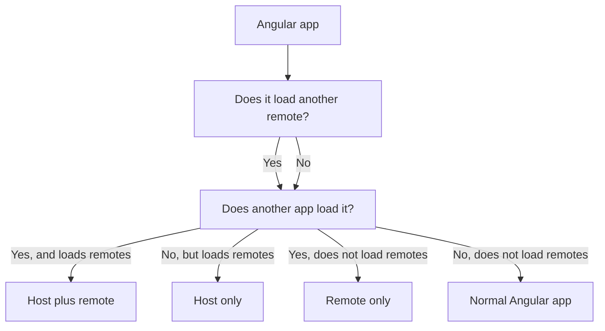

Current repository examples:

| App | Role | Native Federation use case |
| --- | --- | --- |
| `shell-app` | Host only | Storefront shell loads auth and admin features by route. |
| `auth-app` | Remote only | Authentication feature exposes its routes to hosts. |
| `admin-app` | Host plus remote | Admin feature is loaded by the shell and also loads auth routes for its own login flow. |

Role-based file checklist:

| File | Host only | Remote only | Host plus remote | Why |
| --- | --- | --- | --- | --- |
| `@angular-architects/native-federation` in `package.json` | Yes | Yes | Yes | Builder/config/runtime package. |
| `es-module-shims` in `package.json` | Yes | Yes | Yes | Import map support. |
| Native Federation builder in `angular.json` | Yes | Yes | Yes | Generates/uses federation metadata. |
| `federation.config.mjs` | Yes | Yes | Yes | Defines federation behavior for the app. |
| `remotes` in `federation.config.mjs` | Yes | No | Yes | Only apps that consume remotes need this. |
| `exposes` in `federation.config.mjs` | Usually no | Yes | Yes | Only apps consumed by another app need this. |
| `public/assets/federation.manifest.json` | Yes | No | Yes | Only apps that load remotes need remote discovery. |
| `src/federation-loader.ts` | Yes | No | Yes | Only apps that call `loadRemote(...)` need the wrapper. |
| `src/main.ts` with `startFederation(...)` | Yes | No | Yes | Hosts initialize with a manifest and store the federation result. |
| `src/main.ts` with `initFederation()` | No | Yes | No | Pure remotes initialize federation without a manifest. |
| `src/bootstrap.ts` | Yes | Yes | Yes | Keeps Angular bootstrap after federation initialization. |
| Host routes using `loadRemote(...)` | Yes | No | Yes | Only hosts route to remotes. |
| Remote route exports | No | Yes | Yes | Only remotes expose route modules. |
| Native Federation types in `tsconfig.app.json` | Yes | Yes | Yes | Keeps TypeScript aware of package types. |

| File | Added or changed? | Exists in which apps? | What it does |
| --- | --- | --- | --- |
| `package.json` | Changed | `shell-app`, `auth-app`, `admin-app` | Adds `@angular-architects/native-federation` and `es-module-shims`. |
| `angular.json` | Changed | All Native Federation apps | Uses the Native Federation builder wrapper and keeps the Angular esbuild application target. |
| `federation.config.mjs` | Added | All Native Federation apps | Defines app federation name, remotes, exposes, shared packages, skipped packages, and features. |
| `public/assets/federation.manifest.json` | Added | Host apps: `shell-app`, `admin-app` | Maps remote names to remote entry URLs. |
| `src/main.ts` | Changed | All Native Federation apps | Runs `initFederation(...)` or `startFederation(...)` before Angular bootstrap. |
| `src/bootstrap.ts` | Added or split out | All Native Federation apps | Contains the normal Angular `bootstrapApplication(...)` call. |
| `src/federation-loader.ts` | Added only when an app loads remotes | Host and host-plus-remote apps: `shell-app`, `admin-app` | Stores the initialized Native Federation result and loads remote modules. Pure remotes do not need it. |
| `src/app/app.routes.ts` | Changed | Host and remote apps | Hosts load remote routes; remotes export route arrays. |
| `src/app/app.config.ts` | Usually unchanged | All Angular apps | Keeps normal Angular providers. Native Federation is initialized in `main.ts`, not through Angular providers. |
| `tsconfig.app.json` | Changed | All Native Federation apps | Includes Native Federation type declarations through `compilerOptions.types`. |

### `package.json`

Native Federation adds these runtime dependencies:

```json
{
  "dependencies": {
    "@angular-architects/native-federation": "^22.1.1",
    "es-module-shims": "^2.8.0"
  }
}
```

What they do:

| Package | Purpose |
| --- | --- |
| `@angular-architects/native-federation` | Provides the Angular builder, configuration helpers, and runtime initialization APIs. |
| `es-module-shims` | Provides import map behavior needed by Native Federation in browsers and configurations that need shim mode. |

Native Federation is not enabled just by installing the package. The app also needs builder configuration, `federation.config.mjs`, and runtime initialization.

### `angular.json`

Basic Angular app:

```json
"build": {
  "builder": "@angular/build:application"
}
```

Native Federation app:

```json
"build": {
  "builder": "@angular-architects/native-federation:build",
  "options": {
    "cacheExternalArtifacts": true,
    "tsConfig": "tsconfig.app.json"
  },
  "configurations": {
    "production": {
      "target": "shell-app:esbuild:production"
    },
    "development": {
      "target": "shell-app:esbuild:development",
      "dev": true
    }
  }
}
```

What each part does:

| Setting | Meaning |
| --- | --- |
| `@angular-architects/native-federation:build` | Runs the Native Federation wrapper around the Angular build. |
| `cacheExternalArtifacts` | Allows Native Federation to cache generated external/shared artifacts. |
| `tsConfig` | Tells the Native Federation builder which TypeScript config to use. This repo uses `tsconfig.app.json`. |
| `target` | Points Native Federation to the real Angular application build target. |
| `dev: true` | Uses development behavior for local builds and serve. |

The real Angular build remains under the `esbuild` target:

```json
"esbuild": {
  "builder": "@angular/build:application",
  "options": {
    "browser": "src/main.ts",
    "tsConfig": "tsconfig.app.json",
    "assets": [
      {
        "glob": "**/*",
        "input": "public"
      }
    ],
    "styles": ["src/styles.css"],
    "polyfills": ["es-module-shims"]
  }
}
```

What this does:

- `browser: "src/main.ts"` keeps `main.ts` as the browser entry.
- `assets` copies `public` into the build output, including `assets/federation.manifest.json`.
- `polyfills: ["es-module-shims"]` loads the import map shim needed by Native Federation.
- `styles` keeps the app's global CSS.

### `federation.config.mjs`

This is the main Native Federation configuration file.

Host example from `shell-app`:

```js
import { withNativeFederation, shareAll } from '@angular-architects/native-federation/config';

export default withNativeFederation({
  name: 'shell_app',

  remotes: {
    auth_app: 'http://localhost:4201/remoteEntry.json',
    admin_app: 'http://localhost:4202/remoteEntry.json',
  },

  shared: {
    ...shareAll(
      { singleton: true, strictVersion: true, requiredVersion: 'auto', build: 'package' },
      {
        overrides: {
          '@angular/core': {
            singleton: true,
            strictVersion: true,
            requiredVersion: 'auto',
            build: 'package',
            includeSecondaries: false,
          },
        },
      },
    ),
  },

  skip: [
    'rxjs/ajax',
    'rxjs/fetch',
    'rxjs/testing',
    'rxjs/webSocket',
    '@angular/core/event-dispatch-contract.min.js',
    '@angular/core/primitives/di',
    '@angular/core/primitives/event-dispatch',
    '@angular/core/primitives/signals',
    '@angular/core/rxjs-interop',
  ],

  features: {
    denseChunking: true,
  },
});
```

What each part does:

| Code | Meaning |
| --- | --- |
| `withNativeFederation(...)` | Normalizes the config for the Native Federation builder. |
| `shareAll(...)` | Creates shared dependency configuration from `package.json`. |
| `name: 'shell_app'` | Gives this app a stable federation name. Hosts and remotes reference this name. |
| `remotes` | Lists remote applications this app can consume. Host apps use this. |
| `exposes` | Lists local modules this app exposes to other apps. Remote apps use this. |
| `shared` | Defines dependencies that should be shared instead of duplicated where possible. |
| `singleton: true` | Requests one shared runtime instance for a package. Important for Angular packages. |
| `strictVersion: true` | Fails or warns on incompatible versions instead of silently mixing them. |
| `requiredVersion: 'auto'` | Uses package versions from `package.json`. |
| `build: 'package'` | Builds shared package artifacts for federation. |
| `includeSecondaries: false` | Prevents automatic sharing of every secondary entry point for `@angular/core`; this repo skips several Angular internals explicitly. |
| `skip` | Excludes packages or secondary entry points that should not be emitted/shared. |
| `denseChunking: true` | Groups generated chunk metadata to reduce `remoteEntry.json` metadata size. |

Remote example from `auth-app`:

```js
export default withNativeFederation({
  name: 'auth_app',
  exposes: {
    './routes': './src/app/app.routes.ts',
  },
});
```

What it means:

```text
Other apps can load:
  remote name: auth_app
  exposed module: ./routes

Native Federation maps that to:
  auth-app/src/app/app.routes.ts
```

Host plus remote example from `admin-app`:

```js
export default withNativeFederation({
  name: 'admin_app',
  exposes: {
    './routes': './src/app/app.routes.ts',
  },
  remotes: {
    auth_app: 'http://localhost:4201/remoteEntry.json',
  },
});
```

`admin-app` is both:

- A remote for `shell-app`, because it exposes `./routes`.
- A host for `auth-app`, because it has `remotes.auth_app`.

### `public/assets/federation.manifest.json`

This file exists in host apps.

`shell-app/public/assets/federation.manifest.json`:

```json
{
  "auth_app": "http://localhost:4201/remoteEntry.json",
  "admin_app": "http://localhost:4202/remoteEntry.json"
}
```

What it does:

- The key is the remote name used by `loadRemote(...)`.
- The value is the URL of that remote's generated `remoteEntry.json`.
- The host reads this file during federation initialization.
- The manifest can be replaced per environment without changing TypeScript code.

`admin-app/public/assets/federation.manifest.json`:

```json
{
  "auth_app": "http://localhost:4201/remoteEntry.json"
}
```

`auth-app` does not need this file because it is currently a pure remote and does not load another remote.

### `src/main.ts`

Basic Angular `main.ts` usually bootstraps Angular immediately:

```ts
import { bootstrapApplication } from '@angular/platform-browser';
import { App } from './app/app';
import { appConfig } from './app/app.config';

bootstrapApplication(App, appConfig).catch((err) => console.error(err));
```

Native Federation must initialize first.

Host `main.ts`:

```ts
import { startFederation } from './federation-loader';

startFederation('/assets/federation.manifest.json')
  .then(() => import('./bootstrap'))
  .catch((err: unknown) => console.error(err));
```

Remote-only `main.ts`:

```ts
import { initFederation } from '@angular-architects/native-federation';

initFederation()
  .then(() => import('./bootstrap'))
  .catch((err: unknown) => console.error(err));
```

What this does:

- Initializes Native Federation before Angular imports run.
- Loads the host federation manifest if the app consumes remotes.
- Creates the import map and shared dependency setup.
- Dynamically imports `bootstrap.ts` only after federation setup is ready.

This order is important. If Angular imports run before federation initialization, the browser can fail to resolve package imports such as `@angular/core`.

### `src/bootstrap.ts`

This file contains the normal Angular bootstrap code:

```ts
import { bootstrapApplication } from '@angular/platform-browser';
import { App } from './app/app';
import { appConfig } from './app/app.config';

bootstrapApplication(App, appConfig).catch((err: unknown) => console.error(err));
```

Why it exists:

- It keeps Angular imports out of `main.ts`.
- `main.ts` can initialize Native Federation first.
- Angular starts only after Native Federation has prepared runtime loading.

### `src/federation-loader.ts`

This file exists only in apps that load other remotes.

| App | Needs `federation-loader.ts`? | Why |
| --- | --- | --- |
| `shell-app` | Yes | It is the main host and loads `auth_app` and `admin_app`. |
| `admin-app` | Yes | It is a remote for `shell-app`, but it is also a host for `auth_app`. This makes it a host-plus-remote app. |
| `auth-app` | No | It exposes `./routes` but does not load another remote. |

If an app only exposes modules and never calls `loadRemote(...)`, do not add `federation-loader.ts` to that app.

```ts
import { initFederation, NativeFederationResult } from '@angular-architects/native-federation';

let federation: Promise<NativeFederationResult> | undefined;

export function startFederation(manifestUrl?: string) {
  federation = initFederation(manifestUrl);
  return federation;
}

export async function loadRemote<T = unknown>(
  remoteName: string,
  exposedModule: string,
): Promise<T> {
  if (!federation) throw new Error('Native Federation has not been initialized.');
  const { loadRemoteModule } = await federation;
  return loadRemoteModule<T>(remoteName, exposedModule);
}
```

What each part does:

| Code | Meaning |
| --- | --- |
| `federation` | Stores the initialized Native Federation promise. |
| `startFederation(...)` | Starts Native Federation and optionally loads the host manifest. |
| `loadRemote(...)` | Loads an exposed module from a remote after federation is initialized. |
| `NativeFederationResult` | Type returned by `initFederation(...)`; includes the preferred `loadRemoteModule`. |
| Error if `federation` is missing | Prevents route loading before Native Federation setup. |

Why use this wrapper:

- In `@angular-architects/native-federation@22.1.1`, the top-level `loadRemoteModule` export still exists, but the package's type declarations mark it deprecated.
- The preferred API is the `loadRemoteModule` returned by `initFederation(...)`.
- This wrapper gives the app one consistent place to initialize and load remotes.

When to use `startFederation(...)` in `main.ts`:

```text
App loads remotes? yes -> use startFederation('/assets/federation.manifest.json')
App loads remotes? no  -> use initFederation()
```

That is why `shell-app` and `admin-app` use `startFederation(...)`, while `auth-app` uses `initFederation()`.

### `src/app/app.routes.ts`

Host route:

```ts
{
  path: 'auth',
  loadChildren: () =>
    loadRemote<{ routes: Routes }>('auth_app', './routes').then((m) => m.routes),
}
```

What it does:

```text
When the user navigates to /auth:
  1. Angular Router calls loadChildren.
  2. loadRemote asks Native Federation for auth_app -> ./routes.
  3. Native Federation loads auth_app remoteEntry.json if needed.
  4. It resolves ./routes to the generated remote module.
  5. The module returns Angular Routes.
  6. Angular Router mounts those routes under /auth.
```

Remote route export:

```ts
import { Routes } from '@angular/router';

export const routes: Routes = [
  {
    path: '',
    loadComponent: () => import('./features/auth/login/login').then((m) => m.Login),
  },
];
```

Why this works:

- The remote exposes `./routes`.
- The source file exports `routes`.
- The host loads `./routes` and reads `m.routes`.
- Both host and remote are Angular apps, so Angular Router understands the route array.

### `src/app/app.config.ts`

In this repository, `app.config.ts` remains a normal Angular application config file. It is not a Native Federation configuration file.

Typical Angular app config:

```ts
import { ApplicationConfig } from '@angular/core';
import { provideRouter } from '@angular/router';
import { routes } from './app.routes';

export const appConfig: ApplicationConfig = {
  providers: [provideRouter(routes)],
};
```

What it does:

| Code | Meaning |
| --- | --- |
| `ApplicationConfig` | Angular application provider configuration. |
| `provideRouter(routes)` | Registers this app's own Angular routes. |
| Other Angular providers | Register normal Angular services such as HTTP, animations, interceptors, or app-level services. |

What it does not do:

- It does not register the Native Federation manifest.
- It does not load remote entries.
- It does not expose remote modules.
- It does not replace `federation.config.mjs`.
- It does not replace `main.ts` federation initialization.

Keep Native Federation concerns in these files instead:

| Concern | File |
| --- | --- |
| Runtime initialization | `src/main.ts` |
| Angular bootstrap after federation setup | `src/bootstrap.ts` |
| Host remote loading helper | `src/federation-loader.ts` |
| Host route integration | `src/app/app.routes.ts` |
| Build-time federation config | `federation.config.mjs` |
| Runtime remote URLs | `public/assets/federation.manifest.json` |

Do not add webpack-style or unrelated federation providers to `app.config.ts` for this repository. With `@angular-architects/native-federation@22.1.1`, the inspected apps use `initFederation(...)` before Angular bootstrap.

### `tsconfig.app.json`

This repository uses `tsconfig.app.json` for both the Angular application build and the Native Federation wrapper build:

```json
{
  "extends": "./tsconfig.json",
  "compilerOptions": {
    "types": [
      "@angular-architects/native-federation"
    ]
  },
  "include": [
    "src/**/*.ts"
  ],
  "exclude": [
    "src/**/*.spec.ts"
  ]
}
```

What it does:

| Setting | Meaning |
| --- | --- |
| `extends` | Reuses the app's base TypeScript settings. |
| `types` | Includes Native Federation type declarations explicitly. |
| `include: ["src/**/*.ts"]` | Includes `main.ts`, `bootstrap.ts`, `federation-loader.ts`, app routes, and exposed route modules. |
| `exclude: ["src/**/*.spec.ts"]` | Keeps unit test files out of the application build. |

`tsconfig.federation.json` is not needed here because `tsconfig.app.json` already covers all Native Federation source files used by these apps.

### Generated `remoteEntry.json`

You do not create `remoteEntry.json` manually. Native Federation generates it when the remote app is built or served.

For this repository:

```text
auth-app running on 4201  -> http://localhost:4201/remoteEntry.json
admin-app running on 4202 -> http://localhost:4202/remoteEntry.json
```

What it contains conceptually:

- The remote name.
- Exposed module metadata.
- Generated chunk references.
- Shared dependency metadata.

The host manifest points to this file. The browser loads it at runtime.

### Step 1: Create or identify the applications

This repository already has three Angular applications:

```text
frontend/native-federation/shell-app
frontend/native-federation/auth-app
frontend/native-federation/admin-app
```

Assign one clear role to each app:

| App | Role |
| --- | --- |
| `shell-app` | Main host application |
| `auth-app` | Remote application |
| `admin-app` | Remote application and secondary host |

### Step 2: Install Native Federation dependencies

Run this in each Angular app:

```bash
npm add @angular-architects/native-federation es-module-shims
```

This repository currently uses:

```text
@angular-architects/native-federation@22.1.1
es-module-shims@2.8.0
```

### Step 3: Configure the Angular builder

Each Native Federation app uses `@angular-architects/native-federation:build` as the public build/serve builder and keeps Angular's application builder under the `esbuild` target.

Current pattern from `angular.json`:

```json
"build": {
  "builder": "@angular-architects/native-federation:build",
  "options": {
    "cacheExternalArtifacts": true,
    "tsConfig": "tsconfig.app.json"
  }
},
"esbuild": {
  "builder": "@angular/build:application",
  "options": {
    "browser": "src/main.ts",
    "tsConfig": "tsconfig.app.json",
    "polyfills": ["es-module-shims"]
  }
}
```

The important parts are:

- Use `@angular-architects/native-federation:build`.
- Keep `es-module-shims` in `polyfills`.
- Keep `src/main.ts` as the browser entry.
- Use `tsconfig.app.json` for both the Native Federation wrapper builder and the Angular application builder when it already includes the application source files.

### Step 4: Add `federation.config.mjs` to each app

Host app example:

```js
import { withNativeFederation, shareAll } from '@angular-architects/native-federation/config';

export default withNativeFederation({
  name: 'shell_app',
  remotes: {
    auth_app: 'http://localhost:4201/remoteEntry.json',
    admin_app: 'http://localhost:4202/remoteEntry.json',
  },
  shared: {
    ...shareAll({ singleton: true, strictVersion: true, requiredVersion: 'auto', build: 'package' }),
  },
});
```

Remote app example:

```js
import { withNativeFederation, shareAll } from '@angular-architects/native-federation/config';

export default withNativeFederation({
  name: 'auth_app',
  exposes: {
    './routes': './src/app/app.routes.ts',
  },
  shared: {
    ...shareAll({ singleton: true, strictVersion: true, requiredVersion: 'auto', build: 'package' }),
  },
});
```

Host plus remote example:

```js
export default withNativeFederation({
  name: 'admin_app',
  exposes: {
    './routes': './src/app/app.routes.ts',
  },
  remotes: {
    auth_app: 'http://localhost:4201/remoteEntry.json',
  },
  shared: {
    ...shareAll({ singleton: true, strictVersion: true, requiredVersion: 'auto', build: 'package' }),
  },
});
```

### Step 5: Create the federation manifest for host apps

For `shell-app`, create:

```text
shell-app/public/assets/federation.manifest.json
```

With:

```json
{
  "auth_app": "http://localhost:4201/remoteEntry.json",
  "admin_app": "http://localhost:4202/remoteEntry.json"
}
```

For `admin-app`, create:

```text
admin-app/public/assets/federation.manifest.json
```

With:

```json
{
  "auth_app": "http://localhost:4201/remoteEntry.json"
}
```

Pure remotes such as `auth-app` do not need a host manifest unless they also load other remotes.

### Step 6: Split `main.ts` and `bootstrap.ts`

Host `main.ts`:

```ts
import { startFederation } from './federation-loader';

startFederation('/assets/federation.manifest.json')
  .then(() => import('./bootstrap'))
  .catch((err: unknown) => console.error(err));
```

Remote-only `main.ts`:

```ts
import { initFederation } from '@angular-architects/native-federation';

initFederation()
  .then(() => import('./bootstrap'))
  .catch((err: unknown) => console.error(err));
```

`bootstrap.ts`:

```ts
import { bootstrapApplication } from '@angular/platform-browser';
import { App } from './app/app';
import { appConfig } from './app/app.config';

bootstrapApplication(App, appConfig).catch((err) => console.error(err));
```

Keep Angular imports in `bootstrap.ts`, not in `main.ts`.

### Step 7: Expose remote routes

In the remote's `federation.config.mjs`:

```js
exposes: {
  './routes': './src/app/app.routes.ts',
}
```

In `src/app/app.routes.ts`:

```ts
import { Routes } from '@angular/router';

export const routes: Routes = [
  {
    path: '',
    loadComponent: () => import('./features/auth/login/login').then((m) => m.Login),
  },
];
```

The host expects the exposed module to export `routes`.

### Step 8: Add a remote loading helper for host apps

For Native Federation `22.1.1`, prefer the `loadRemoteModule` returned by `initFederation(...)`.

Example helper:

```ts
import { initFederation, NativeFederationResult } from '@angular-architects/native-federation';

let federation: Promise<NativeFederationResult> | undefined;

export function startFederation(manifestUrl?: string) {
  federation = initFederation(manifestUrl);
  return federation;
}

export async function loadRemote<T = unknown>(remoteName: string, exposedModule: string): Promise<T> {
  if (!federation) throw new Error('Native Federation has not been initialized.');
  const { loadRemoteModule } = await federation;
  return loadRemoteModule<T>(remoteName, exposedModule);
}
```

If using this helper, initialize with `startFederation(...)` in `main.ts`:

```ts
import { startFederation } from './federation-loader';

startFederation('/assets/federation.manifest.json')
  .then(() => import('./bootstrap'))
  .catch((err: unknown) => console.error(err));
```

### Step 9: Load remote routes from the host router

`shell-app/src/app/app.routes.ts`:

```ts
import { Routes } from '@angular/router';
import { loadRemote } from '../federation-loader';

export const routes: Routes = [
  {
    path: 'auth',
    loadChildren: () =>
      loadRemote<{ routes: Routes }>('auth_app', './routes').then((m) => m.routes),
  },
  {
    path: 'admin',
    loadChildren: () =>
      loadRemote<{ routes: Routes }>('admin_app', './routes').then((m) => m.routes),
  },
];
```

The remote name and exposed key must match exactly:

```text
auth_app + ./routes
admin_app + ./routes
```

### Step 10: Share compatible Angular dependencies

For Angular-to-Angular federation, keep Angular packages compatible and shared as singletons:

```js
shared: {
  ...shareAll({ singleton: true, strictVersion: true, requiredVersion: 'auto', build: 'package' }),
}
```

Verify versions:

```bash
npm ls @angular/core @angular-architects/native-federation rxjs
```

In this repository, all Native Federation apps resolve `@angular/core@22.1.3`.

### Step 11: Start and verify locally

Start remotes first:

```bash
cd frontend/native-federation/auth-app
npm start

cd ../admin-app
npm start

cd ../shell-app
npm start
```

Verify URLs:

```text
http://localhost:4201/remoteEntry.json
http://localhost:4202/remoteEntry.json
http://localhost:4200/assets/federation.manifest.json
http://localhost:4200/auth/login
http://localhost:4200/admin/dashboard
```

### Step 12: Build for production

Build each app independently:

```bash
cd frontend/native-federation/auth-app
npm run build

cd ../admin-app
npm run build

cd ../shell-app
npm run build
```

Deploy each remote's generated `remoteEntry.json` and generated assets together.

### Step 13: Replace local manifest URLs for production

Production manifest example:

```json
{
  "auth_app": "https://cdn.example.com/auth-app/remoteEntry.json",
  "admin_app": "https://cdn.example.com/admin-app/remoteEntry.json"
}
```

Use different manifests for local, staging, and production.

### Step 14: Add error fallbacks

Do not let one unavailable remote break the whole host.

```ts
loadRemote<{ routes: Routes }>('auth_app', './routes')
  .then((m) => m.routes)
  .catch(() => fallbackRoutes);
```

Use a fallback route or component that explains the remote feature is temporarily unavailable.

Handle three different failure cases separately:

| Case | Where to handle it | Example |
| --- | --- | --- |
| Unknown host URL | Host routes | `/unknown-page` should render a shell 404 page. |
| Unknown remote child URL | Remote routes | `/auth/not-real` should be handled by `auth_app` after `/auth` is mounted. |
| Remote cannot load | Host `loadRemote(...)` wrapper or route | `/auth` should show "Auth feature unavailable" if `auth_app` is down. |

Recommended host-level 404 route:

```ts
export const routes: Routes = [
  {
    path: '',
    component: ShellComponent,
    children: [
      // normal local and remote routes first
      {
        path: 'auth',
        loadChildren: () =>
          loadRemoteRoutes('auth_app', './routes'),
      },
      {
        path: 'admin',
        loadChildren: () =>
          loadRemoteRoutes('admin_app', './routes'),
      },
      {
        path: '**',
        loadComponent: () =>
          import('./features/not-found/not-found.page').then((m) => m.NotFoundPage),
      },
    ],
  },
];
```

Recommended remote-level fallback route:

```ts
export const routes: Routes = [
  {
    path: '',
    component: AuthLayout,
    children: [
      { path: '', redirectTo: 'login', pathMatch: 'full' },
      {
        path: 'login',
        loadComponent: () => import('./features/auth/login/login').then((m) => m.Login),
      },
      {
        path: '**',
        loadComponent: () =>
          import('./features/auth/auth-not-found/auth-not-found').then((m) => m.AuthNotFound),
      },
    ],
  },
];
```

Keep the wildcard route last. Angular route matching is ordered, so a `**` route placed too early will capture valid routes before they can load.

### Step 15: Cross-framework implementation path

For Angular to React or Angular to Vue, do not expose a React/Vue component and expect Angular to render it directly.

Use this implementation path:

```text
1. Remote exposes ./register.
2. ./register defines a Web Component or exports mount(element, props).
3. Host loads ./register through Native Federation.
4. Host renders a wrapper component.
5. Wrapper passes data through attributes/properties.
6. Remote sends events through CustomEvent.
7. Host cleans up listeners on destroy/unmount.
```

Use Web Components for cross-framework UI unless you have a strong reason to use a lower-level mount API.

## 15. Development Setup

Install dependencies per app:

```bash
cd frontend/native-federation/auth-app
npm install

cd ../admin-app
npm install

cd ../shell-app
npm install
```

Run remotes and hosts:

```bash
cd frontend/native-federation/auth-app
npm start

cd ../admin-app
npm start

cd ../shell-app
npm start
```

Verify:

```text
http://localhost:4200
http://localhost:4201/remoteEntry.json
http://localhost:4202/remoteEntry.json
http://localhost:4200/assets/federation.manifest.json
```

Important local development rule:

- A route-level remote can be unavailable until that route is visited.
- The manifest and remote entry URLs still need to be reachable when the host initializes or loads the remote, depending on initialization strategy.

## 16. Production Deployment

Native Federation supports independent deployment, but only if contracts remain compatible.

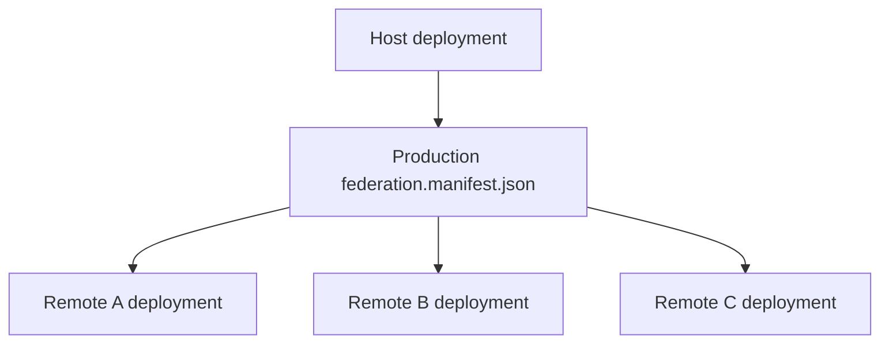

Production recommendations:

- Deploy each remote to a stable base URL.
- Deploy `remoteEntry.json` with the generated assets it references.
- Use environment-specific manifests for local, staging, and production.
- Avoid hardcoded production URLs in source code when a manifest can be replaced at deploy time.
- Keep old remote deployments available during host rollout if users may have cached host assets.
- Monitor remote load failures.

Example production manifest:

```json
{
  "auth_app": "https://cdn.example.com/auth-app/v42/remoteEntry.json",
  "admin_app": "https://cdn.example.com/admin-app/v17/remoteEntry.json"
}
```

### Dynamic Manifests

A dynamic manifest can be generated or selected per environment:

```text
local shell -> local remotes
staging shell -> staging remotes
production shell -> production remotes
```

Do not deploy a production shell with localhost remote URLs.

### Remote Unavailable

If a remote is unavailable:

- The host can still load if the failing remote is not required during startup.
- The route or feature that needs the remote should show a controlled error state.
- The host should not crash the whole application for one unavailable optional remote.

Use fallbacks at the route wrapper level where possible.

## 17. Error Handling

Native Federation apps need normal application error handling plus federation-specific error handling. Keep these cases separate:

| Error case | Example URL | Owner | Expected behavior |
| --- | --- | --- | --- |
| Host page not found | `/something-random` | Host | Show shell-level 404 page. |
| Remote child page not found | `/auth/not-real` | Remote after `/auth` loads | Show auth-specific not-found page or redirect inside `auth_app`. |
| Remote unavailable | `/auth/login` while `auth_app` is down | Host | Show remote-unavailable fallback instead of crashing the shell. |
| Exposed module missing | Host asks for `auth_app` `./missing` | Host plus remote contract | Log contract error and show fallback. |
| Remote component throws | Remote route loads but component fails | Remote for feature error, host for outer fallback | Show feature error UI if possible; monitor/log error. |

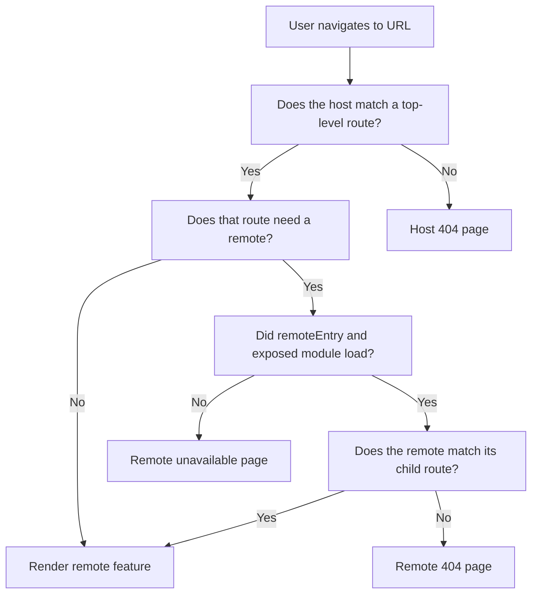

For route-level Angular remotes, wrap remote loading in a helper that can log and return fallback routes:

```ts
import { Routes } from '@angular/router';
import { loadRemote } from '../federation-loader';

const remoteUnavailableRoutes: Routes = [
  {
    path: '',
    loadComponent: () =>
      import('./remote-unavailable.component').then((m) => m.RemoteUnavailableComponent),
  },
];

export function loadRemoteRoutes(remoteName: string, exposedModule: string): Promise<Routes> {
  return loadRemote<{ routes: Routes }>(remoteName, exposedModule)
    .then((m) => m.routes)
    .catch((error) => {
      console.error(`Failed to load ${remoteName}:${exposedModule}`, error);
      return remoteUnavailableRoutes;
    });
}
```

Use that helper in host routes:

```ts
{
  path: 'auth',
  loadChildren: () => loadRemoteRoutes('auth_app', './routes'),
},
{
  path: 'admin',
  loadChildren: () => loadRemoteRoutes('admin_app', './routes'),
}
```

Then keep host-level unknown routes separate:

```ts
{
  path: '**',
  loadComponent: () =>
    import('./features/not-found/not-found.page').then((m) => m.NotFoundPage),
}
```

Remote apps should also handle their own unknown child routes. In the current repository, `auth-app` and `admin-app` already have wildcard redirects:

```ts
{ path: '**', redirectTo: '' }
```

That is acceptable for a simple flow, but a dedicated not-found page is clearer when the remote owns many deep routes:

```ts
{
  path: '**',
  loadComponent: () =>
    import('./features/not-found/remote-not-found.page').then((m) => m.RemoteNotFoundPage),
}
```

The host should not try to know every child URL owned by the remote. For example, the shell should know that `/auth` belongs to `auth_app`; `auth_app` should know whether `/auth/reset-password` or `/auth/not-real` is valid.

For Web Components:

- Show loading while the registration module loads.
- Check `customElements.get(tagName)`.
- Show fallback UI if registration or rendering fails.
- Remove event listeners on destroy/unmount.

## 18. Debugging

Start with the generated metadata and work inward.

1. Open the host manifest URL.
2. Open each remote entry URL.
3. Check browser Network tab for failed JavaScript chunks.
4. Check console for import map/specifier errors.
5. Confirm `main.ts` initializes federation before importing Angular bootstrap.
6. Confirm remote names match exactly.
7. Confirm exposed module keys match exactly.
8. Confirm shared dependency versions.

Useful commands:

```bash
cd frontend/native-federation/shell-app
npm ls @angular/core @angular-architects/native-federation

cd ../auth-app
npm ls @angular/core @angular-architects/native-federation

cd ../admin-app
npm ls @angular/core @angular-architects/native-federation
```

Native Federation names are case-sensitive:

```text
federation.config.mjs name: auth_app
manifest key:             auth_app
loadRemote name:          auth_app
exposed key:              ./routes
```

### Native Federation Troubleshooting

#### Remote Cannot Be Loaded

Problem: The host route is visited, but the remote feature does not load.

Possible cause: The remote dev server or deployed remote is unavailable, the remote entry URL is wrong, or the host cannot reach the remote origin.

How to verify:

```bash
curl http://localhost:4201/remoteEntry.json
curl http://localhost:4202/remoteEntry.json
```

Solution: Start the remote, correct the manifest URL, and confirm the remote entry is served from the same deployment as its generated assets.

#### Host Page Not Found

Problem: An unknown top-level URL shows a blank page, stays on the shell layout with no content, or redirects unexpectedly.

Possible cause: The host does not have a final `**` wildcard route, or the wildcard route is placed before valid local and remote routes.

How to verify: Open a known invalid host URL such as `http://localhost:4200/unknown-route` and inspect the host `src/app/app.routes.ts`.

Solution: Add a final host-level wildcard route after local and remote routes:

```ts
{
  path: '**',
  loadComponent: () =>
    import('./features/not-found/not-found.page').then((m) => m.NotFoundPage),
}
```

#### Remote Page Not Found

Problem: The remote loads, but an unknown child URL inside the remote feature redirects strangely or shows the wrong page.

Possible cause: The remote does not own a clear `**` fallback inside its exposed route tree.

How to verify: Open a known invalid remote URL such as `http://localhost:4200/auth/not-real` and inspect the remote's exposed `src/app/app.routes.ts`.

Solution: Add a final remote-level wildcard route inside the exposed routes:

```ts
{
  path: '**',
  loadComponent: () =>
    import('./features/not-found/remote-not-found.page').then((m) => m.RemoteNotFoundPage),
}
```

For simple auth flows, redirecting unknown child routes back to the default route can be acceptable:

```ts
{ path: '**', redirectTo: '' }
```

Use a real not-found component when the remote has many pages and users need a clear explanation.

#### Wildcard Route Captures Valid Remote Route

Problem: A valid remote route such as `/auth/login` or `/admin/dashboard` shows the not-found page.

Possible cause: The host or remote wildcard route appears before the route that should match.

How to verify: Check route order in `src/app/app.routes.ts`. Angular evaluates routes from top to bottom.

Solution: Keep `**` as the last route at its level. Host wildcard goes after host local routes and remote route prefixes. Remote wildcard goes after the remote's child routes.

#### Manifest Cannot Be Loaded

Problem: The host fails during `initFederation('/assets/federation.manifest.json')`.

Possible cause: The manifest file is missing from `public/assets`, was not included in the build assets, or the deployed host is serving the wrong asset path.

How to verify: Open `http://localhost:4200/assets/federation.manifest.json` in the browser and confirm it returns JSON.

Solution: Put the manifest under the host's `public/assets` folder or adjust the `initFederation(...)` path to the real deployed location.

#### Remote URL Is Incorrect

Problem: The manifest loads, but the host requests a remote from localhost, staging, or another wrong environment.

Possible cause: The wrong environment manifest was deployed.

How to verify: Open the deployed host's `assets/federation.manifest.json` and inspect the URLs.

Solution: Generate or deploy an environment-specific manifest for local, staging, and production.

#### Exposed Module Does Not Exist

Problem: `loadRemote('auth_app', './routes')` fails even though `remoteEntry.json` is reachable.

Possible cause: The exposed module key in the host does not match the remote's `exposes` key.

How to verify: Compare all three values:

```text
remote federation.config.mjs exposes: './routes'
host route loadRemote(...):           './routes'
remote source file export:            export const routes
```

Solution: Make the exposed key and export name match exactly. Native Federation names are case-sensitive.

#### CORS Error

Problem: The browser blocks `remoteEntry.json` or generated remote assets.

Possible cause: The remote server or CDN does not allow the host origin.

How to verify: Check the browser Network tab for blocked requests and missing `Access-Control-Allow-Origin` response headers.

Solution: Configure the remote asset server or CDN to allow the host origin. In production, prefer explicit trusted origins over `"*"`.

#### Import Map Issues

Problem: The browser console shows an error such as `Unable to resolve specifier '@angular/core'`.

Possible cause: Angular bootstrapped before Native Federation initialized, `es-module-shims` is missing, or a shared package was skipped incorrectly.

How to verify: Check that `src/main.ts` calls `initFederation(...)` before importing `./bootstrap`, and check `angular.json` for `"polyfills": ["es-module-shims"]`.

Solution: Keep Angular imports out of `main.ts`, keep the `main.ts` and `bootstrap.ts` split, and keep `es-module-shims` configured.

#### Shared Dependency Problems

Problem: The remote loads inconsistently, dependency injection behaves unexpectedly, or strict version checks fail.

Possible cause: Host and remote use incompatible shared dependency versions or a dependency that must be singleton is duplicated.

How to verify:

```bash
cd frontend/native-federation/shell-app
npm ls @angular/core rxjs

cd ../auth-app
npm ls @angular/core rxjs

cd ../admin-app
npm ls @angular/core rxjs
```

Solution: Align Angular and RxJS versions for Angular-to-Angular federation and keep required runtime dependencies shared as singletons.

#### Framework Runtime Problems

Problem: A cross-framework remote loads, but the UI does not render.

Possible cause: The host loaded a framework component but did not call that framework's renderer, mount API, or Web Component registration.

How to verify: Check whether the exposed module exports a plain component, a `mount(...)` function, or a custom element registration function.

Solution: For cross-framework UI, expose a Web Component registration module or a `mount(element, props)` API. Do not expect Angular, React, and Vue components to render each other directly.

#### Version Mismatch

Problem: A host and remote worked locally, but fail after one remote is upgraded.

Possible cause: The remote changed a shared dependency version or changed the exposed module contract without host compatibility.

How to verify: Compare `package.json`, lock files, deployed remote version, and exposed module exports.

Solution: Keep shared runtime versions compatible, version exposed contracts, and deploy host/remote changes in a compatible order.

#### Remote Unavailable

Problem: A deployed route fails because a remote deployment is down or missing generated assets.

Possible cause: Remote assets were not deployed atomically, CDN cache points to missing files, or the remote service is unavailable.

How to verify: Open `remoteEntry.json`, then open the generated asset URLs referenced by that remote entry.

Solution: Deploy remote entry and generated assets together, keep rollback artifacts, and add host fallback UI for remote routes.

#### Cross-Framework Rendering Issues

Problem: A Web Component tag appears in the DOM, but its content is blank.

Possible cause: The registration module did not run, the underlying framework mount failed, required props are missing, or styles/assets failed to load.

How to verify: Run `customElements.get('reports-widget')` in DevTools, inspect console errors, and check generated chunk requests in the Network tab.

Solution: Register the custom element before rendering, pass required data through attributes/properties, and ensure the remote's assets are served from valid URLs.

#### Web Component Registration Issues

Problem: The browser throws a custom element registration error.

Possible cause: The same element name was registered twice, or two remotes use the same tag name.

How to verify: Check `customElements.get('tag-name')` before registration and search remotes for duplicate `customElements.define(...)` names.

Solution: Guard registration with `if (!customElements.get(tagName))`, use globally unique tag names, and treat tag names as public contracts.

## 19. Security

Treat remote JavaScript as trusted application code. If the host loads a remote, that remote runs in the same browser page and can access the same DOM and browser APIs available to page JavaScript.

Security guidance:

- Load remotes only from trusted origins.
- Use HTTPS in production.
- Configure CORS for remote assets intentionally.
- Do not put credentials in CustomEvent payloads.
- Do not rely on frontend route guards for authorization.
- Enforce authorization in backend APIs.
- Use Content Security Policy where practical.
- Pin or control remote URLs through deployment configuration.
- Review exposed module contracts as public application APIs.

## 20. Performance

Native Federation can improve initial bundle size by loading remote features on demand, but it can also hurt performance if overused.

Recommendations:

- Use route-level federation for large feature areas.
- Avoid making every small component a remote.
- Keep shared dependency configuration intentional.
- Cache remote assets with a deployment strategy that supports rollback.
- Preload critical remotes after the initial page is interactive when needed.
- Keep remote entry files reachable and lightweight.
- Monitor remote load time and failure rate.

This project enables:

```js
features: {
  denseChunking: true,
}
```

Dense chunking groups chunks in generated metadata to reduce metadata size.

## 21. Best Practices

Host and remote boundaries:

- Let the host own top-level composition.
- Let remotes own feature internals.
- Keep exposed modules small and stable.
- Prefer route-level remotes for application areas.

Shared dependencies:

- Share Angular packages for Angular-to-Angular.
- Share React packages for React-to-React.
- Share Vue for Vue-to-Vue.
- Do not share unrelated framework runtimes across different frameworks.
- Use strict versions when runtime compatibility matters.

Cross-framework integration:

- Prefer Web Components for UI.
- Prefer plain JavaScript modules for non-UI code.
- Prefer DOM events, URLs, and APIs for communication.
- Keep framework internals private.

Deployment:

- Use environment-specific manifests.
- Version remote deployments.
- Preserve backward compatibility between host and remote contracts.
- Add fallback UI for remote failures.

Security:

- Treat remotes as trusted code.
- Never expose tokens in events or URLs.
- Validate all sensitive actions on the backend.

## 22. Anti-Patterns

Avoid:

- Turning every component into a remote.
- Using Native Federation only for folder organization.
- Sharing every dependency automatically without reviewing the contract impact.
- Sharing incompatible framework runtimes.
- Importing Angular components directly into React or Vue and expecting them to render.
- Importing React components directly into Angular or Vue and expecting them to render.
- Depending on another remote's private service, store, context, or component instance.
- Hardcoding production remote URLs in source code.
- Letting remote-to-remote imports create hidden deployment order.
- Broadcasting sensitive data through browser events.
- Using Native Federation when a normal package or Angular library would be simpler.

## 23. Same vs Cross Framework Comparison

| Host | Remote | Native Federation possible? | Recommended integration | Complexity | Notes |
| --- | --- | --- | --- | --- | --- |
| Angular | Angular | Yes | Federated Angular routes or Angular components | Low | Current repo pattern. Share compatible Angular packages. |
| React | React | Yes | Federated React modules, route objects, or components | Low to medium | Share compatible `react` and `react-dom`. |
| Vue | Vue | Yes | Federated Vue components or route records | Low to medium | Share compatible `vue` when needed. |
| Angular | React | Yes | Web Component or mount API loaded from federated JS module | High | Angular cannot directly render a React component as Angular. |
| Angular | Vue | Yes | Web Component or mount API loaded from federated JS module | High | Angular cannot directly render a Vue component as Angular. |
| React | Angular | Yes | Angular custom element or mount API | High | React cannot directly render an Angular component. |
| React | Vue | Yes | Vue custom element or mount API | High | React cannot directly render a Vue component. |
| Vue | Angular | Yes | Angular custom element or mount API | High | Vue cannot directly render an Angular component. |
| Vue | React | Yes | React-backed custom element or mount API | High | Vue cannot directly render a React component. |
| Angular | Web Component | Yes | Load registration module, render custom element | Medium | Add `CUSTOM_ELEMENTS_SCHEMA` where needed. |
| React | Web Component | Yes | Load registration module, render custom element | Medium | Use DOM listeners for custom events when needed. |
| Vue | Web Component | Yes | Load registration module, render custom element | Medium | Configure unknown custom element handling if needed. |

## 24. Architecture Decision Guide

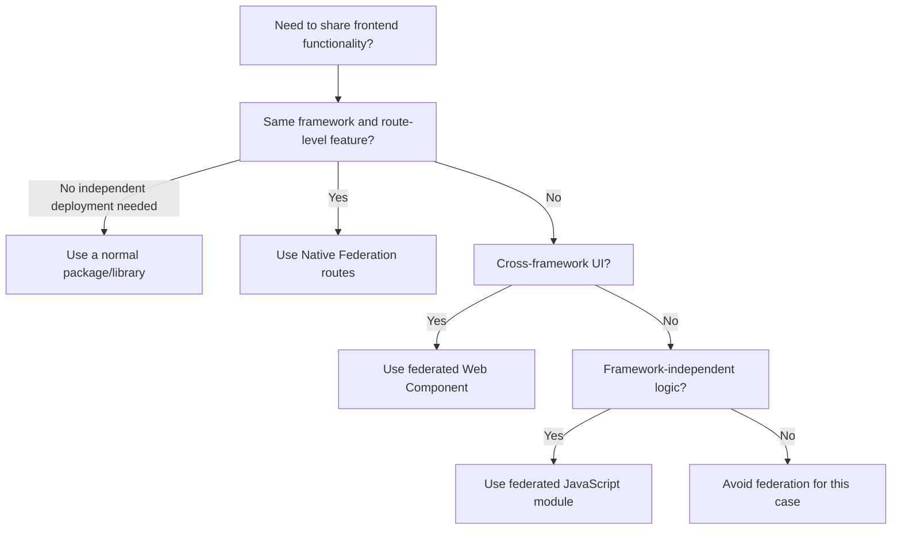

Use Angular-to-Angular Native Federation when:

- Teams need independent deployment.
- The feature boundary is route-level or application-level.
- Angular versions are compatible.
- The remote can expose stable Angular routes or components.

Use cross-framework federation when:

- A team must use a different framework.
- You are migrating between frameworks.
- The boundary can be expressed as a Web Component, mount API, URL, event, or plain JS contract.

Use a normal library when:

- There is no independent deployment requirement.
- The code is small and versioned with the host.
- The feature is deeply coupled to the host.

## 25. FAQ

### What is Native Federation?

Native Federation is an ESM/import-map based runtime loading system that lets a host application load exposed JavaScript modules from independently built remote applications.

### How does this repository use it?

`shell-app` initializes Native Federation with `/assets/federation.manifest.json`, then lazy-loads `auth_app` and `admin_app` route modules. `auth_app` and `admin_app` expose `./routes`.

### How do I use Angular with Angular?

Expose Angular `Routes` from the remote:

```js
exposes: {
  './routes': './src/app/app.routes.ts',
}
```

Load those routes in the Angular host:

```ts
loadRemote<{ routes: Routes }>('auth_app', './routes').then((m) => m.routes)
```

Share compatible Angular packages as singletons.

### How do I use Angular with React?

Do not import a React component and treat it as Angular. Have the React remote expose a JavaScript module that registers a Web Component or exports a `mount(element, props)` function. The Angular host loads that module and renders an Angular wrapper around the Web Component or mount target.

### How do I use Angular with Vue?

Use the same pattern as React: expose a Vue-backed Web Component registration module or a framework-neutral mount API. Pass data through attributes/properties and receive events through `CustomEvent`.

### How can different frameworks communicate?

Prefer:

- Attributes and properties.
- `CustomEvent`.
- URL and query parameters.
- Backend APIs.
- `postMessage` for iframe/window boundaries.
- Plain shared contract packages.

Avoid sharing framework-specific service instances across frameworks.

### When should I use Web Components?

Use Web Components when a UI feature built in one framework needs to be embedded in a different framework. They create a browser-native boundary that Angular, React, Vue, and plain HTML can all use.

### What should I share?

Share framework runtimes only among compatible apps using the same framework:

- Angular with Angular.
- React with React.
- Vue with Vue.

Share plain contract libraries only when they are stable and intentionally versioned.

### What should I not share?

Do not share incompatible framework runtimes, feature-private dependencies, private stores, private services, or implementation details. Do not share Angular with React or Vue just because all apps are federated.

### How do I deploy independently?

Deploy each remote's `remoteEntry.json` and generated assets to a stable URL. Deploy the host with a manifest pointing to the desired remote versions. Keep exposed module contracts backward-compatible.

### What happens when a remote fails?

The feature that needs the remote fails to load unless the host provides a fallback. Add route-level or wrapper-level error handling so the rest of the host can continue running.

### How do I debug Native Federation?

Check the manifest, remote entry URL, exposed module key, browser Network tab, import map/specifier errors, shared package versions, and bootstrap order.

### When should I choose same-framework vs cross-framework?

Choose same-framework federation when teams can align on one framework. It is simpler and has fewer lifecycle problems. Choose cross-framework federation when there is a real organizational, migration, or legacy reason, and use Web Components or framework-neutral modules at the boundary.

## 26. Native Federation Details Often Missed

The guide above covers the main architecture. These are the smaller Native Federation details that commonly cause confusion during implementation.

### Final Gap Review

After reviewing this repository again, the guide should explicitly protect readers from adding files or APIs that are common in other federation tutorials but are not part of this setup.

What this repository needs:

| Need | Where it belongs |
| --- | --- |
| Enable the Native Federation build wrapper | `angular.json` |
| Define app name, exposes, remotes, shared packages, skipped packages, and features | `federation.config.mjs` |
| Tell a host where remote entries are at runtime | `public/assets/federation.manifest.json` |
| Initialize federation before Angular imports | `src/main.ts` |
| Keep Angular bootstrap separate from federation initialization | `src/bootstrap.ts` |
| Load remote modules from initialized federation result | `src/federation-loader.ts` in host apps only |
| Mount Angular remote routes | `src/app/app.routes.ts` |
| Make TypeScript aware of Native Federation package types | `tsconfig.app.json` |

What this repository does not need:

| Do not add | Why |
| --- | --- |
| `webpack.config.js` or `module-federation.config.js` | This is Native Federation with Angular esbuild, not webpack Module Federation. |
| `remoteEntry.js` references | The inspected Native Federation setup serves `remoteEntry.json`. |
| Manual edits to generated `remoteEntry.json` | It is generated output and must be produced by the Native Federation build/serve process. |
| Native Federation providers in `app.config.ts` | Federation initializes before Angular bootstrap in `main.ts`. |
| `src/federation-loader.ts` in a pure remote | Pure remotes expose modules but do not load other remotes. |
| A separate `tsconfig.federation.json` | `tsconfig.app.json` already includes the needed files in this repository. |

### `federation.config.mjs` vs `federation.manifest.json`

These two files are related but they are not the same thing.

| File | Time used | Main purpose | Who needs it |
| --- | --- | --- | --- |
| `federation.config.mjs` | Build and serve setup | Defines what this app is, what it exposes, what it consumes, and what it shares. | Every Native Federation app. |
| `public/assets/federation.manifest.json` | Browser runtime | Maps remote names to deployed `remoteEntry.json` URLs. | Only apps that load remotes. |

Example:

```js
// shell-app/federation.config.mjs
export default withNativeFederation({
  name: 'shell_app',
  remotes: {
    auth_app: 'http://localhost:4201/remoteEntry.json',
    admin_app: 'http://localhost:4202/remoteEntry.json',
  },
});
```

```json
{
  "auth_app": "http://localhost:4201/remoteEntry.json",
  "admin_app": "http://localhost:4202/remoteEntry.json"
}
```

How to think about it:

- `federation.config.mjs` is the app's Native Federation configuration.
- `federation.manifest.json` is the host's runtime address book.
- A pure remote needs `federation.config.mjs` so it can expose modules and generate federation metadata.
- A pure remote does not need `federation.manifest.json` unless it also loads another remote.
- Production deployments usually replace or generate the manifest per environment while keeping TypeScript code unchanged.

### Angular Builder Shape

In this repository, the `build` and `serve` targets are Native Federation wrapper targets:

```json
"builder": "@angular-architects/native-federation:build"
```

The real Angular application build is still present under the `esbuild` target:

```json
"builder": "@angular/build:application"
```

That means Native Federation wraps the Angular application build. Do not replace this setup with webpack-specific configuration.

### `tsconfig.app.json` vs `tsconfig.federation.json`

A separate `tsconfig.federation.json` is not required in this repository. The Native Federation builder only needs a valid TypeScript config, and the existing `tsconfig.app.json` already includes the application source files:

```json
{
  "extends": "./tsconfig.json",
  "compilerOptions": {
    "types": [
      "@angular-architects/native-federation"
    ]
  },
  "include": ["src/**/*.ts"],
  "exclude": ["src/**/*.spec.ts"]
}
```

Because `src/**/*.ts` includes `src/main.ts`, `src/federation-loader.ts`, and exposed files such as `src/app/app.routes.ts`, `tsconfig.app.json` is enough for the current `shell-app`, `auth-app`, and `admin-app`.

Use a separate federation tsconfig only if you have a concrete reason, such as a more complex workspace where the Native Federation builder needs a different source set from the Angular app build. Otherwise, one app tsconfig is simpler and avoids duplicated compiler settings.

### Remote Contract Typing

Native Federation loads JavaScript at runtime, so TypeScript does not automatically know what a remote exports. This repository uses a generic type at the loading point:

```ts
loadRemote<{ routes: Routes }>('auth_app', './routes').then((m) => m.routes)
```

That is a local compile-time promise. It does not validate the remote at runtime. The remote must actually export:

```ts
export const routes: Routes = [];
```

For larger systems, put shared remote contracts in a small framework-neutral package, or add explicit runtime validation before using the remote export.

### Remote Naming Rules

These three values must match exactly:

```text
remote federation.config.mjs name: auth_app
host manifest key:                  auth_app
host loadRemote name:               auth_app
```

These two values must also match:

```text
remote exposes key:                 ./routes
host loadRemote exposedModule:      ./routes
```

Use stable names. Renaming a remote or exposed module is a breaking change for every host that consumes it.

### Generated Assets and Cache Headers

`remoteEntry.json` is metadata. It points to generated JavaScript assets. A production deployment must publish `remoteEntry.json` and the assets it references together.

Recommended cache behavior:

| Asset | Suggested caching |
| --- | --- |
| `remoteEntry.json` | Short cache or revalidated cache, because it points to the current remote build. |
| Hashed JS/CSS assets | Long cache, because the filename changes when content changes. |
| Host manifest | Short cache or environment-controlled replacement. |

If `remoteEntry.json` points to assets that no longer exist, the host can discover the remote but still fail while loading chunks.

### CORS and Origins

Native Federation fetches remote metadata and assets through normal browser network requests. If the host and remote are on different origins, the remote server or CDN must allow those asset requests.

Local development origins in this repo:

```text
http://localhost:4200 -> shell-app
http://localhost:4201 -> auth-app
http://localhost:4202 -> admin-app
```

Production should use explicit trusted origins where possible.

### SSR Status

This repository is documented as browser-side Native Federation. The current inspected Angular apps use browser application builds and client-side `initFederation(...)`.

Do not assume server-side rendering, hydration, or Node-side federation is configured here. If SSR is added later, document it separately because the federation initialization, dependency loading, and deployment model need additional server-side rules.

### Current Wrapper Consistency Check

The repository contains `federation-loader.ts` wrappers in host apps. Those wrappers store the `initFederation(...)` promise and load remotes from that initialized result.

For this pattern to work consistently, host `main.ts` should initialize through the wrapper:

```ts
import { startFederation } from './federation-loader';

startFederation('/assets/federation.manifest.json')
  .then(() => import('./bootstrap'))
  .catch((err: unknown) => console.error(err));
```

If `main.ts` calls `initFederation(...)` directly while route code calls the wrapper's `loadRemote(...)`, the wrapper's internal federation promise is never set. The document calls out this version-specific pattern because `@angular-architects/native-federation@22.1.1` marks the top-level `loadRemoteModule` helper as deprecated.

### Verification Checklist

Use this after every Native Federation change:

```text
1. npm ls @angular/core @angular-architects/native-federation
2. Open /assets/federation.manifest.json from every host.
3. Open every remoteEntry.json URL from the manifest.
4. Confirm remote names match config, manifest, and loadRemote.
5. Confirm exposed module names match config and loadRemote.
6. Confirm the exposed module exports the expected symbol.
7. Confirm es-module-shims is in Angular polyfills.
8. Confirm main.ts initializes federation before bootstrap.ts imports Angular.
9. Navigate to every remote route from the host.
10. Navigate to an invalid host URL and confirm the host 404 page.
11. Navigate to an invalid remote child URL and confirm the remote fallback.
12. Stop one remote and confirm the host shows remote-unavailable fallback UI.
```

## 27. Quick Reference

Current repo remote names:

```text
shell_app
auth_app
admin_app
product_spotlight_app
```

Current remote entries:

```text
http://localhost:4201/remoteEntry.json
http://localhost:4202/remoteEntry.json
http://localhost:4203/remoteEntry.json
```

Current exposed modules:

```text
auth_app  -> ./routes -> ./src/app/app.routes.ts
admin_app -> ./routes -> ./src/app/app.routes.ts
product_spotlight_app -> ./register -> ./src/register.tsx
```

Current host route loading:

```ts
loadRemote<{ routes: Routes }>('auth_app', './routes').then((m) => m.routes);
loadRemote<{ routes: Routes }>('admin_app', './routes').then((m) => m.routes);
```

Current dynamic React remote loading:

```ts
loadRemoteFromEntry<ProductSpotlightRegisterModule>(
  environment.productSpotlightRemoteEntry,
  'product_spotlight_app',
  './register',
);
```

Correct host bootstrap shape:

```ts
import { startFederation } from './federation-loader';

startFederation('/assets/federation.manifest.json')
  .then(() => import('./bootstrap'))
  .catch((err: unknown) => console.error(err));
```

Remote-only bootstrap shape:

```ts
initFederation()
  .then(() => import('./bootstrap'))
  .catch((err: unknown) => console.error(err));
```

Same-framework rule:

```text
Same framework -> remote can expose framework-native routes/components when versions are compatible.
```

Cross-framework rule:

```text
Different frameworks -> federate JavaScript modules, but integrate UI through Web Components or mount APIs.
```

Dependency sharing rule:

```text
Share compatible framework runtimes within the same framework family.
Do not blindly share framework-specific dependencies across different frameworks.
```

Troubleshooting checklist:

```text
1. Is the manifest reachable?
2. Is remoteEntry.json reachable?
3. Do remote names match?
4. Does the exposed module key exist?
5. Did federation initialize before Angular bootstrap?
6. Is es-module-shims configured?
7. Are shared package versions compatible?
8. Are CORS and asset URLs correct?
9. For cross-framework UI, is the Web Component registered before use?
10. Is there a host-level 404 route?
11. Is there a remote-level 404 or redirect inside each exposed remote route tree?
12. Is there fallback UI for remote failure?
```
